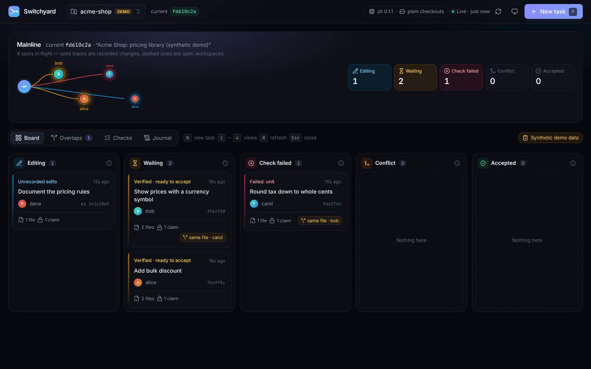

# Switchyard

**Supervise several coding sessions in one repository.** Switchyard shows who owns each task, where tasks touch the same code, what the checks said, and what is ready to land. It then lands each change through the [Zit](https://getzit.org/) engine, one at a time.



Zit, not Switchyard, does the actual work. It provides isolated workspaces, claims, symbol-level footprints, check evidence and atomic acceptance. Switchyard is a local web workspace on top of it:

- **Task board.** Each task is shown in exactly one of these lanes: *Editing*, *Waiting*, *Check failed*, *Conflict* or *Accepted*. Each card says why it is in that lane, using Zit's own status.
- **Mainline view.** Recent accepted history, with the work in flight branching off `current`.
- **Review pane.** Shows the recorded diff and live workspace edits, the author's account of the change, the evidence for each check, claims, and overlaps.
- **Overlap matrix.** Shows where two tasks touch the same file or symbol. This is labelled as a review signal. Zit's actual verdicts (stale, text conflict) are shown separately.
- **Checks you approve.** The exact commands from `zit.toml` are shown before they first run, and any changed command needs a new approval. Check output is bounded and redacted.
- **Safe acceptance.** Accept only goes through when you reviewed against the current `current`. Repeated or racing clicks cannot land a change twice. Rejected changes stay intact.
- **Recovery.** Every engine action is journaled before it starts, so an interrupted one shows up with recovery steps after a restart.

Other screens: [inspector with failing check](docs/screenshots/inspector-checks.png) · [diff](docs/screenshots/inspector-diff.png) · [overlaps](docs/screenshots/overlaps.png) · [checks history](docs/screenshots/checks.png) · [light theme](docs/screenshots/board-light.png) · [phone](docs/screenshots/phone-board.png)

## Requirements

- Node.js 22 or newer and npm.
- git 2.38 or newer (Zit uses `git merge-tree --write-tree`).
- Zit 0.1.x. `npm run setup:zit` builds the pinned release (0.1.1) from crates.io into `./.tools`. This needs Rust 1.88 or newer. You can instead point `ZIT_BIN` at a release binary.
- Linux or macOS (Zit does not support Windows).

## Run it

```sh
npm ci
npm run setup:zit      # once: builds zit 0.1.1 into .tools/bin/zit
npm run demo           # optional: disposable demo repository with four tasks
npm run build && npm start
# open http://127.0.0.1:4780
```

For development with hot reload, run `npm run dev`. This starts the API on `127.0.0.1:4780` and the UI on <http://localhost:5173>.

### The demo

`npm run demo` creates `.demo/acme-shop`, a small JavaScript library with two checks (`node --test` and a format check), and registers it as **synthetic demo data**. It then plays the part of four people working in their own Zit workspaces:

| Owner | Task | Result |
|---|---|---|
| alice | Add bulk discount (new files) | Waiting, verified |
| bob | Currency symbol in `formatTotal` | Waiting, verified; overlaps carol in the same file, different function |
| carol | Truncate tax in `tax` | **Check failed** (`unit`); blocked from acceptance |
| dana | Document the pricing rules | Editing, with unrecorded edits; her claim on `src/pricing.js#tax` is **refused by Zit** |

To try it: accept alice's change, then accept bob's (Zit composes it onto the new current). Carol stays blocked until the check passes. No agent or API credentials are involved.

The demo approves its own two check commands on your behalf and says so in its output. To remove it, run `npm run demo:reset`. This disposes only that repository's Zit workspaces and caches, unregisters it, and deletes `.demo/`.

### Use your own repository

Use a disposable clone while you are trying it out. Choose **Register a repository** and enter its absolute path. Then **Initialise Zit**, which creates `refs/zit/current` at `HEAD` and leaves your branches untouched. **New task** opens a Zit workspace. Its path is shown in the inspector: work there with any editor or agent, then **Record**. If the repository has no `zit.toml`, accept has nothing to check. Add a check, for example:

```toml
[[check]]
name = "unit"
run = "npm test"
```

Switchyard uses the same `ZIT_HOME` as your `git zit` CLI (default `~/.zit`), so both see the same workspaces. Work started with `git zit run` shows up on the board as **CLI** tasks.

## Commands

| Command | What it does |
|---|---|
| `npm run dev` | API (tsx watch) and Vite UI with hot reload |
| `npm run build` | Typecheck, then build the UI into `dist/` |
| `npm start` | Serve the API and the built UI on `127.0.0.1:4780` |
| `npm test` | All tests: unit, integration against real Zit, and browser end-to-end |
| `npm run typecheck` | TypeScript only |
| `npm run setup:zit` | Build Zit 0.1.1 into `.tools/` |
| `npm run demo` / `npm run demo:reset` | Create or remove the demo repository |
| `npm run screenshots` | Capture `docs/screenshots/` from a running server |

Configuration is through environment variables; see [.env.example](.env.example). No secrets are needed.

## Keyboard

`N` new task · `1`–`4` Board / Overlaps / Checks / Journal · `R` refresh · `Esc` close the inspector. All controls are reachable with Tab and have visible focus.

## Documentation

- [Architecture](docs/ARCHITECTURE.md): components, data model, how engine state stays authoritative, and the security model.
- [Validation](docs/VALIDATION.md): what was tested and how, acceptance criteria, and known limitations.
- [Notices and licensing](NOTICE.md).

## Limitations

- Copy-on-write sharing depends on the file system. Switchyard probes it the way Zit does and shows the result in the header. On ext4 or overlayfs every workspace is a full checkout, which is correct but uses more disk.
- Zit does not report progress for individual checks, so running checks show elapsed time and can be cancelled. Cancelling a check stores no evidence. Cancelling an accept leaves `current` unchanged unless the atomic ref update had already happened.
- Zit's conflict detection is symbol-level for Rust, Python, JavaScript, TypeScript, Go and Markdown sections. Other files are compared as whole files. Switchyard's overlap view is a textual signal and never claims general semantic conflict detection.
- One local user. No authentication, because the server binds to loopback only. There is no cloud orchestration and no launching of agents from the browser.
- Job progress lives in memory. After a restart, check history and the journal are kept, but a job that was running shows as interrupted.
