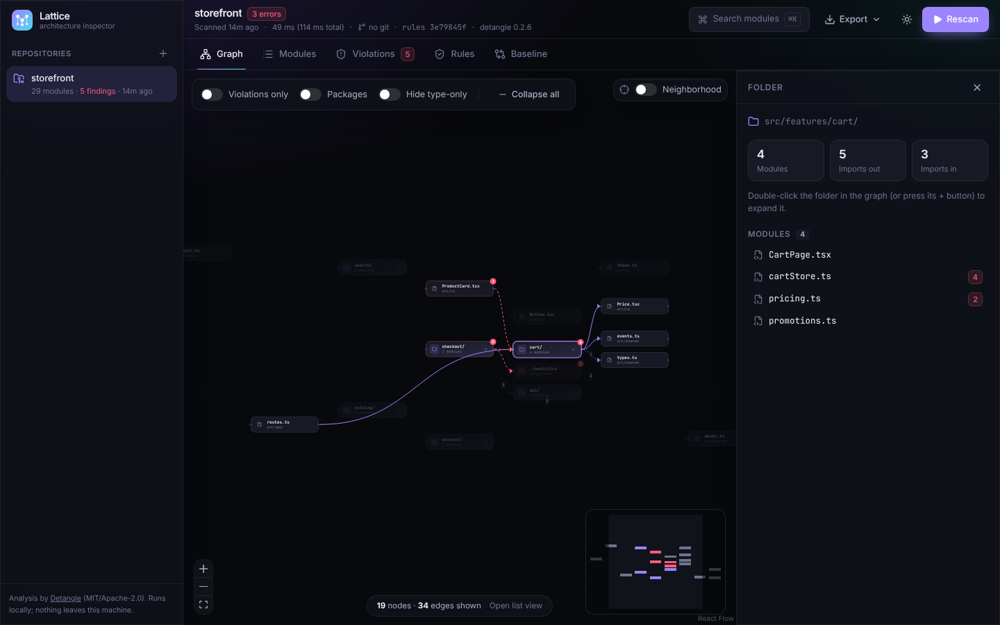
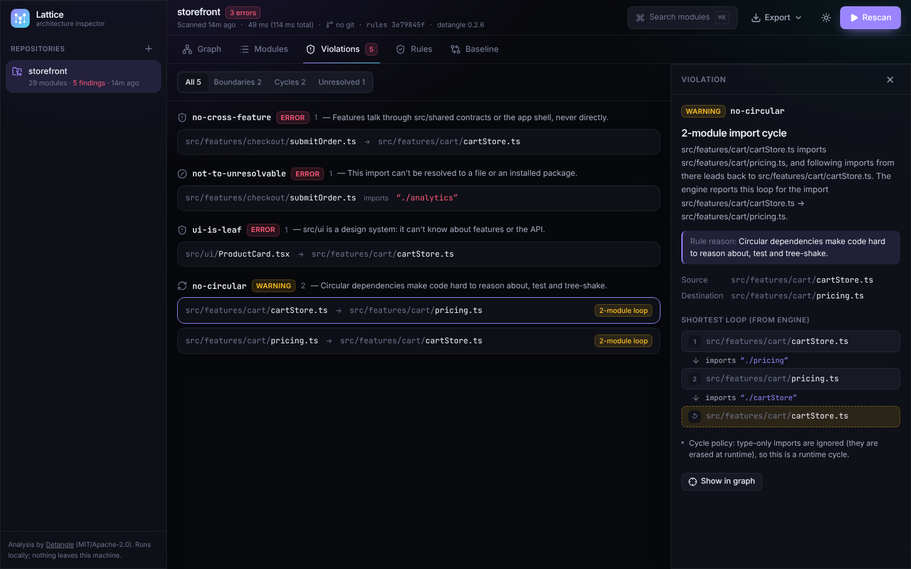
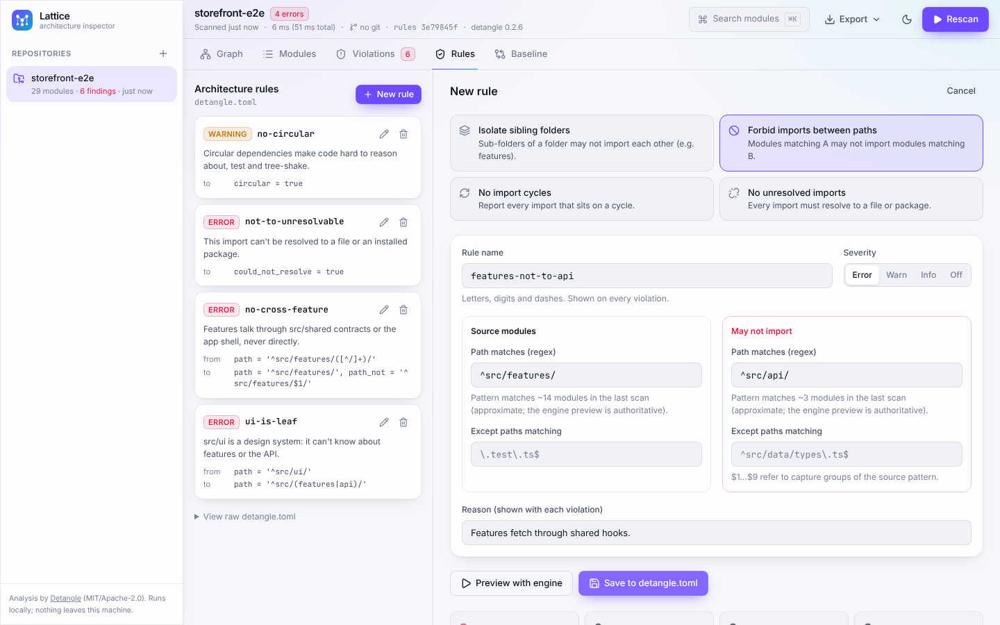
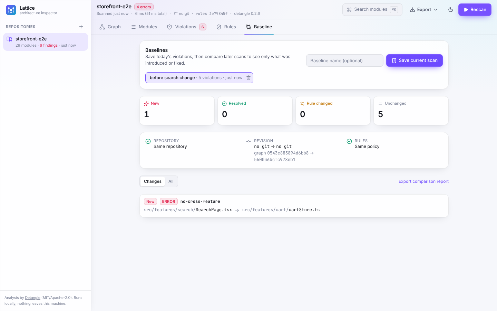

# Lattice — Visual Architecture Inspector

Lattice makes a JavaScript/TypeScript repository's import graph understandable and helps you stop new architecture violations. It explains every cycle, unresolved import and forbidden boundary with the exact import path behind it, and lets you design rules with structured controls that are **previewed against the real engine** before anything is written to `detangle.toml`.

Analysis is done by [Detangle](https://github.com/debug-diary-1/detangle) (npm `detangle@0.2.6`, MIT OR Apache-2.0). Lattice adds the local service, visual workspace, rule editor, baselines and reports around it. Everything runs on your machine.

| Graph with neighborhood highlight | Cycle explained from engine evidence |
|---|---|
|  |  |
| **Rule designed visually, previewed with the engine** | **Baseline: only the introduced violation is new** |
|  |  |

## Quick start

Requires Node.js 22+ (tested on 22.22.0) on macOS, Linux or Windows (x64/arm64; Detangle ships prebuilt binaries).

```sh
npm ci
npm run dev          # API on http://127.0.0.1:4318, UI on http://127.0.0.1:5173
```

Open http://127.0.0.1:5173 and either register a project folder (absolute path to the folder containing `package.json`) or click a bundled demo project. Press **Scan**.

Production-style single process:

```sh
npm run build
npm start            # UI + API on http://127.0.0.1:4318
```

| Command | What it does |
|---|---|
| `npm run dev` | API (auto-reload) + Vite UI |
| `npm run build` / `npm start` | Build the UI, serve UI + API from one loopback port |
| `npm run typecheck` | TypeScript over UI, server, tests and scripts |
| `npm test` | Unit + integration tests (real engine, disposable temp copies of fixtures) |
| `npm run test:e2e` | Playwright end-to-end tests against the production build (set `PLAYWRIGHT_CHROMIUM=/path/to/chrome` to use a system browser) |
| `npm run fixtures:large [-- N]` | Generate the synthetic N-module scale fixture (default 1,000) in `fixtures/generated-N/` |
| `npm run bench [-- dir]` | Measure analysis and graph view-model/layout time separately |
| `npm run demo:toggle [-- add\|remove]` | Add/remove one forbidden cross-feature import in `fixtures/storefront` |
| `npm run reset` | Delete Lattice's local data (`.lattice-data/`), generated fixtures and the demo toggle |

Configuration (environment variables, all optional): `PORT` (default `4318`), `HOST` (default `127.0.0.1`), `LATTICE_DATA` (data directory, default `./.lattice-data`), `DETANGLE_BIN` (use a specific Detangle binary). No secrets are needed.

## Using it

- **Graph** — folders start collapsed to ~18 nodes; expand with the `+` button or double-click. Toggle *Violations only*, *Packages*, *Hide type-only*, or *Neighborhood* (1–3 hops around the selected module). Red animated edges are violations, amber edges are cycle edges, dotted edges are type-only imports. Large views are capped (220 nodes / 700 edges, violations kept first) and the strip at the bottom says exactly what is hidden.
- **Modules** — the readable list alternative: virtualized, sortable, filterable; arrow keys move the selection.
- **Violations** — grouped by rule and category. Selecting one shows source, destination, rule reason and the offending path: the engine's own loop for cycles, the import specifier for boundaries, and why imports are usually unresolved.
- **Module detail** — imports/importers (type-only and dynamic imports marked), violations in both directions, and *Why does it depend on…*: the shortest import chain to any other module (optionally runtime-only).
- **Rules** — pick a template (isolate sibling folders, forbid A → B, no cycles, no unresolved imports), fill structured fields, **Preview with engine** (runs `detangle check` with the proposed file and shows new / disappearing / severity-changed violations, affected paths and the TOML diff), then save. Save is disabled until a preview matches the current form.
- **Baseline** — save a scan as a baseline, rescan later, and see *New*, *Resolved*, *Unchanged* and *Rule changed*. Repository, revision, graph fingerprint and rule policy are compared explicitly.
- **Export** — Markdown or JSON report (repository-relative paths; includes the baseline comparison when one is selected) and the `detangle.toml` that reproduces the results with `npx detangle check`.
- Keyboard: `⌘K`/`Ctrl+K` or `/` search, `1`–`5` switch views, `S` scan, `Esc` clear selection. Light/dark theme follows the system and can be toggled.

### Demo: one import creates a violation, removing it resolves it

1. Register the bundled **storefront** demo and scan. In **Baseline**, *Save current scan*.
2. `npm run demo:toggle -- add`, then **Rescan** → the comparison shows exactly **1 New** `no-cross-feature` violation (`search/SearchPage.tsx → cart/cartStore.ts`).
3. `npm run demo:toggle -- remove`, then **Rescan** → *New 0*. (A baseline saved while the import existed shows it as *Resolved*.)

## Architecture

```
src/ (React 19 + TypeScript, Vite, Tailwind v4)           server/ (Node + Fastify, loopback only)
  App.tsx            layout, scan lifecycle, shortcuts       index.ts    HTTP routes, Host/Origin/CSRF checks, static UI
  components/        Graph, List, Violations, Rules,          service.ts  registration, scans, rule preview/save, baselines
                     Compare, DetailPane, Palette, Sidebar    engine.ts   Detangle adapter (execFile, no shell, timeouts, cancel)
  lib/graph.ts       folder collapsing, filters, caps         roots.ts    root validation, symlink + config-evaluation checks
  lib/layout.ts      dagre ≤90 nodes, linear layered above    rules.ts    structured rules ⇄ TOML text edits, policy hashes
  lib/explain.ts     violation → explanation + hops           scan.ts     snapshot build, git revision, shortest path, baseline diff
shared/types.ts      typed contracts (Repository, Scan,       store.ts    versioned JSON store, atomic writes
                     Module, ImportEdge, ArchitectureRule→     report.ts   Markdown / JSON reports
                     RuleDraft/ConfigRule, Violation, Baseline)
```

- **Engine integration.** Each scan runs `detangle graph <root> -f json --externals` (modules, edges, metrics, cycles) and `detangle check <root> -f json` (the authoritative rule result, identical to CI) in parallel. A test asserts both agree. The binary is resolved through the `detangle` package's own platform lookup; it is invoked with `execFile` and a minimal environment.
- **Scan = snapshot.** A scan stores the engine version, the git commit/branch read from `.git` (git itself is never run, since it can execute hooks/fsmonitor), a graph fingerprint, and the config version: raw text hash, a comment-insensitive policy hash, and per-rule hashes.
- **Stable violation identity** is `rule|scope|from|to`. Baseline comparison marks a violation as *Rule changed* (never new/resolved) when its rule's definition, the global options, or the rule source changed.
- **Rule editing** edits text one `[[forbidden]]` block at a time (keeping leading comments and everything else), then re-parses both versions and refuses the write if anything other than the targeted rule changed. Inline-array rule files are shown read-only. Saving requires the file hash from the preview (409 if the file changed), the engine must accept the new file, and the previous file is copied to `.lattice-data/backups/<repo>/`. Creating the first rule starts from the engine's own `detangle init` starter so built-in checks keep running.
- **Shortest path** for "why does A depend on B" is a BFS over the engine's edge list; cycle loops come from the engine itself.

### Safety

- The service binds to `127.0.0.1`, rejects unknown `Host` headers (DNS rebinding) and foreign `Origin`s, and requires a custom header on every mutation.
- Only explicitly registered roots are read. A root must contain `package.json` or `detangle.toml` (otherwise the engine would treat an ancestor as root); `/` and the home folder are refused. Symlinks that leave the root are reported and not followed; modules resolved outside the root are dropped from the graph.
- No repository code runs: no installs, builds or scripts, and JavaScript rule configs are ignored. If `detangle.toml` names `vite_config`/`webpack_config`/`babel_config` (which Detangle evaluates with Node), the scan is refused unless you enable *Allow bundler config evaluation* for that repository.
- Notes explain what affects resolution: missing `node_modules` with declared dependencies, no `tsconfig.json` for TypeScript files, built-in rules in use, and engine notes.

## Validation

Measured on: Intel Xeon @ 2.10 GHz × 4, 16 GiB, Linux, Node 22.22.0, headless Chromium 1194.

- `npm run typecheck` — passes.
- `npm test` — 38 tests pass: fixture classification (clean, real runtime cycle with a type-only back edge, forbidden cross-feature import, unresolved import) against the real engine; graph ⇄ list consistency; every explanation hop is a real engine edge; TOML round-trips and comment-preserving add/update/delete; inline-array and multi-line-string edge cases; rule preview with real engine results; stale-hash save refusal; engine-rejected regex surfaced in preview and blocked on save; first-rule creation keeps built-ins; baseline flags only the introduced violation and doesn't misreport a rule deletion as a fix; invalid paths; outside-root symlink; config-evaluation guard; broken config; scan cancellation; HTTP Host/Origin/CSRF protection; report contents.
- `npm run test:e2e` — 4 Playwright tests pass on the production build: invalid-path errors; full workflow (scan → explain boundary + cycle → graph neighborhood → list → baseline → introduce import → 1 new → design rule → preview → edit invalidates preview → save preserves comments → reload persists); 390 px narrow viewport; 1,000-module graph.
- Scale (`npm run fixtures:large && npm run bench`, 1,001 modules incl. 1 unresolved, 2,974 imports, median of 5 after warm-up):
  - Analysis: **89 ms** per scan end-to-end in the service (engine-reported parse + graph: 17 ms).
  - UI view-model + layout (Node): default folder view 4 ms + 34 ms; all files capped to 220 nodes 7 ms + 1 ms (781 nodes / 2,540 edges hidden by caps, reported in the UI); 2-hop neighborhood 2 ms + 1 ms.
  - Browser (Playwright, wall-clock incl. network and React render): scan click → graph visible ~340 ms; expand a folder ~320 ms; search + neighborhood ~190 ms; at most 700 edges in the DOM.
- Visual inspection done at 1440×900 (light and dark) and 390×844.

## Limitations

- Results are only as complete as static imports: runtime-only dependencies (string-built paths, DI containers, `eval`) are invisible, and npm imports resolve correctly only after you install dependencies yourself.
- The visual editor covers `[[forbidden]]` rules built from the four templates (and equivalent hand-written ones). Other rules (`allowed`, `required`, groups, `via_only`, tags…) are listed read-only; previews and scans still honor them.
- Bundler-config aliases need the explicit opt-in described above.
- Git revision is read from the registered root's own `.git`; a package registered inside a monorepo shows "no git", and uncommitted changes are reflected only in the graph fingerprint.
- Cycle explanations show the loop the engine reports for each edge; other loops through the same modules may exist.
- Single user, local only. Lattice keeps the last 12 scans per repository (plus any a baseline uses).

## Licensing

Lattice is MIT-licensed. Third-party notices are in [NOTICE.md](NOTICE.md). Fixtures are synthetic.
