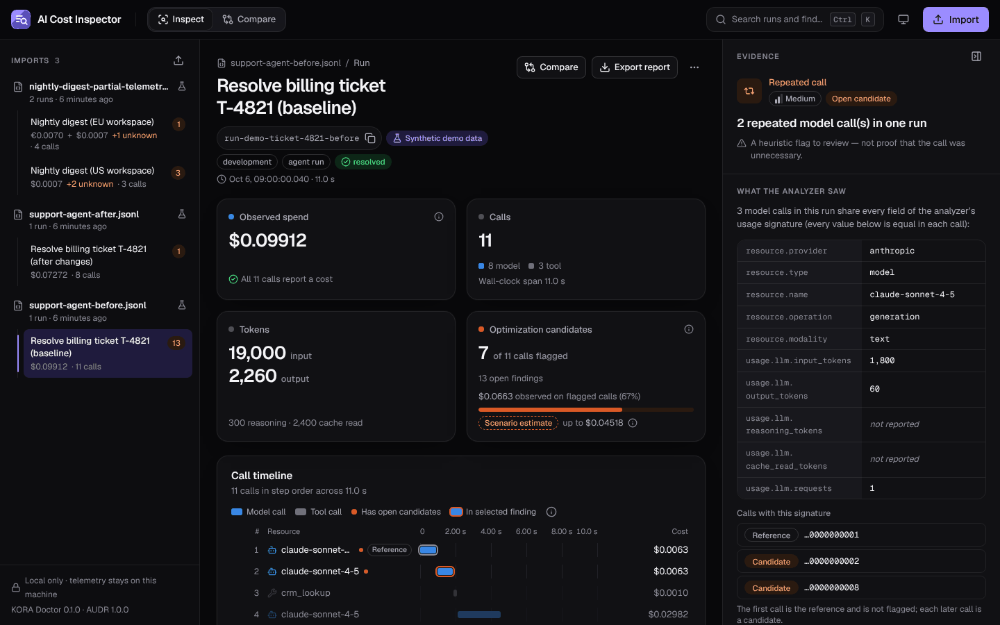
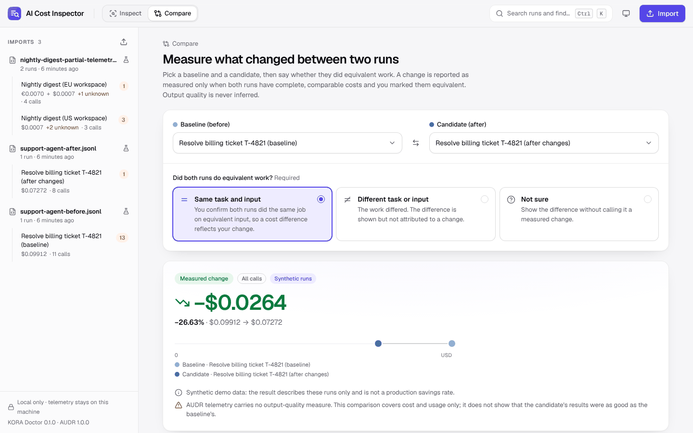
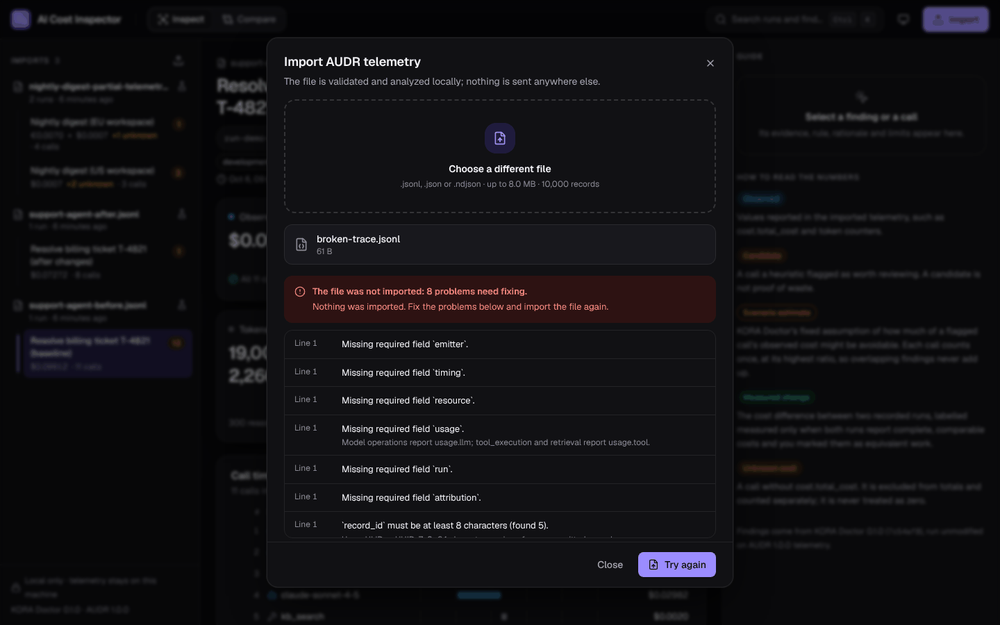
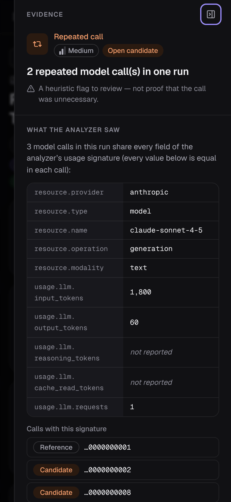

# AI Cost Inspector

See where an AI agent's money went, call by call, and which calls are worth a
second look.

AI Cost Inspector is a local web app for [AUDR](https://github.com/openaudr/audr)
agent-cost telemetry. Import a trace and you get:

- **Observed spend** per run, per model and per call, in exact decimal money. Costs
  in different currencies are never added together, and a call with no reported cost
  shows as unknown, never as $0.
- **Optimization candidates** from [KORA Doctor](https://github.com/Krako-Labs/kora-doctor).
  Each finding opens an evidence inspector with the affected calls, the data the
  heuristic matched, its rule, its rationale and its limits.
- **Measured change** between two runs (before and after a change), reported as
  measured only when both runs have complete, comparable costs and you have said
  they did equivalent work.
- **Portable reports** in JSON and self-contained HTML that make sense without the
  app.

Everything runs on your machine. The app calls no model, needs no account or API
key, and makes no outbound network requests.

**Try it in your browser:** <https://cal2020.github.io/hello-world-app/ai-cost-inspector/>.
Nothing to install: the same Python backend runs inside the page (via Pyodide), and files
you import never leave your device. The first visit downloads about 19 MB and startup
takes a few seconds. See [browser/README.md](browser/README.md).



| Comparing two runs | Import errors, by line | Phone layout |
| --- | --- | --- |
|  |  |  |

## Quick start

You need:

- [uv](https://docs.astral.sh/uv/) 0.11 or newer. It installs Python 3.13 (3.12+
  works) and the pinned backend dependencies.
- Node.js 22 with npm 10, for the frontend build.
- git. uv fetches KORA Doctor from GitHub at a pinned commit.
- make (optional; every target is a one-line command you can run yourself).

```sh
make setup   # uv sync --frozen (backend) and npm ci (frontend)
make build   # build the frontend into frontend/dist
make start   # serve the app and the API on http://127.0.0.1:8765
```

Open <http://127.0.0.1:8765> and choose **Explore the demo**. The demo loads three
synthetic, labelled imports: a baseline agent run with a repeated-call pattern, the
same task after three changes, and a two-run file with incomplete telemetry in two
currencies.

Without make:

```sh
cd backend && uv sync --frozen && cd ..
cd frontend && npm ci && npm run build && cd ..
cd backend && uv run --frozen cost-inspector serve
```

For development, `make dev` runs the API with auto-reload on :8765 and the Vite dev
server on <http://127.0.0.1:5173>, which proxies `/api` to the API.

## Using it

1. **Import** a `.jsonl`, `.json` or `.ndjson` file: choose **Import** and drop or
   pick the file, or run `uv run --frozen cost-inspector import FILE` from `backend/`.
   One import is up to 8 MiB and 10,000 records. A file is imported whole or not at
   all: if any record is invalid, nothing is stored and every problem is listed with
   its line number and a suggested fix.
2. **Inspect a run.** The center column shows observed spend, calls, tokens and
   candidates, then a call timeline and the list of findings. Selecting a finding
   highlights its calls on the timeline and opens its evidence on the right: what
   the analyzer saw, the affected calls, the rule, the analyzer's rationale, the
   limits, and KORA Doctor's scenario estimate.
3. **Dismiss** a finding you have reviewed, with an optional note. Dismissed
   findings stay listed with your note, and you can restore them.
4. **Compare** two runs. Pick a baseline and a candidate, then answer whether both
   did equivalent work. The answer decides how the difference is labelled.
5. **Export** an import or a saved comparison as JSON or HTML.
6. **Delete** an import (with its comparisons) or a single run. Deleting a run
   re-analyzes what remains and keeps the dismissals of findings that survive.

Press <kbd>Ctrl</kbd>/<kbd>⌘</kbd> <kbd>K</kbd> for the command palette. Everything
works from the keyboard, the selection lives in the URL (reload and back/forward
restore it), and the layout adapts down to phone width, where the sidebar and the
inspector become sheets. Light and dark themes follow the system unless you choose
one.

## Reading the numbers

The app keeps these labels apart everywhere, including in reports:

| Label | Meaning |
| --- | --- |
| **Observed** | A value present in the imported telemetry, such as `cost.total_cost` or a token counter. |
| **Candidate** | A call a heuristic flagged as worth reviewing. A candidate is not proof of waste. |
| **Scenario estimate** | KORA Doctor's fixed assumption of how much of a flagged call's observed cost might be avoidable (100%, 80%, 70% or 50% depending on the rule). Each call counts once, at its highest ratio, so overlapping findings never add up. |
| **Measured change** | The cost difference between two recorded runs. It is labelled *measured* only when both runs report complete, comparable costs and you marked them as equivalent work. Otherwise it is shown as an observed difference, or not compared. |
| **Unknown cost** | A call without `cost.total_cost`. It is excluded from totals and counted separately, never treated as zero. |

Some consequences:

- A percent change is shown only when the baseline is known and non-zero.
- Matching token counts are never presented as identical prompts. AUDR carries no
  prompt content, so the evidence shows the counters that matched and says what was
  not compared.
- No view claims that a cheaper run produced equally good results. AUDR has no
  quality signal.
- Amounts are shown with all their digits; the UI rounds only beyond 8 decimal
  places, and says so.

## Input format

The input is [AUDR v1.0.0](https://github.com/openaudr/audr): one record per model
or tool call. The app accepts JSON Lines (one record per line), a JSON array of
records, or a single record. Every record is validated against the official AUDR
JSON Schema, vendored in `backend/src/cost_inspector/ingest/audr/`.

A two-call example (a model call with a reported cost, then a tool call without one):

```json
{"spec_version":"1.0.0","record_id":"01JZ8K3W5Q4N2M7X9V0B1C2D3E","emitter":{"component":"router","name":"my-agent","version":"1.4.0"},"timing":{"event_time":"2026-10-07T12:00:00.850Z","duration_ms":850},"resource":{"provider":"anthropic","type":"model","name":"claude-sonnet-4-5","operation":"generation","modality":"text"},"run":{"run_id":"run-2026-10-07-0001","span_id":"span-1","step":1},"attribution":{"environment":"development"},"usage":{"llm":{"input_tokens":1800,"output_tokens":60,"requests":1}},"cost":{"total_cost":0.0063,"currency":"USD"}}
{"spec_version":"1.0.0","record_id":"01JZ8K3W5Q4N2M7X9V0B1C2D3F","emitter":{"component":"harness","name":"my-agent","version":"1.4.0"},"timing":{"event_time":"2026-10-07T12:00:01.300Z","duration_ms":420},"resource":{"provider":"self-hosted","type":"tool","name":"kb_search","operation":"tool_execution"},"run":{"run_id":"run-2026-10-07-0001","span_id":"span-2","step":2},"attribution":{"environment":"development"},"usage":{"tool":{"type":"invocation","call_count":1}}}
```

Beyond the schema, the importer applies the AUDR sink rules: exact duplicate records
are dropped with a note, a reused `record_id` with different content is an error,
corrections replace the record they restate, and voids remove it. Records missing
`attribution.environment` are accepted with a warning. When several records share a
`(run_id, span_id)` and more than one of them reports a cost, the import warns that
the total could double count.

The in-app import dialog shows the same explanation, and
[`backend/src/cost_inspector/demo/`](backend/src/cost_inspector/demo/) has complete
example files with their expected totals.

## What is stored

Data lives in one SQLite file, `backend/.data/inspector.sqlite3` by default
(`ACI_DB_PATH` changes it). For each import it stores the file name, SHA-256 and
size, and the normalized telemetry of each call: timing, resource, run, usage
counters, cost (as exact decimal text), labels and emitter. It does not keep the
uploaded file. These identifiers are dropped at import and never stored:
`attribution.user_id`, `attribution.account_id`, `attribution.subscription_id`,
`resource.key_name` and `run.trace_id`. AUDR records carry no prompt or response
content, so there is none to store. Labels are kept as your emitter wrote them.

Dismissal notes and saved comparisons are stored in the same file. Delete imports in
the app, or use the commands below.

## Commands

| make | Direct command | What it does |
| --- | --- | --- |
| `make setup` | `uv sync --frozen`; `npm ci` | Install pinned dependencies |
| `make build` | `npm run build` (in `frontend/`) | Build the frontend |
| `make start` | `uv run --frozen cost-inspector serve` (in `backend/`) | Serve app and API on 127.0.0.1:8765 |
| `make dev` | | API with reload, plus Vite on :5173 |
| `make seed-demo` | `uv run --frozen cost-inspector seed-demo` | Add the synthetic demo imports (idempotent) |
| `make reset-demo` | `uv run --frozen cost-inspector reset-demo` | Remove the demo imports and their comparisons, then seed them again |
| `make reset CONFIRM=yes` | `uv run --frozen cost-inspector reset --yes` | Delete every import and comparison |
| | `uv run --frozen cost-inspector import FILE` | Validate and import a file from disk |
| `make test` | `uv run --frozen pytest`; `npm test` | Backend and frontend unit/integration tests |
| `make lint` | ruff, mypy, `tsc -b`, ESLint | Static checks |
| `make e2e` | `npm run e2e` (in `frontend/`) | Build, then run Playwright end to end on a throwaway database |
| `make check` | | `lint`, `test` and `e2e` |
| `make browser` | `uv run --frozen python ../browser/build.py` (in `backend/`) | Build the in-browser version into `browser/dist/ai-cost-inspector` |
| `make browser-serve` | `python3 -m http.server 8790 --directory browser/dist` | Serve it on <http://127.0.0.1:8790/ai-cost-inspector/> |
| `make browser-e2e` | `npx playwright test -c playwright.browser.config.ts` (in `frontend/`) | End-to-end suite against the in-browser build |

## Configuration

All settings are environment variables read when the server starts.

| Variable | Default | Meaning |
| --- | --- | --- |
| `ACI_DB_PATH` | `backend/.data/inspector.sqlite3` | SQLite database file |
| `ACI_HOST` | `127.0.0.1` | Bind address. Non-loopback addresses are refused unless you pass `serve --allow-remote`. |
| `ACI_PORT` | `8765` | Port |
| `ACI_MAX_UPLOAD_BYTES` | `8388608` (8 MiB) | Upload limit, 1 KiB to 64 MiB |
| `ACI_MAX_RECORDS` | `10000` | Records per import, 1 to 50,000 |
| `ACI_STATIC_DIR` | `frontend/dist` | Built frontend to serve |
| `ACI_ALLOWED_HOSTS` | | Extra `Host` header values to accept, comma-separated |
| `ACI_ALLOWED_ORIGINS` | | Extra origins allowed to make changes, comma-separated |
| `ACI_API_URL` | `http://127.0.0.1:8765` | Where the Vite dev server proxies `/api` |

## HTTP API

The frontend uses a small JSON API that you can also script against. Money is always
a decimal string with a currency, never a float. Requests that change data (`POST`,
`PATCH`, `DELETE`) must send `X-Requested-With: cost-inspector`, and browsers may
only send them from the app's own origin.

```sh
# Import a file
curl -s -X POST -H 'X-Requested-With: cost-inspector' \
  --data-binary @trace.jsonl 'http://127.0.0.1:8765/api/imports?filename=trace.jsonl'

# List imports with their observed spend
curl -s http://127.0.0.1:8765/api/imports

# Download the HTML report of an import
curl -s -o report.html 'http://127.0.0.1:8765/api/imports/<import id>/report?format=html'
```

| Endpoint | Purpose |
| --- | --- |
| `GET /api/meta` | Versions, limits, accepted formats, glossary, rules |
| `GET /api/imports`, `POST /api/imports?filename=` | List imports; import a file (request body) |
| `GET`, `DELETE /api/imports/{id}` | Import overview with finding summaries; delete |
| `GET /api/imports/{id}/report?format=json\|html` | Import report |
| `GET`, `DELETE /api/runs/{id}` | Run with its calls, finding summaries and timeline; delete |
| `GET`, `PATCH /api/findings/{id}` | Full finding (evidence, affected calls, rule, limits, overlaps); dismiss or restore |
| `GET /api/compare?baseline=&candidate=&equivalence=` | Compare two runs without saving |
| `GET`, `POST /api/comparisons`; `DELETE /api/comparisons/{id}` | Saved comparisons |
| `GET /api/comparisons/{id}/report?format=json\|html` | Comparison report |
| `POST`, `DELETE /api/demo` | Load or remove the synthetic demo |

The OpenAPI description is at `/api/openapi.json`.

## Security

AI Cost Inspector is a single-user tool for your own machine, and it has no
authentication.

- It listens on 127.0.0.1 only. `serve` refuses other addresses unless you pass
  `--allow-remote`.
- Requests with an unexpected `Host` header are rejected, which blocks DNS
  rebinding. Requests that change data must come from the app's origin and carry the
  `X-Requested-With` header, which blocks cross-site request forgery.
- The app is served with a strict Content Security Policy (`script-src 'self'`, no
  framing). Reports are served with `default-src 'none'`; they contain no scripts and
  load nothing external.
- Uploaded text is only ever parsed as JSON. Uploads stop at the size limit while
  streaming, the record limit is checked before parsing, and JSON nested too deeply
  is reported as an error. Imported strings are rendered as text, escaped by React in
  the app and by Jinja2 autoescaping in HTML reports.
- The app needs no credentials and never calls out to the network.

## How it is built

- **Backend** (`backend/`): Python 3.13, FastAPI, SQLite with versioned migrations,
  `jsonschema` for AUDR validation, KORA Doctor v0.1.0 as the analyzer (installed
  unmodified at a pinned commit), Jinja2 for HTML reports.
- **Frontend** (`frontend/`): React 19, TypeScript 6, Vite 8, Tailwind CSS 4, Radix
  primitives, TanStack Query, cmdk, Geist fonts, lucide icons.
- **In-browser build** (`browser/`): the same frontend and backend as static files. The
  backend runs in a Web Worker on Pyodide 314.0.7 (Python 3.14 compiled to WebAssembly),
  and the database is saved in the browser's IndexedDB.

See [docs/ARCHITECTURE.md](docs/ARCHITECTURE.md) for the components, data model,
integrations and the hardest design questions, and
[docs/VALIDATION.md](docs/VALIDATION.md) for what was tested, how, and the measured
performance.

## Limitations

- **The in-browser version is slower.** Startup takes about 6–7 seconds and analysis
  runs about 2–2.5 times slower than native Python. Its data lives in one browser
  profile, and one tab at a time can use it. See [browser/README.md](browser/README.md).
- **Heuristics only.** Findings are KORA Doctor v0.1.0's five heuristics. They can
  miss real waste and flag necessary calls; every finding lists the rule's limits.
- **Evidence depends on the pinned analyzer.** KORA Doctor reports only which records
  a finding covers. The app re-derives the evidence with the analyzer's own (private)
  helpers at the pinned commit and cross-checks the result; if they ever disagree,
  the evidence is withheld and the finding says so. Upgrading KORA Doctor means
  re-running the parity tests.
- **No multi-emitter merge.** Records that describe one operation from several
  emitters are analyzed separately; the import warns when their costs could double
  count.
- **Import time at the limit.** A 10,000-record file takes about 8 seconds to import
  on the test machine, mostly schema validation. A 2,000-call run takes about
  1.6 seconds to appear. See [docs/VALIDATION.md](docs/VALIDATION.md).
- **Schema source.** openaudr.dev was not reachable from the build environment, so
  the AUDR schema and conformance fixtures were taken from the
  [openaudr/audr](https://github.com/openaudr/audr) repository at commit `95213e3`.
  The validator agrees with all 38 upstream conformance cases.
- **Tested in Chromium.** The end-to-end suite and the visual checks ran in
  headless Chromium on Linux. Firefox, Safari and screen readers were not tested.

## License

AI Cost Inspector bundles or depends on third-party software, including KORA Doctor
and the AUDR schema (both Apache-2.0). Their notices are in
[THIRD_PARTY_NOTICES.md](THIRD_PARTY_NOTICES.md), and the license and notice files
ship next to the vendored files. This repository does not yet declare a license for
its own code; add one before distributing it.
