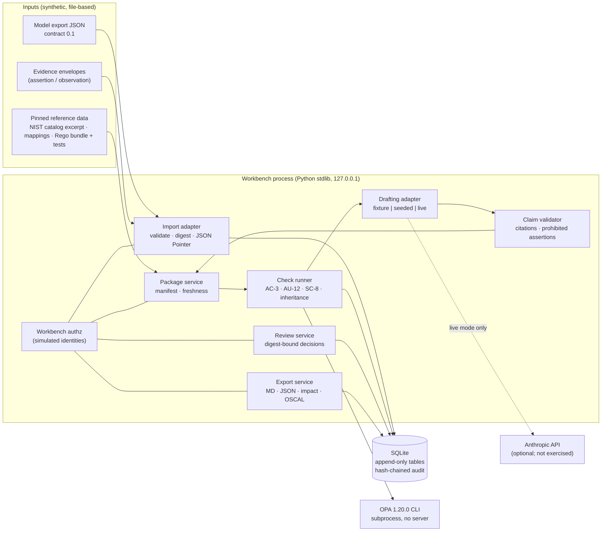

# Architecture note

## What exists (implemented and exercised)

Trust boundaries: (1) everything imported is an assertion until a check, bounded by its predicate,
says otherwise; (2) the drafter is untrusted: no tools, no writes, output validated; (3) OPA candidates
run in a temp directory with restricted capabilities and cannot touch the reviewed bundle; (4) review
and export transitions are decided only by the review/export services under a write lock.

## Key decisions and trade-offs

| Decision | Alternatives considered | Why this one | Revisit when |
|---|---|---|---|
| Stable namespaced ids (`cmp:`, `flow:`) for identity; JSON Pointers only for *citation* into immutable bytes | Pointer-as-identity; content hashing per element | Array positions move between revisions; ids survive. Pointers stay exact because they cite a digest-pinned snapshot | A real Cameo export supplies element UUIDs; map those to ids in the adapter |
| Conservative invalidation: any dependency-manifest change makes review STALE | Fine-grained invalidation from the impact graph | Impact analysis can be wrong; a false "still reviewed" is worse than an extra review. Impact report explains *what* to look at, not *whether* to re-review | Reviewer load becomes the bottleneck and impact analysis has measured recall |
| Evidence applicability is a separate function from check logic (environment, expiry, target revisions, status) | Let each check decide | One place to audit "why wasn't this report used"; the same rule applies to every control | More evidence types need type-specific applicability |
| Relational tables + explicit dependency fields | Graph database | Graph-shaped queries here are 1–2 hops; SQLite keeps it a single process, offline, easy to reset | Multi-program traversal or cross-model reuse queries |
| OPA via CLI subprocess | OPA server; embedded Go/WASM | No listening port, no API auth to configure, pinned binary with verified hash | Latency matters (≈90 ms/package build today, mostly subprocess spawn) |
| Validator is rules over structured claims | LLM-as-judge | Deterministic, testable, explainable; catches uncited, unresolvable, not-permitted, prohibited, overclaim | Need semantic support checking; then an LLM judge stays advisory next to human labels |
| Review is *document* review for the demo | Model RMF dispositions | The prototype must not imply assessor or AO authority | A customer defines its real workflow and roles |

## Reuse with a TTP-assistance prototype

Reusable as-is: source snapshots with digests and pointers, evidence envelopes and applicability,
claim/citation validator, digest-bound review with revocation and optimistic concurrency, run
manifests, hash-chained audit, evaluation harness shape (fresh DB per case, expected file, baseline).
**Not** reusable: the control semantics, obligations, SC-8/AU-12 predicates, Rego bundle and tests.
A TTP workflow would need its own source types (e.g., test reports, lessons learned), its own
deterministic checks (step references, prerequisite roles, decision points present) and domain SME review.

## Known limitations (true today)

- Identities are simulated; no authentication. Server is for localhost demos only (CSRF token, no TLS).
- A live model call happens inside the package transaction (holds the SQLite write lock while waiting).
- Export files are written before the export row commits; a failed commit can leave orphan files.
- The "overclaim" rule is a regex over implementation verbs; it will miss paraphrases.
- Append-only is enforced by triggers; the hash chain detects edits but an administrator can rebuild it.
- Fixture expiry dates end 2027-06-30; after that, evidence becomes inapplicable unless `DMMC_NOW` is pinned.
