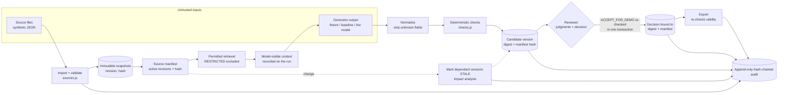

# Architecture note

A single Node.js process with modular services, SQLite persistence (`node:sqlite`), and a vanilla-JS UI. It has no runtime framework. The only runtime dependency is the Anthropic SDK, which is loaded lazily and only for the optional live generator.

## Pipeline

## Responsibility boundaries

| Component | Decides | Must not decide |
|---|---|---|
| Source store (`sources.js`) | Revision order (highest `revisionSeq` wins), content hashes, rejects overwrites and out-of-order revisions | Whether a source is true |
| Retrieval (`retrieve`) | Which passages are permitted for model context; records inclusions and exclusions | Which revision is authoritative (the manifest rule decides that) |
| Generator (`providers/`) | Suggests steps, claims, citations, gaps, conflicts, hypotheses | Status, permissions, currency calculations, source edits. Unknown output fields are stripped and reported (`normalizeContent`). |
| Checks (`checks.js`) | Citation resolution to the exact passage and quote, requirement coverage, missing observations, record conflicts, calibration date math, obsolete evidence, instruction-like text | Whether a real quote supports the claim. The H08 evaluation case shows this limit. |
| Review (`workbench.js` `judge`/`decide`/`revoke`) | Records identified reviewer judgments and decisions bound to the exact digest and manifest | That human presence guarantees correctness |
| Export (`exportVersion`) | Re-checks decision validity, state and blocking findings before producing a "reviewed" artifact | Reusing a revoked, superseded or stale decision |
| Evaluation (`evaluation.js`) | Runs fixed cases and records actual outcomes, with denominators | Inventing human scores; extrapolating to operational reliability |

## Key decisions and why

1. **Decisions bind to a candidate digest and a source-manifest hash.** A decision is valid only while both still match. Any source import changes the manifest, so every non-terminal version with the old manifest is marked `STALE` (`markStale`). This is deliberately conservative. Precision is provided separately by the impact view.
2. **Impact is claim-level; invalidation is manifest-level.** `impact()` classifies each claim as `REASSESS` (the cited passage changed, or a computed result changed) or `RECONFIRM` (the source was revised but the cited passage text is unchanged). Everything else is reported as unaffected.
3. **Judgments are keyed by claim digest.** The digest covers text, kind and exact cited snapshot ids. After regeneration, a judgment carries over only if the claim is byte-identical and cites the same revision. Claims that cite a revised source need a new judgment.
4. **Code owns numbers.** Calibration currency is a `computed` claim: the generator asks for it, and `runChecks` computes it from REQ-002's structured `maxCalibrationAgeDays` and the most recent certificate.
5. **Idempotent operations.** Every mutation carries an `opId`. The operation row is written in the same transaction as the mutation (`runOp`), so a retry after a crash returns the committed result. Generation has two phases, so a slow model call never holds a transaction open. Runs and operations that a crash leaves pending are reconciled at startup. This gives no exactly-once guarantee across external services.
6. **Append-only by application.** SQLite triggers reject updates and deletes on audit events and source snapshots, and reject changes to version content. Audit events are hash-chained, and the UI shows chain verification. These protections do not stop someone with direct database access.

## Data model

`source_snapshots` (SourceSnapshot) · `candidate_versions` (CandidateVersion: content JSON, digest, source manifest, checks) · `runs` (RunManifest: config and config hash, source manifest, model-visible context, raw output, stripped fields, usage, latency) · `support_judgments` (EvidenceLink support status, keyed by claim digest) · `review_decisions` (ReviewDecision) · `exports` · `operations` (idempotency) · `audit_events` (AuditEvent) · `eval_runs` / `eval_results` (EvaluationResult).

Model elements (ModelElement) are held in the structured payload of the simulated system-model snapshot, not in a separate table. Evidence links are embedded in claims and resolved by the checks at version creation.

## What a real system-model integration would need (not implemented)

- An adapter that exports elements and relationships with stable element ids and a model revision identifier into `source_snapshots`, keeping the original export for provenance.
- Agreement on which repository and revision is authoritative, and on what a "revision" means for a model that changes continuously.
- Element-level change detection, so impact analysis can work below the whole-snapshot level.
- Permission mapping from the model repository to `accessLabel`.
- Verification of product- and version-specific interfaces against vendor documentation. None have been checked here.
