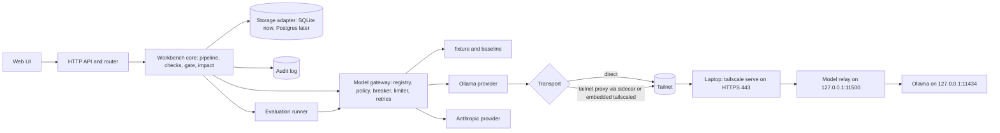
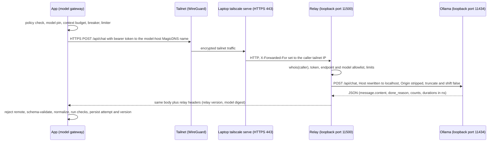

# Implementation brief v2: Procedure Evidence Workbench

| | |
|---|---|
| Version | 2.0, 2026-10-09. Supersedes v1 (`9af90aa`). |
| Code baseline | `claude/ttp-workbench-prototype-3t5kob` at `9af90aa` (20 tests passing; evaluation gate PASS) |
| Status | Proposed. Product decisions are listed in section 19 with a default for each. |
| Audience | Engineers and coding agents implementing the work |
| First priority | Live local models: the app reaches Ollama on the owner's laptop over Tailscale |

---

## 0. How to use this brief

**Language.** MUST, SHOULD and MAY are used as in RFC 2119. Requirements carry ids (for example `MG-07`) so pull requests, tests and reviews can cite them.

**Work packages.** Each one states its objective, requirements, design, interfaces, data changes, failure behavior, security, tests, acceptance criteria, out-of-scope items, size and dependencies. Sizes assume one engineer working with a coding agent: S is up to 1 day, M is 2–4 days, L is 1–2 weeks, XL is more than 2 weeks.

**Rules for implementers.**
1. **Keep each pull request small.** Each PR covers one work package, or one numbered step of a rollout plan.
2. **Keep the main branch green.** `npm test` and the deterministic evaluation gate (0 unsafe outcomes) MUST pass on every merge.
3. **Protect the invariants.** No PR may weaken an invariant in section 3 without a decision record in `docs/decisions/`.
4. **Record what you verified.** Each PR description lists the commands run and their results, and what could not be verified.
5. **Update the docs in the same PR.** That means `README.md`, `docs/ARCHITECTURE.md` and `docs/GAPS.md`.
6. **Label simulated components** in the UI, the exports and the reports until they are replaced.

**Verification tags.**
- **Verified 2026-10-09** means the fact was checked while writing this brief against upstream source code or documentation. Section 5.2 lists those facts.
- **VERIFY** means the implementer MUST confirm it against the installed version before relying on it.

---

## 1. Objectives and non-goals

**Objectives by phase.**

| Phase | Objective | Exit criterion |
|---|---|---|
| 0. Live models (M0–M2) | The app drafts with real models on the owner's laptop over Tailscale, safely and observably | A full demo path runs with a local model; the laptop going offline fails visibly; tailnet policy tests pass |
| 1. Evidence (M3) | Measure whether AI drafting helps | Committed report: live models vs template on held-out cases, labeled blind by two reviewers |
| 2. Pilot-ready (M4–M6) | Real documents, real review discipline, real sign-in | A pilot customer loads their own documents and reviews with two-person sign-off |
| 3. SaaS foundation (M7) | Multi-tenant, deployable, recoverable | Staging and production built from code; tenant-isolation tests and a restore drill pass |
| 4. Product depth (M8) | Scale and configurability | A second customer onboarded without code changes |
| 5. Enterprise and government (M9) | Assurance, disconnected edition, commercial operations | Disconnected edition installed from a package; audit package exported; billing live |

**Non-goals (in every phase).**
- **No operational approvals.** The system never publishes, approves or authorizes procedures by itself, and its states never claim operational approval.
- **No public exposure of model hosts.** Tailscale Funnel and any other public tunnel to the laptop are prohibited.
- **No unverified compliance claims.** Nothing claims FedRAMP, DoD Impact Level, ATO or Air Force process conformance until an assessor has confirmed it.
- **No training on customer data.**
- **No multi-agent orchestration** in the product. One controlled drafting call per run is enough.

---

## 2. Baseline (as built at `9af90aa`)

| Area | State |
|---|---|
| Runtime | Node 22 with `node:http` and `node:sqlite`, no framework. A vanilla-JS UI built with Vite. A browser-only build runs the same server code in the page (sql.js) and is hosted on GitHub Pages and as a claude.ai page. |
| Pipeline | Immutable source snapshots → manifest → permitted retrieval → generator → normalization → deterministic checks → candidate version → reviewer judgments and decision → export |
| Generators | `fixture` (deterministic stand-in with a seeded error, **not AI**), `baseline` (template), `anthropic` (written, **never run**). Generator dispatch is inline in `startRun()` in `server/workbench.js`. |
| Controls | Decisions bound to the candidate digest and the manifest hash; a transactional acceptance gate (rationale checked last); STALE marking; claim-level impact (REASSESS / RECONFIRM); idempotent operations; a hash-chained, append-only audit log |
| Tests and evaluation | 20 `node:test` tests, including a process-kill crash/retry test and a restart test. An 18-case suite with criteria declared in advance; gate PASS. |
| Simulated or missing | System-model data (hand-written JSON); identities (demo tokens); live models; ingestion; dual review; configurable checks; connectors; multi-tenancy; deployment pipeline |

---

## 3. Invariants

Every phase MUST keep these. Each has an enforcement point and at least one test.

| Id | Invariant | Enforced in | Existing or required test |
|---|---|---|---|
| I-1 | The model proposes; code decides state. Generator output never sets status, permissions or computed values. Unknown fields are stripped and reported. | `normalizeContent`, `decide` | "instruction-like source text grants no authority…"; "acceptance requires a reviewer judgment on every fact claim, and ignores client approval flags" |
| I-2 | Decisions bind to the exact candidate digest and source-manifest hash. Export re-checks validity in the same transaction. | `decide`, `exportVersion`, `decisionStatus` | "a requirement change marks the accepted version stale…"; "editing creates a new version…"; "revocation is retained in history…"; "a source import between load and accept rejects the stale decision" |
| I-3 | Nothing is overwritten. Revisions, versions, decisions and audit events are retained; revocation and supersession are new records. | DB triggers; later, privileges | "source history is never overwritten" |
| I-4 | Every displayed citation resolves to an exact retained passage, or is shown as failing. | `runChecks` | "every resolved citation points to the exact retained snapshot and passage span" |
| I-5 | Citation existence is separate from a reviewer's judgment of support. | `support_judgments` | Evaluation case H08 (`evaluation.test.js`) |
| I-6 | No silent fallback. A failed live run is recorded as FAILED, creates no version, and is never replaced by other output. | `startRun` | "a failed live-model run is explicit and never replaced by fixture output" |
| I-7 | Every mutation is idempotent by operation id and audited, including denials. | `runOp`, `reserveOp` | "operation ids are idempotent…"; "crash after commit: retrying the same opId…" (`process.test.js`) |
| I-8 | Simulated components are labeled in the UI, exports and reports. | UI, `renderExport` | "fixture and baseline runs are labeled in the version and the export" |
| I-9 (new) | **Data egress.** Content is sent only to providers the project's policy allows. Remote or cloud-hosted inference is denied unless explicitly allowed. | Model gateway (MG-16) | MG tests |
| I-10 (new) | **Configuration identity.** Every model output is attributable to an exact configuration hash that includes the model digest. An unpinned or drifted model cannot pass as an evaluated one. | Model gateway (MG-10, MG-11) | MG tests |

---

## 4. Target architecture

### 4.1 Components



### 4.2 Design principles

- **Ports and adapters.** The core does no direct I/O, so the same code runs in the server, the CLI and the browser build. Storage, models, ingestion, identity and notifications are adapters.
- **Gateway owns all model I/O.** The core never calls a provider directly. That puts egress policy, pinning, retries, limits and recording in one place.
- **The transport is independent of the provider.** How bytes reach the tailnet (direct, sidecar, embedded, browser) is separate from what is spoken (the Ollama API).
- **Untrusted at every hop.** Model output, source text and relay responses are treated as untrusted and validated.

### 4.3 Deployment topologies

| Id | Topology | Model connectivity | Use |
|---|---|---|---|
| T1 | Developer machine already on the tailnet | `direct` | Development, first live runs |
| T2 | Single-host pilot (Docker Compose: app plus Tailscale sidecar) | `tailnet-proxy` (sidecar) | Pilot, demos with a live model |
| T3 | Hosted static demo (GitHub Pages) | none by default; optional `browser-direct` | Public demo; live model only from a viewer device on the tailnet |
| T4 | SaaS (container service) | `tailnet-proxy` per environment; later `runner-agent` per tenant | Production |
| T5 | Disconnected on-premises | LAN `direct` to a local relay (no Tailscale coordination server) | Customer enclaves |

### 4.4 Repository layout changes

```
server/core/            pipeline, checks, gate, impact (moved from server/*.js; storage only through the adapter)
server/gateway/         gateway.js, registry.js, policy.js, breaker.js, limiter.js, errors.js
server/gateway/providers/  fixture.js, baseline.js, anthropic.js, ollama.js, shared-prompt.js
server/gateway/transports/ direct.js, tailnet-proxy.js, browser-direct.js
server/tailnet/         supervisor.js (embedded tailscaled), status.js
relay/                  laptop model relay (Node 22, stdlib only), doctor script, service files
deploy/compose/         pilot compose files (app + tailscale sidecar; model-host variant)
deploy/terraform/       Phase 3 infrastructure (SaaS foundation)
docs/decisions/         decision records
docs/runbooks/          laptop model host, tailnet policy, incident procedures
```

Moving files to `server/core/` is a separate, behavior-preserving PR (MG step 1). The browser build's aliases MUST be updated in the same PR.

---

## 5. Workstream MG: model gateway and local models over Tailscale (first priority)

### 5.1 Objective

Make real models usable by the app, starting with Ollama on the owner's laptop, reached over Tailscale. It must be safe (no public exposure, strict data egress), reproducible (models pinned by digest), observable (health, breaker, metrics) and failure-explicit (invariant I-6). The same gateway and relay later serve the disconnected edition (section 15.4) and SaaS tenants (section 13.8).

### 5.2 Facts this design relies on (verified 2026-10-09)

Checked against upstream sources: Ollama `docs/api.md`, `docs/faq.mdx`, `api/types.go`, `envconfig/config.go` and `server/routes.go`; Tailscale `cmd/containerboot/main.go`, `cmd/tailscaled/*.go` and `ipn/ipnlocal/serve.go`; `tailscale/github-action` v4. Also observed directly from this environment.

**Ollama**

| # | Fact | Consequence for the design |
|---|---|---|
| F1 | Binds `127.0.0.1:11434` by default (`OLLAMA_HOST` changes it). | Keep the default. Never bind `0.0.0.0` on the laptop. |
| F2 | When bound to loopback, it **rejects with 403** any request whose `Host` header is not `localhost`, the machine hostname, `*.localhost`, `*.local`, `*.internal`, or a loopback, private, unspecified or local-interface IP. Its own docs tell proxies to send `Host: localhost:11434`. | Anything in front of Ollama MUST rewrite `Host`. |
| F3 | Default allowed CORS origins are `127.0.0.1` and `0.0.0.0`; more can be added with `OLLAMA_ORIGINS`. | The relay strips `Origin` before forwarding, and handles CORS itself. |
| F4 | `POST /api/chat` takes `model`, `messages`, `format` (`"json"` or a **JSON schema**), `options`, `stream`, `keep_alive`, `think`, `truncate` and `shift`. All durations come back in **nanoseconds**. The response has `done_reason`, `prompt_eval_count` and `eval_count`, and on thinking models `message.thinking`. | Structured output by schema; time units converted; thinking stored separately. |
| F5 | In chat, `truncate: true` cuts history when the rendered prompt exceeds the context length, and `shift: true` shifts history when generation reaches the limit instead of erroring. **Both default to true when omitted.** | Without explicit `truncate: false` and `shift: false`, an oversized prompt can silently drop source passages while the run record claims the model saw them. Always send both as false (VERIFY the minimum Ollama version that supports them, and the status and message of the resulting error). |
| F6 | The default context length depends on version and available memory (4k to 256k); `OLLAMA_CONTEXT_LENGTH` overrides it. | Always set `options.num_ctx` explicitly per request. |
| F7 | `GET /api/tags` returns each model's `name`, `digest`, `size` and `details` (family, parameter size, quantization). `GET /api/version` returns the server version. `POST /api/show` returns model information. | Pin models by digest; record the server version. |
| F8 | Models can run remotely ("cloud" models): show and chat responses can carry `remote_host` and `remote_model`. `OLLAMA_NO_CLOUD=1` disables remote inference. | Laptop sets `OLLAMA_NO_CLOUD=1`; relay and gateway reject any model or response with `remote_host` set. |
| F9 | When busy it answers 503 (queue size `OLLAMA_MAX_QUEUE`, default 512). `OLLAMA_NUM_PARALLEL` defaults to 1. `OLLAMA_MAX_LOADED_MODELS` defaults to 3 per GPU (or 3 on CPU). Memory scales with parallel requests times context length. | 503 is retryable with backoff. Concurrency is 1 by default. Keep the queue small. |
| F10 | `OLLAMA_DEBUG_LOG_REQUESTS` writes request bodies to disk. | MUST be unset on the laptop (data handling). |
| F19 | A chat request with an empty `messages` array loads the model into memory, and adding `keep_alive: 0` unloads it. Environment variables are set with `launchctl setenv` on macOS, `systemctl edit ollama.service` on Linux, and the account's environment variables on Windows, followed by an Ollama restart. | Warm-up before evaluation batches (MG-25); the laptop runbook uses the per-OS method. |

**Tailscale**

| # | Fact | Consequence for the design |
|---|---|---|
| F11 | `tailscale serve --bg --https=443 <target>` exposes a local server inside the tailnet only (Funnel is the separate public command), and `--bg` keeps the configuration across restarts. Targets can be `http://`, `https://`, `https+insecure://`, or on Unix-like systems a Unix socket (`unix:/path`). A trailing `off` removes one configuration; `serve reset` clears all of them. | The relay is published only with `serve`, never `funnel`. Removal uses `off`, never `reset`. |
| F12 | `serve` forwards **the incoming `Host`** (for example `model-host.<tailnet>.ts.net`) to its proxy target. Combined with F2, `serve` pointed straight at Ollama returns 403. | A relay that rewrites `Host` is required, not optional. |
| F13 | `serve` sets `X-Forwarded-For` (overwriting any value the client sent) to the caller's tailnet IP, plus `X-Forwarded-Host` and `X-Forwarded-Proto`. It sets `Tailscale-User-Login`, `Tailscale-User-Name` and related headers **only for callers on user-owned (untagged) devices**, and strips any such headers the client sent. Non-ASCII values are MIME Q-encoded. | The relay can identify callers: tagged nodes through `whois` on `X-Forwarded-For`, user devices through the identity headers (decoded before comparison). |
| F14 | `tailscale whois [--json] [--proto tcp\|udp] ip[:port]` returns the caller's node (including its tags) and user profile, plus a `CapMap` of application capabilities that the tailnet policy grants that caller on this device. | The relay authorizes by tag or user, and can optionally take model permissions from the central tailnet policy (RL-04). |
| F15 | `tailscaled` supports `--tun=userspace-networking`, `--statedir`, `--state=mem:` (ephemeral) and `--socket`. Its outbound proxies are `--socks5-server` and `--outbound-http-proxy-listen`, and they dial through Tailscale's dialer. | Lets the app reach the tailnet without a TUN device or root (embedded mode). |
| F16 | The official container (`tailscale/tailscale`, containerboot) accepts:<br>• credentials: `TS_AUTHKEY`, or `TS_CLIENT_ID` with `TS_CLIENT_SECRET` (an OAuth client), or `TS_CLIENT_ID` with `TS_ID_TOKEN` or `TS_AUDIENCE` (workload identity federation). The key, secret and token accept `file:` paths. `TS_AUTHKEY` is mutually exclusive with the client variables, and `TS_CLIENT_SECRET`, `TS_ID_TOKEN` and `TS_AUDIENCE` cannot be combined;<br>• `TS_EXTRA_ARGS`, `TS_STATE_DIR`, `TS_USERSPACE` (on by default), `TS_SOCKS5_SERVER`, `TS_OUTBOUND_HTTP_PROXY_LISTEN`, `TS_AUTH_ONCE`, `TS_SERVE_CONFIG`;<br>• `TS_ENABLE_HEALTH_CHECK` with `TS_LOCAL_ADDR_PORT` (a `/healthz` that returns 200 once the node has a tailnet IP). | Sidecar mode without long-lived auth keys. |
| F17 | `tailscale/github-action@v4` joins CI to the tailnet with an OAuth client (`oauth-client-id`, `oauth-secret`) or workload identity federation (`oauth-client-id`, `audience`; Tailscale 1.90.1 or later; the workflow needs `id-token: write`), plus `tags` and `ping` (waits up to 3 minutes for a peer). | CI live runs without stored long-lived secrets. |
| F18 | **This Claude Code cloud environment cannot reach Tailscale.** `controlplane.tailscale.com`, `login.tailscale.com`, `derp1.tailscale.com` and `pkgs.tailscale.com` all failed to connect from the session that wrote this brief. | Cloud agent sessions cannot do live runs today (see TR-6). |

### 5.3 End-to-end path



### 5.4 Gateway requirements (app side)

| Id | Requirement |
|---|---|
| MG-01 | **Provider interface.** Every generator is a provider implementing the contract in Appendix C: `describe()`, `health()`, `listModels()`, `generate(request, {signal})`, and optionally `embed()`. `fixture` and `baseline` become providers with no behavior change. |
| MG-02 | **Request envelope** (Appendix C). It MUST carry `runId`, `attemptNo`, `opId`, the model reference (name plus expected digest), prompt version and prompt hash, output schema and schema hash, options, deadline, data class and the project policy snapshot. |
| MG-03 | **Result envelope.** It MUST carry the raw text, parsed JSON, usage (input and output tokens; total and load time in ms), the served model, digest and provider version, `done_reason`, transport details (kind, endpoint host, relay version) and all attempts. |
| MG-04 | **Error taxonomy.** Every failure maps to exactly one code in Appendix A, which also gives retryability and the resulting run status. Raw provider errors MUST NOT reach the UI. |
| MG-05 | **Retries.** Retry only the codes Appendix A marks retryable (`PROVIDER_UNAVAILABLE`, `PROVIDER_OVERLOADED`, `TAILNET_UNREACHABLE`), at most 2 retries within the deadline, with exponential backoff and jitter, honoring `Retry-After`. Never retry silently on invalid output. An optional "repair attempt" (off by default) is a new, recorded attempt with its own raw output. Every attempt is persisted (MG-21). |
| MG-06 | **Timeouts and cancellation.** Connect timeout 5 s. Total deadline per request 300 s by default, which allows for a cold model load. Use `AbortController`. Cancelling a run aborts the request, and the run ends CANCELLED. A laptop that sleeps mid-call leaves the connection silent rather than closed, so during calls longer than 30 s the gateway probes `/relay/healthz` every 15 s. Three consecutive probe failures abort the call with `PROVIDER_UNAVAILABLE` in about a minute instead of at the deadline. |
| MG-07 | **Concurrency.** A semaphore per provider endpoint (default 1, matching F9) with a bounded queue (default 8). The evaluation runner uses the same semaphore. A full queue fails fast with `PROVIDER_BUSY`. |
| MG-08 | **Circuit breaker** per endpoint. Closed, then open after 3 consecutive transport failures, then half-open after a 60 s cooldown with a `GET /api/version` probe. While open, requests fail immediately with `CIRCUIT_OPEN`, and the UI shows the state and when the endpoint was last seen. |
| MG-09 | **Health and discovery.** `health()` calls `/api/version` (enforcing a minimum version, MG-22), `/api/tags`, `/api/show` for allowlisted models, and `/relay/info`. Results are cached for 60 s. Transport health (MG-24) is reported alongside. |
| MG-10 | **Model pinning.** Projects allow models by name **and** digest. If the served digest differs from the pinned one, the run fails with `MODEL_DIGEST_MISMATCH`. The registry UI shows drift ("model changed on host since evaluation"). |
| MG-11 | **Configuration hash.** It covers: provider; model name and digest; provider major.minor version; prompt version and prompt hash; schema hash; options (temperature, seed policy, `num_ctx`, `num_predict`, `think`, top_p); retrieval configuration; check-pack version. Transport kind, hostnames and IPs are excluded because they do not change model output, so moving the laptop or switching from `direct` to `proxy` keeps the identity. They are recorded on the run. |
| MG-12 | **Context budget.** Estimate prompt tokens conservatively (characters ÷ 3, counting system prompt, passages and schema). Require estimate + `num_predict` ≤ `num_ctx`; otherwise fail with `CONTEXT_TOO_LARGE` before sending. With the defaults that allows 12,288 prompt tokens of 16,384. For scale: the seeded PSK-7 prompt is about 2,400 characters (15–16 passages) plus about 1,900 characters of schema, roughly 1,500 tokens by this estimate; real documents (workstream IN) will be far larger. Always send `truncate:false, shift:false` (F5). After the response, if `prompt_eval_count` ≥ `num_ctx` − 32, fail with `CONTEXT_TRUNCATED`. This check is one-sided: prompt caching can make the count low, so a low count proves nothing. Record the estimate, `num_ctx` and `prompt_eval_count`. |
| MG-13 | **Structured output.** Send `format: OUTPUT_SCHEMA`. Then parse and validate against the schema in the app (`OUTPUT_INVALID_JSON` or `OUTPUT_SCHEMA_INVALID`), then apply the existing `normalizeContent`. `done_reason: "length"` fails with `OUTPUT_TRUNCATED`. Cap `num_predict` (default 4096). Keep the schema to the subset that grammar-constrained decoding handles well: objects, arrays, strings, enums, `required` and `additionalProperties`, which is all the current schema uses. Avoid `$ref`, `oneOf`, `pattern` and `format` (VERIFY against the installed version). App-side validation is authoritative either way. |
| MG-14 | **Thinking models.** Default `think: false`. If a pinned model requires thinking, `message.thinking` is stored in the attempt record, access-restricted, never parsed and never shown to reviewers by default. The `think` setting is part of the configuration hash. |
| MG-15 | **Determinism.** Temperature 0 by default. The seed comes from a hash of the operation id and is recorded. Evaluation repeats use explicit seeds. Reports state that results can still vary across hardware and server versions. |
| MG-16 | **Egress policy (I-9).** Each project has `dataClass` (`SYNTHETIC`, `INTERNAL`, `RESTRICTED`) and `allowedProviders`. The gateway refuses with `EGRESS_POLICY_DENIED` if content would go to a disallowed provider. Remote models (F8) are refused unless the project explicitly allows them. The laptop endpoint is labeled "non-production model host" and is allowed for `SYNTHETIC` by default only. |
| MG-17 | **Logging.** Never log prompts, passages or outputs. Log hashes, sizes, model, digest, latency, attempt number and error code. Raw outputs are stored in the database with access control and a retention policy. |
| MG-18 | **Secrets.** Relay tokens and Tailscale credentials live only server-side (secret files or a secret manager) and never in browser bundles, the repo or logs. The static build contains no secrets. |
| MG-19 | **UI.** The generator picker shows each allowed model with a health badge (online, offline, drift, busy) and when it was last seen. Run details show transport, relay version, model and digest, tokens, timings and attempts. Failures show a plain message plus the code. |
| MG-20 | **API.** `GET /api/providers` returns health, models with digests, breaker state and transport status, with no secrets. `POST /api/providers/:id/probe` (admin only) forces a health check. |
| MG-21 | **Persistence.** A new `run_attempts` table holds: `run_id`, `attempt_no`, `started_at`, `finished_at`, `status`, `error_code`, `http_status`, `served_model`, `served_digest`, `provider_version`, `usage_json`, `raw_output` (restricted), `thinking` (restricted), `transport_json`. The `runs` row keeps the summary. Run statuses stay `RUNNING`, `SUCCEEDED`, `FAILED` and `INTERRUPTED` (set at startup for runs left `RUNNING`), plus a new `CANCELLED`. Attempt rows left open by a restart are closed as `INTERRUPTED` too. |
| MG-22 | **Minimum provider version.** `OLLAMA_MIN_VERSION`, set by the implementer after checking that F4 and F5 are supported. Older servers fail with `PROVIDER_VERSION_UNSUPPORTED`. |
| MG-23 | **Browser build.** Live providers stay aliased out of the browser build unless `browser-direct` (TR-4) is explicitly compiled in. In both cases no secrets are present. |
| MG-24 | **Transport health** is reported per mode: direct (DNS and TCP reachability of the relay), sidecar (`/healthz` from F16), embedded (`tailscale status --json`: backend state `Running` plus tailnet IPs). |
| MG-25 | **Warm-up.** Before an evaluation batch, and optionally when a user opens the generator picker, the gateway MAY load the model with an empty chat request (F19). Load time is recorded separately and never counted as generation latency. |
| MG-26 | **HTTP client timeouts.** Node's `fetch` (undici) has default header and body timeouts of 300 s. With `stream:false`, response headers arrive only after generation finishes, so a slow cold load plus a long output can hit the header timeout before the gateway's own deadline. Configure the dispatcher's `headersTimeout` and `bodyTimeout` explicitly from `MODEL_TIMEOUT_MS`, and let the gateway's `AbortController` be the single source of truth for the deadline. |
| MG-27 | **Error-code migration.** The existing Anthropic adapter's codes map to Appendix A: `PROVIDER_TRUNCATED` becomes `OUTPUT_TRUNCATED`, `PROVIDER_BAD_OUTPUT` becomes `OUTPUT_INVALID_JSON`, and `PROVIDER_REFUSAL` and `PROVIDER_UNAVAILABLE` are kept. Runs stored with old codes stay readable; the UI maps both spellings. |

#### 5.4.1 Gateway call sequence (normative order)

Each step either passes or ends the attempt with the named code. Steps 1–5 send nothing, so their failures are "not attempted".

1. Resolve the provider and model from the project allowlist (`MODEL_NOT_ALLOWED`).
2. Apply the egress policy for the project's data class (`EGRESS_POLICY_DENIED`, `MODEL_REMOTE_REJECTED` when the health cache shows `remote_host`).
3. Check the breaker (`CIRCUIT_OPEN`) and the transport health (`TAILNET_UNREACHABLE`).
4. Build the prompt, compute the prompt and schema hashes and the configuration hash, and apply the context budget (`CONTEXT_TOO_LARGE`).
5. Acquire the endpoint semaphore (`PROVIDER_BUSY` when the queue is full).
6. Insert the `run_attempts` row in its own transaction **before** sending, so a crash mid-call leaves evidence of the attempt.
7. Check the model digest against the pin, using the health cache refreshed if older than 60 s (`MODEL_DIGEST_MISMATCH`).
8. Send with the deadline. A transient transport error goes back to step 6 as a new attempt, within the MG-05 limits.
9. Check the served identity: refuse any response with `remote_host`, and compare the relay's `X-Model-Digest` with the pin. Without a relay, re-read `/api/tags` after the call. A digest that changed during the call fails the attempt.
10. Check `done_reason`, then parse and validate the output (`OUTPUT_*`).
11. Finish the attempt row and release the semaphore. The core then normalizes, runs checks and creates the version in its existing transaction. A failure in any step leaves the run FAILED with no version (I-6).

### 5.5 Transports: how the app reaches the tailnet

| Id | Mode | When to use | How it works | Requirements |
|---|---|---|---|---|
| TR-1 | `direct` | T1: the app host is already on the tailnet (the Tailscale app is installed) | `fetch` with the MG-26 dispatcher to `https://model-host.<tailnet>.ts.net` | MUST verify TLS normally. No proxy. |
| TR-2 | `tailnet-proxy` via **sidecar** | T2 and T4 (Compose, ECS, Kubernetes) | Official `tailscale/tailscale` container in userspace mode. The app shares the sidecar's network namespace, and the sidecar runs an HTTP proxy on `127.0.0.1:1055`. The gateway sends **only model traffic** through the proxy, using `fetch` and `ProxyAgent` from the same pinned `undici` package. Mixing the package's dispatcher with Node's built-in `fetch` can fail across undici versions. | Credentials through an OAuth client (`TS_CLIENT_ID`, `TS_CLIENT_SECRET=file:…`) with `--advertise-tags=tag:workbench-app`. App readiness waits for the sidecar `/healthz`. State on a volume, or `mem:` for stateless tasks. The proxy resolves MagicDNS names through Tailscale's dialer (VERIFY with a smoke request). TLS to the relay verifies normally, because `serve` certificates are publicly trusted. Kernel mode is optional and needs `NET_ADMIN` and `/dev/net/tun`, which many managed runtimes do not allow (VERIFY for the chosen runtime); the default is userspace. Example in Appendix E. |
| TR-3 | `tailnet-proxy` via **embedded supervisor** | A single host without an orchestrator (VM, bare metal) | The app starts and supervises `tailscaled --tun=userspace-networking --state=mem: --socket=<dir>/ts.sock --outbound-http-proxy-listen=127.0.0.1:1055`, then runs `tailscale --socket=… up --auth-key=… --hostname=… --advertise-tags=tag:workbench-app`. It restarts with backoff and becomes ready when `tailscale status --json` reports `Running`. On graceful shutdown it runs `tailscale logout` (which removes the ephemeral node at once) and then stops `tailscaled`. After a crash, the ephemeral node is removed some time after it goes offline (VERIFY the delay). | Tailscale binaries pinned by version and SHA-256 and fetched by a build step, not at runtime. The auth key comes from an OAuth client (VERIFY the `?ephemeral=true&preauthorized=true` suffix format). Supervisor logs carry no secrets. |
| TR-4 | `browser-direct` (optional, off by default) | T3: the static demo, when the **viewer's device** is on the tailnet | The browser calls the relay URL directly. The relay authorizes by Tailscale user identity headers (F13); no token, because a static page cannot keep secrets. | Off unless the page is opened with `#local-model` and the build includes it. The relay allows CORS for exact origins only. Note that `https://cal2020.github.io` is shared by **every** GitHub Pages site of that account. Browsers increasingly gate requests from public pages to private addresses. Chrome's Local Network Access, the successor to Private Network Access, can require the viewer to grant permission, and tailnet addresses (`100.64.0.0/10`) may count as local. The relay still answers the older preflight (`Access-Control-Request-Private-Network` → `Access-Control-Allow-Private-Network: true`). VERIFY behavior per browser. The UI shows "Calling your tailnet model host". |
| TR-5 | `runner-agent` (Phase 3, with the SaaS foundation) | SaaS tenants, or networks where inbound access is impossible | An outbound-only agent next to the model host polls the app's job API over HTTPS with short-lived credentials, calls its local relay or Ollama, and posts signed results bound to the job id and configuration hash | Same envelopes as MG-02 and MG-03. Job leases with heartbeats. Detailed in section 13.8. |
| TR-6 | Claude Code cloud sessions | Agents building this project | **Blocked today** (F18) | To enable, the environment's network access settings must allow the Tailscale domains: control and login, DERP relays, the log server and packages. Even then, `tailscaled` must work through the environment's TLS-intercepting proxy, which is unverified: the HTTP upgrades used by the control and DERP connections may not survive interception, and direct UDP is unlikely to be available. Until verified, live runs happen on T1, T2 or CI. Agents still build and test everything against stub servers. |

**Prohibited in every mode:**
- Tailscale Funnel;
- binding Ollama or the relay to `0.0.0.0`;
- auth keys or relay tokens in client code, the repo or logs;
- disabling TLS verification;
- routing non-model traffic through the tailnet proxy.

### 5.6 Model relay (runs on the laptop)

A small service in this repo (`relay/`, Node 22, standard library only) that sits between `tailscale serve` and Ollama. It is required, because of F12. It also enforces identity and allowlist policy on the host itself.

| Id | Requirement |
|---|---|
| RL-01 | **Binding.** Listens on `127.0.0.1:11500` only. It is published with `tailscale serve --bg --https=443 http://127.0.0.1:11500`, and forwards to `http://127.0.0.1:11434` with `Host: localhost:11434`.<br>• **Port 443 already served on the laptop:** use another HTTPS port (for example `--https=8443`). `OLLAMA_BASE_URL` and the policy's destination port then change to match. `relay:init` checks `tailscale serve status --json` first and never overwrites an existing handler.<br>• **Linux option:** listen on a Unix socket instead (`tailscale serve --bg --https=443 unix:/run/workbench-relay/relay.sock`, mode 0660). Other local users then cannot reach the relay or forge identity headers. macOS keeps loopback TCP, because the Tailscale app's sandbox may not reach arbitrary sockets (VERIFY).<br>• **Removal:** `tailscale serve --https=443 off`, never `serve reset` (F11). |
| RL-02 | **Header hygiene.** Strip `Origin`, `Referer`, `Cookie`, `Authorization` and any `Tailscale-*` headers before forwarding. Add `X-Relay-Version` and `X-Model-Digest` to responses. |
| RL-03 | **Endpoint allowlist.** `GET /api/version`, `GET /api/tags` (filtered to the allowlist), `POST /api/show` (allowlisted models), `POST /api/chat` (`stream:false` only at first), `POST /api/embed` (allowlisted embedding models), `GET /relay/healthz`, `GET /relay/info`. Everything else returns 404. Pull, delete, create, copy and push are never reachable over the tailnet. |
| RL-04 | **Caller identity.**<br>• **Trust boundary.** Trust `X-Forwarded-For` only because the relay listens on loopback (or a restricted socket), where only `serve` and local processes can reach it. Requests without `X-Forwarded-For` did not come through `serve`; they are refused on every endpoint except `/relay/healthz`, `/relay/info` and `/relay/metrics`, which the doctor uses. Requests through `serve` go through the full pipeline below, except `/relay/healthz`.<br>• **Lookup.** Run `tailscale whois --json --proto tcp <ip>` (CLI path configurable for macOS app installs) and cache the result for 60 s. On Linux, VERIFY that the relay's user can run `whois` (read access to the local API; `tailscale set --operator=<user>` grants it).<br>• **Decision.** Allow the caller if its node tags intersect `allowedTags`, or its login is in `allowedUsers`. Otherwise return 403 `RELAY_UNAUTHORIZED`. Identity headers from `serve` are Q-decoded and must agree with `whois`.<br>• **Optional central policy.** Read per-caller model permissions from an application capability in the tailnet policy, for example `example.com/cap/model-relay` with `{ "models": [...] }`, returned in the whois `CapMap` (F14, Appendix D). Access is then managed in one place for the whole tailnet. |
| RL-05 | **Bearer token** (defense in depth). Required for tagged callers (app and CI). Tokens are stored as SHA-256 hashes with ids, several can be valid at once for rotation, and they are compared in constant time. Callers on user devices (`browser-direct`) are authorized by identity alone. |
| RL-06 | **Model policy.** Allowlist by name and digest. A drifted digest is refused unless `allowDrift` is set. Any model or response with `remote_host` is refused (F8). Clamp `num_ctx` to the model's `maxCtx` and `num_predict` to `maxNumPredict`. Force `stream:false`, `truncate:false` and `shift:false`. Keep `keep_alive` within bounds. |
| RL-07 | **Limits.** Maximum body size (default 2 MB). Global concurrency equal to `OLLAMA_NUM_PARALLEL` with a bounded queue. A per-caller token bucket (default 30 per minute). When saturated, return 429 with `Retry-After`. Map Ollama 503 to 503 with `Retry-After`. Timeout on the Ollama call. |
| RL-08 | **CORS** (only when `browserOrigins` is non-empty). Exact-match origins, `OPTIONS` handling, and the Private Network Access response header (TR-4). |
| RL-09 | **Logging.** One structured line per request: time, caller node and tags, endpoint, model, digest, request bytes, tokens, durations, status. Never log content. `/relay/metrics` answers only local requests and refuses anything that came through `serve`. |
| RL-10 | **Configuration.** `relay.config.json` (Appendix F) plus environment overrides, validated at startup (fail fast). Reloads on `SIGHUP`. |
| RL-11 | **Packaging.** `npm run relay`. Service definitions: a launchd plist for macOS, a systemd unit for Linux, and instructions for Windows. `npm run relay:install-service` installs the one for the current OS. The service starts after the network is up and restarts on failure. |
| RL-12 | **Doctor.** `npm run relay:doctor` checks the laptop runbook (section 5.8) and prints PASS or FAIL per item. Release readiness requires all PASS. |
| RL-13 | **Versioned contract.** `GET /relay/info` returns `relayVersion`, `protocol: 1`, `ollamaVersion`, models (name, digest, kind, maxCtx), limits and availability windows. The gateway checks the protocol version. |
| RL-14 | **Error contract.** Relay-generated errors are JSON `{ "error": { "code", "message", "retryAfterSec"? } }` with these codes:<br>• `NOT_FOUND` (404)<br>• `BODY_TOO_LARGE` (413)<br>• `RELAY_UNAUTHORIZED` (401 or 403)<br>• `MODEL_NOT_ALLOWED` (403)<br>• `MODEL_DIGEST_MISMATCH` (409)<br>• `MODEL_REMOTE_REJECTED` (502)<br>• `RATE_LIMITED` (429)<br>• `UPSTREAM_BUSY` (503)<br>• `UPSTREAM_UNAVAILABLE` (502)<br>• `UPSTREAM_TIMEOUT` (504)<br>• `UPSTREAM_ERROR`, which passes Ollama's own status and message through.<br>The gateway maps these with Appendix A.2. |
| RL-15 | **Init.** `npm run relay:init` does the setup that is easy to get wrong:<br>• reads `/api/tags` and writes `relay.config.json` with the chosen models and their digests;<br>• generates a token, prints it once and stores only its hash;<br>• checks for an existing `serve` handler on the chosen port;<br>• prints the exact `tailscale serve` command and policy snippet for this device. |
| RL-16 | **Disconnects and timeouts.** When the caller disconnects, abort the upstream request so Ollama stops generating (VERIFY that Ollama cancels on request cancellation). The upstream call uses `node:http`, which keeps the relay free of dependencies and avoids `fetch`'s 300 s defaults (MG-26), with an explicit overall deadline (`upstreamTimeoutMs`). The relay MAY stream from Ollama and aggregate, which allows a stall timeout (no tokens for N seconds) separate from the total deadline. The app-facing response stays non-streaming in protocol 1. |

**Relay request pipeline (normative order).**
1. Check method and path against the endpoint allowlist (`NOT_FOUND`).
2. Check body size (`BODY_TOO_LARGE`).
3. Identify the caller by `X-Forwarded-For` and `whois` (`RELAY_UNAUTHORIZED`).
4. Check the bearer token for tagged callers (`RELAY_UNAUTHORIZED`).
5. Take a token from the caller's rate bucket (`RATE_LIMITED`).
6. Parse JSON and check the model against the allowlist and the cached digest from `/api/tags`, refreshed every 30 s (`MODEL_NOT_ALLOWED`, `MODEL_DIGEST_MISMATCH`).
7. Rewrite the body: force `stream:false` (app-facing), `truncate:false` and `shift:false`, clamp `num_ctx`, `num_predict` and `keep_alive`.
8. Acquire a concurrency slot (`UPSTREAM_BUSY` when the queue is full).
9. Forward with the rewritten `Host`, the stripped headers and the timeout.
10. Inspect the response. If `remote_host` is present, discard the body and return `MODEL_REMOTE_REJECTED`.
11. Return the body with the relay headers, and write the metadata log line.

**Relay threat model.**

| Threat | Control |
|---|---|
| Model host reachable from the internet | `serve` only (never `funnel`); loopback binds; doctor check |
| Unauthorized tailnet device calls the model | Tailnet ACL (section 5.7) plus relay `whois` allowlist plus token |
| Spoofed identity headers from tailnet callers | `serve` strips client-sent `Tailscale-*` headers and overwrites `X-Forwarded-For` (F13); identity is confirmed with `whois` |
| Local process on the laptop forges headers or calls Ollama directly | Accepted risk: a local process can reach Ollama on 11434 without the relay, so the relay does not defend against the laptop itself. The laptop is a trusted, non-production host; doctor checks posture (5.8). On Linux, the Unix-socket option (RL-01) stops other local users from reaching the relay. |
| Remote model management (pull or delete) through the tailnet | Endpoint allowlist (RL-03) |
| Silent model swap | Digest pinning (RL-06, MG-10) |
| Data left on the laptop | No content logging; `OLLAMA_DEBUG_LOG_REQUESTS` unset; synthetic or approved data only |
| Resource exhaustion | Size, concurrency, rate and time limits (RL-07) |
| Prompt injection through source text | Unchanged app-side controls (I-1); the relay does not interpret content |

### 5.7 Tailnet policy, identity and keys

**Identity of the laptop.** Choose one:
- **Option A (default for a personal laptop):** keep the laptop user-owned and refer to it in policy by a `hosts` alias with its tailnet IP. User identity and the normal key-expiry behavior are unchanged.
- **Option B (for a dedicated model machine):** tag it `tag:model-host`. Tagged devices lose user identity, and key expiry behaves differently (VERIFY); this suits a box that does nothing else.

**Tags.**
- `tag:workbench-app` for app servers, sidecars and embedded nodes.
- `tag:workbench-ci` for CI runners.
- `tag:model-host` (Option B only).
- Tag owners: `autogroup:admin`.

**Policy.** Appendix D gives the policy snippet and its `tests`. Four rules apply:
1. **Merge, don't replace.** Merge the snippet into the existing tailnet policy. Replacing a default allow-all policy would cut off other access.
2. **Policy tests are required.** The `tests` block asserts that the app and CI can reach the relay on 443, and that nothing can reach 11434 or 11500.
3. **Mind the default allow-all rule.** If the tailnet still has the default rule letting every device reach every port, the `deny` assertions fail and the policy will not save. Either narrow the default rule first (recommended), or leave out the `deny` assertions until then. Loopback binding is the primary control for 11434 and 11500; the policy is the second layer.
4. **Change through review.** Policy changes are reviewed like code. Keep a copy in `docs/runbooks/tailnet-policy.hujson`.

**Keys and credentials.**
- **Never use personal auth keys** for servers or CI.
- **Use an OAuth client.** Scope it to writing auth keys, limit it to tags `workbench-app` and `workbench-ci`, and keep it in the secret manager. Nodes use ephemeral, pre-authorized keys generated from it.
- **CI without stored secrets.** Prefer workload identity federation (F17, Tailscale 1.90.1 or later). Fall back to the OAuth client.
- **Rotation and revocation.** Rotate the OAuth secret and relay tokens every 90 days and on any suspected exposure. The revocation runbook covers: delete the OAuth client or key, remove the nodes, rotate relay tokens, review relay logs.
- **Device approval.** If the tailnet requires approval, pre-authorized keys cover tagged nodes, and approval applies to user devices.
- **Audit logs.** Enable the tailnet's configuration audit logs, and network flow logs if the plan includes them (VERIFY the plan).

**Certificates.** HTTPS through `serve` needs MagicDNS and HTTPS certificates enabled for the tailnet. Certificate names are published in public Certificate Transparency logs, which reveals the tailnet name and device name. Choose a neutral device name for the model host.

### 5.8 Laptop model host runbook (checked by `relay:doctor`)

| Check | Required setting |
|---|---|
| Ollama version | At least `OLLAMA_MIN_VERSION` (MG-22) |
| Environment variables | Set with the per-OS method (F19) and confirmed after an Ollama restart |
| Bind address | `OLLAMA_HOST` unset or `127.0.0.1:11434` |
| Remote inference | `OLLAMA_NO_CLOUD=1` |
| Request logging | `OLLAMA_DEBUG_LOG_REQUESTS` unset; `OLLAMA_DEBUG` off |
| Concurrency | `OLLAMA_NUM_PARALLEL=1` (2 only if memory allows); `OLLAMA_MAX_LOADED_MODELS=1` during evaluations; `OLLAMA_MAX_QUEUE=16` |
| Context | Requests set `num_ctx`. Optionally `OLLAMA_CONTEXT_LENGTH=16384`. |
| Keep-alive | `OLLAMA_KEEP_ALIVE=10m` |
| Models | Pulled; digests copied into `relay.config.json`. A changed digest means re-evaluation. |
| Relay | Running as a service on `127.0.0.1:11500`; `/relay/healthz` returns 200 |
| Tailscale | Logged in; MagicDNS and HTTPS enabled; `tailscale serve status` shows the relay handler (`https:443 → http://127.0.0.1:11500`, or the chosen port or socket); no Funnel on any port |
| Exposure | Nothing listening on non-loopback addresses for ports 11434 or 11500 |
| Posture | Full-disk encryption on, OS up to date, screen lock on |
| Power | During evaluation windows: `caffeinate -i` (macOS) or `systemd-inhibit` (Linux); windows published in `/relay/info` |
| Data | Synthetic or approved data only; the laptop is labeled a non-production host |
| Certificate | The doctor makes the first HTTPS request itself. That request provisions the `serve` certificate and can take tens of seconds, and the app should never be the one to see it. |

Checks that cannot be determined, such as disk encryption on some Linux setups, print WARN with the manual command to run. They never print PASS.

#### 5.8.1 Laptop setup sequence

1. **Ollama.** Install or update Ollama and confirm the version meets `OLLAMA_MIN_VERSION`.
2. **Environment.** Set the variables in the table above with the per-OS method (F19), then restart Ollama.
3. **Models.** Pull the chosen models (decision D3).
4. **Tailscale.** In the admin console, give the laptop a neutral device name such as `model-host`, and enable MagicDNS and HTTPS certificates.
5. **Relay config.** In a clone of this repository, run `npm run relay:init` (RL-15). It records model digests, generates the token and checks for an existing `serve` handler.
6. **Service.** `npm run relay:install-service` installs the launchd or systemd service (RL-11).
7. **Publish.** Run the `tailscale serve --bg …` command that init printed. On Linux this needs sudo, or `sudo tailscale set --operator=$USER` once.
8. **Policy.** Merge the Appendix D snippet into the tailnet policy and confirm its tests pass.
9. **Doctor.** `npm run relay:doctor` must show every item PASS.
10. **Smoke test.** From another tailnet device: `curl -H "Authorization: Bearer <token>" https://model-host.<tailnet>.ts.net/relay/info`.

#### 5.8.2 App setup on a tailnet machine (T1)

1. Put the relay token in a file outside the repository with mode 0600.
2. Set `MODEL_PROVIDERS=fixture,baseline,ollama`, `OLLAMA_BASE_URL=https://model-host.<tailnet>.ts.net` and `OLLAMA_RELAY_TOKEN_FILE=<path>`.
3. Run `npm start`.
4. `GET /api/providers` should show the endpoint online with the pinned digests. Generate once from the UI and confirm that the run details show provider, model, digest, transport and relay version.

### 5.9 Operations

- **Provider status** is shown in the app: health, breaker state, last seen, models and drift.
- **Alerts:** the breaker stays open for more than 10 minutes inside a published availability window; a digest drifts; the relay protocol doesn't match.
- **Laptop asleep or offline mid-run:** the attempt fails, and the run ends FAILED with `PROVIDER_UNAVAILABLE` (including an early abort by the MG-06 liveness probe), `TAILNET_UNREACHABLE`, or `PROVIDER_TIMEOUT` if nothing detected it before the deadline. No version is created. The user can retry with a new operation id. Queued evaluation jobs retry inside the window, then end as "host offline". That status is separate from a test failure, so a sleeping laptop never looks like a code regression.
- **Capacity:** one laptop serves one request at a time by default. The evaluation runner schedules around this (MG-07). Interactive use and evaluations share the queue, and interactive requests go first.

### 5.10 Tests for this workstream

1. **Unit tests** with a stub Ollama server and a stub relay. Cover:
   - every Appendix A code, and the A.2 mapping;
   - the context budget, schema validation, digest pinning (including a digest that changes during a call) and the remote-model refusal;
   - breaker state changes, semaphore and queue limits, and retry policy (with an injected clock);
   - the call sequence: no request leaves the app when steps 1–5 fail;
   - the attempt row is written before sending (process-kill test, like the existing crash test);
   - dispatcher timeouts follow `MODEL_TIMEOUT_MS`, using a stub that withholds headers.
2. **Contract fixtures.** Shared JSON fixtures, taken from Ollama's documented response shapes, used by both relay tests and provider tests. When upstream changes, both fail together.
3. **Relay tests:**
   - `Host` is rewritten (the case that would otherwise return 403);
   - headers are stripped;
   - the endpoint allowlist holds;
   - `whois` is stubbed (tagged caller allowed, unknown caller refused, capability-based permissions honored);
   - requests without `X-Forwarded-For` are refused outside the health endpoints;
   - Q-encoded identity headers are decoded and must match `whois`;
   - token rotation works;
   - drift is refused;
   - a 503 maps to 503 with `Retry-After`;
   - oversized bodies are refused;
   - every RL-14 error has the documented status and shape;
   - a caller disconnect aborts the upstream request;
   - the pipeline order holds (for example, an unauthorized caller never reaches the model check);
   - CORS and Private Network Access behave as specified.
4. **Local integration test** (scheduled; heavy). Docker Compose with `ollama/ollama`, a small pinned model (VERIFY one that fits CI), the relay and the app on `direct` transport. Runs the full demo path with a live model.
5. **Tailnet integration test** (manual or nightly; secrets required). A GitHub Actions job joins with `tailscale/github-action@v4` (federation or OAuth), uses `ping` on the relay host, then runs a smoke generation and the live evaluation subset against the laptop. Labeled `live`, and never required for merges.
6. **Fault injection:**
   - kill the relay mid-request;
   - Ollama returns 503;
   - a slow cold load;
   - a truncated output (`done_reason: length`);
   - malformed JSON;
   - a digest drifts;
   - a tag isn't allowed;
   - the breaker opens and recovers.
7. **Policy tests** live in the tailnet policy `tests` block, and the relay deny tests run in CI.

### 5.11 Acceptance criteria

1. On T1, the full demo path runs with an Ollama model. The run shows provider `ollama`, the model name and digest, transport `direct`, the relay version, tokens and timings.
2. On T2 (Compose with the sidecar), the same path works through `tailnet-proxy`. The app refuses to start generating until the sidecar is healthy.
3. With the laptop asleep, generation fails within the deadline with a clear message. No version is created. The breaker opens and recovers when the laptop wakes.
4. Changing a model on the laptop (a new digest) blocks generation with `MODEL_DIGEST_MISMATCH` until the pin is updated. The configuration hash changes.
5. Requests from a tailnet device that isn't allowed return 403 from the relay. Ports 11434 and 11500 are unreachable from the tailnet, and the policy tests pass.
6. A prompt larger than the budget fails with `CONTEXT_TOO_LARGE`, and never runs truncated.
7. All existing tests, plus the new MG, TR and RL tests, pass. The deterministic evaluation gate stays PASS.

### 5.12 Rollout (one PR per step)

| Step | Content | Size | Needs the tailnet? |
|---|---|---|---|
| 1 | Move the core to `server/core/`; add the gateway skeleton; turn fixture, baseline and anthropic into providers; add `run_attempts`. No behavior change. | M | No |
| 2 | Ollama provider (MG-09 to MG-15, MG-22), `direct` transport, stub-server tests | M | No |
| 3 | Relay, init, doctor and service files (RL-01 to RL-16), relay tests, laptop runbook | M | No (stub `whois`) |
| 4 | Providers API and UI (MG-19, MG-20), egress policy (MG-16), breaker and limiter | M | No |
| 5 | First live run on T1 with the owner's laptop; record results in the PR | S | **Yes** |
| 6 | Sidecar Compose (TR-2) and embedded supervisor (TR-3), with tests using a fake `tailscaled` | M | No for tests; yes for the smoke check |
| 7 | CI tailnet smoke job (section 5.10, item 5) | S | **Yes** (secrets) |
| 8 | Optional `browser-direct` (TR-4), behind a flag | S | **Yes** |

---

## 6. Workstream EV: evaluation with real models and human labels

**Objective.** Measure whether AI drafting helps, with denominators, uncertainty and blind human judgment.

| Id | Requirement |
|---|---|
| EV-01 | **Configurations as data.** A registry of configurations (provider, model and digest, prompt version, options, check pack), each with its MG-11 hash. A suite run takes a list of configuration ids. |
| EV-02 | **Matrix runner.** Cases × configurations × repeats, scheduled through the gateway semaphore. Resumable: completed cells are skipped on rerun, keyed by case, configuration hash and seed. |
| EV-03 | **Repeats.** At least 3 per live configuration, with explicit seeds. Repeats are reported separately from distinct cases and never inflate the denominators. |
| EV-04 | **Automatic metrics per draft:**<br>• invalid citation rate (invalid ÷ total citations);<br>• fact claims without evidence;<br>• requirement coverage (covered ÷ mandatory);<br>• gap disclosure (gaps the draft itself disclosed ÷ gaps the code found);<br>• conflict disclosure, computed the same way;<br>• schema failure rate (failed ÷ attempts);<br>• latency p50 and p95;<br>• tokens;<br>• host-offline count, reported separately. |
| EV-05 | **Blind labeling screen.**<br>• It shows one claim, its cited passage and the source revision.<br>• It hides the configuration, model name, automatic scores and the other reviewer's label.<br>• Claim order is randomized per reviewer.<br>• Labels: supports, does not support, contradicts, insufficient, plus a note.<br>• Time on task is recorded.<br>• It is reachable only by users with the `labeler` role. |
| EV-06 | **Two independent labels** per claim. Disagreements are stored before any discussion, then a third reviewer adjudicates. Report raw agreement and Cohen's kappa. |
| EV-07 | **Splits.** Development, held-out and a locked final set. The locked set is run once per release candidate and never used for tuning. |
| EV-08 | **Pre-registration.** Stop and go criteria are written to `fixtures/eval/criteria.json` and committed before the held-out run. The report records the criteria hash and fails if it differs. |
| EV-09 | **Uncertainty.** Every rate gets a Wilson 95% interval. With 40–60 cases the intervals are wide, and the report says what the sample cannot show. |
| EV-10 | **Report.** `npm run eval -- --live --configs <ids>` writes `docs/EVALUATION_REPORT.md` and JSON. It includes:<br>• one column per configuration, with model digests;<br>• the human-adjudicated unsupported-claim rate with its denominator;<br>• agreement statistics;<br>• review minutes per draft;<br>• the unmeasured items. |
| EV-11 | **Eligibility gate.** A project may only select a configuration whose hash has a passing report on file. A new prompt, model digest or check pack means a new configuration and a new evaluation. |
| EV-12 | **CI.** The deterministic suite runs on every PR (required). The live suite runs nightly or on demand over the tailnet (section 5.10, item 5), is not required for merges, and has its own dashboard. |
| EV-13 | **Case set.** Grow from 18 to 40–60 cases, adding cases specific to live models: paraphrased citations, long contexts near the budget, multilingual passages, adversarial instructions in sources, and contradicting revisions. |

**Acceptance.** A committed report with at least two Ollama configurations and the template baseline on the held-out set, labeled by two people with agreement statistics, and every live column showing a model digest.

**Out of scope.** An LLM-as-judge as the measure of record. If one is added later, its scores are advisory and calibrated against the human labels.

**Size.** L. **Depends on** MG steps 1–5.

---

## 7. Workstream RV: review discipline

| Id | Requirement |
|---|---|
| RV-01 | **Judgments per reviewer.** The effective judgment requires agreement from `requiredReviewers` (default 2). A disagreement blocks acceptance until a third reviewer resolves it. |
| RV-02 | **Separation of duties.** A user who created or edited a version cannot accept it (`SOD_VIOLATION`), enforced in `decide()`. |
| RV-03 | **Project review policy** `{ requiredReviewers, allowSelfAccept: false, bulkJudgmentAllowed: false, rationaleMinLength }`. A snapshot of the policy is stored on every decision. |
| RV-04 | **Bulk judgment** exists only in projects marked `demo`, and is always labeled as a shortcut. |
| RV-05 | **The UI shows reviewer coverage** per claim (for example 1 of 2), disagreements, and who must act next. |
| RV-06 | **Migration.** Existing judgments become first-reviewer judgments. Existing decisions keep their validity rules. |

**Tests.**
- One reviewer is not enough.
- An editor cannot accept their own edit.
- A disagreement blocks acceptance.
- Adjudication records all three judgments.
- The policy snapshot is stored with the decision.

**Size** M. **Depends on** MG step 1 (core move).

---

## 8. Workstream IN: document ingestion

| Id | Requirement |
|---|---|
| IN-01 | Accept PDF, DOCX, Markdown and plain text, up to configured limits on size and page count. |
| IN-02 | Store originals by content hash (SHA-256). Re-uploading the same file is idempotent. |
| IN-03 | **Extraction in an isolated worker process:** no network, CPU and memory limits, a timeout, pinned parser libraries with recorded licenses. A crash produces `INGEST_FAILED` and never takes down the app. |
| IN-04 | **Segmentation** into passages with stable locators (`page:3/para:4`, or a heading path) and character offsets into the extracted text. |
| IN-05 | **Structured fields** (for example `maxCalibrationAgeDays`) come from a per-document-type template, or from model suggestions that a reviewer confirms. They are never trusted unconfirmed. Unconfirmed fields cannot feed computed checks. |
| IN-06 | **Revision mapping.** A new revision of the same document is aligned to the old one by text similarity (threshold configurable), so impact analysis can report changed and unchanged passages across revisions. |
| IN-07 | **Scanned PDFs** go through OCR. OCR text is flagged as lower confidence in the evidence panel, and such citations need explicit reviewer confirmation. |
| IN-08 | **Security:** zip-bomb protection for DOCX, PDF scripts and active content ignored, file-type checks by content (not extension), malware scanning hook in Phase 3. |

**Tests.**
- Golden files: extracted passages and locators match snapshots.
- Re-importing an edited file reports the correct changed and unchanged passages.
- A corrupted file fails safely.

**Acceptance.** A public, non-sensitive document goes through import, passages, citation, change impact and export.

**Size** L.

---

## 9. Workstream SC: change scope and staleness

| Id | Requirement |
|---|---|
| SC-01 | **Dependency scope** per version: the cited source ids, the source ids each computed check reads, and the document types each check consumes (for example "any calibration certificate"). |
| SC-02 | **Project setting** `staleness`, either `conservative` (default) or `scoped`. |
| SC-03 | **Scoped mode.** An import marks a version stale only if the new or revised source falls in its scope. A decision binds to a hash of the scoped manifest, recorded on the decision. |
| SC-04 | **Conservative mode** is unchanged and keeps binding to the full manifest. |
| SC-05 | **Migration.** Compute scope for existing versions from their claims and checks. |

**Tests.**
- Existing case H03 (a new certificate) stales the version in both modes.
- An unrelated source leaves the version valid in scoped mode and stale in conservative mode.
- Switching mode on a project never revalidates an already-stale decision.

**Size** M.

---

## 10. Workstream RU: rules and check packs

| Id | Requirement |
|---|---|
| RU-01 | **Generic checks stay in code:** citation resolution, evidence required, schema, hypothesis used as support, instruction-like text, egress and context guards. |
| RU-02 | **Domain rules move into versioned check packs.** Each rule declares its inputs (document types and fields), its output (pass, fail or unknown, with a message) and its severity. "Unknown" is blocking when its inputs are missing. |
| RU-03 | **Pack format v1:** JSON interpreted by a small evaluator with date arithmetic, comparisons, existence and cross-record equality. Example: "calibration age in days ≤ `REQ-002.maxCalibrationAgeDays`". |
| RU-04 | **Every pack ships with test cases.** The pack version is part of the MG-11 configuration hash. |
| RU-05 | **Phase 4:** packs move to OPA/Rego compiled to WebAssembly, so the server and the browser build run identical rules. Packs are signed. |

**Acceptance.** The current PSK-7 checks run as a pack, all tests pass unchanged, and a second pack for a different invented scenario works without code changes.

**Size** M, then L for Rego.

---

## 11. Workstream ID: identity and access

| Id | Requirement |
|---|---|
| ID-01 | **OIDC sign-in** with authorization code and PKCE. Microsoft Entra ID first. |
| ID-02 | **Sessions:** server-side, in a cookie that is `HttpOnly`, `Secure` and `SameSite=Lax`, with rotation on login, idle and absolute timeouts, and CSRF tokens on mutating routes. |
| ID-03 | **Roles:** viewer, author, reviewer, labeler and admin, mapped from identity-provider groups. Project-level role assignments. |
| ID-04 | **Service accounts** for CI and automation, with scoped API keys stored hashed. |
| ID-05 | **Audit events** record the identity provider's subject and issuer. |
| ID-06 | **Demo mode.** Demo tokens only work when `DEMO_MODE=1`, which shows a banner. It is never enabled in pilot or production. |
| ID-07 | **Provisioning.** SCIM provisioning in Phase 4. |

**Acceptance.**
- Sign-in works against a test tenant.
- Authors cannot accept.
- Expiry and logout work.
- CSRF is enforced.
- Audit events carry the subject.

**Size** M.

---

## 12. Workstream CN: connectors

| Id | Requirement |
|---|---|
| CN-01 | **Discovery first.** Record the customer's modeling tool and repository versions, installed interfaces (REST, OSLC, export formats), permissions and change-notification options. Verify against official vendor documentation. Assume nothing. |
| CN-02 | **Adapter contract.** An export becomes a source snapshot with stable element ids, a model revision id, the original export file kept for provenance, and element-level passages. |
| CN-03 | **File-based import first.** Customer-provided exports, until API access is approved. |
| CN-04 | **Permissions.** Map repository permissions to `accessLabel`. Restricted elements never reach model context (existing retrieval rule). |

**Acceptance.** A customer-provided export imports, its elements can be cited, and a model revision change produces a correct impact report.

**Size** L (after discovery).

---

## 13. Workstream PL: platform (SaaS foundation)

**13.1 Tenancy.**
- One Postgres database. Every row carries `tenant_id` and `project_id`.
- Row-level security keyed on a per-request session variable.
- Tests prove one tenant cannot read or write another tenant's rows through any API.

**13.2 Postgres migration.**
- Versioned, forward-only migrations, each with a rollback plan.
- Map the current tables one to one.
- Append-only tables are enforced by revoking `UPDATE` and `DELETE` from the application role, plus triggers.
- Audit hash chains are kept per tenant.

**13.3 Object storage.**
- Content-addressed under a per-tenant prefix, encrypted with per-tenant KMS keys.
- Short-lived signed download URLs; versioning on.

**13.4 Jobs.**
- Ingestion, generation, evaluation and export run on a durable queue (SQS with workers, or Temporal).
- Jobs carry operation ids, and results are committed with them.
- A transactional outbox publishes events.
- Retries follow MG-05. A final failure sets FAILED.

**13.5 API.**
- Versioned (`/v1`) with an OpenAPI specification.
- A deprecation policy.
- Request size limits; per-user and per-tenant rate limits.

**13.6 Delivery.**
- Containers run as non-root with a read-only filesystem and health checks.
- A managed container service, with the Tailscale sidecar in userspace mode (TR-2).
- Infrastructure as code (Terraform), with separate staging and production.
- CI runs the required gates: lint, tests, deterministic evaluation, dependency and image scanning, policy-as-code checks on infrastructure, and signed images with a software bill of materials.
- Deploys to staging automatically, and to production with approval.

**13.7 Observability.**
- Structured logs with request and operation ids, never content.
- Traces across HTTP, jobs and model calls.
- Metrics: latency, errors, queue depth, model tokens and time, breaker states, evaluation gate status.
- Alerts on SLO breaches, audit-chain verification failures and cross-tenant denials.

**13.8 Per-tenant model connectivity.**
- **Default for SaaS tenants:** the `runner-agent` (TR-5), outbound-only. It needs no inbound access and works through corporate egress.
- **Alternative for tenants already on Tailscale:** share the tenant's relay node into the platform tailnet. VERIFY the sharing semantics, including whether tagged nodes can reach shared nodes, before offering this.
- **Rules for both:**
  - per-tenant credentials in the secret manager;
  - per-tenant egress policy (MG-16);
  - the gateway never mixes tenants on one connection.

**13.9 Security baseline.**
- TLS everywhere; secrets in a managed store.
- Content Security Policy on the UI.
- A dependency update policy.
- A threat model kept with the code.
- Penetration testing before the first external tenant.

**13.10 Resilience.**
- Point-in-time recovery for Postgres.
- Pilot targets: recovery point objective 15 minutes, recovery time objective 4 hours.
- A restore drill before the first production tenant.

**Acceptance.**
- Environments are built from code.
- Tenant isolation, restore and policy checks pass in CI.
- Every phase 0–2 test and gate runs in CI.

**Size** XL.

---

## 14. Workstream PD: product depth

| Id | Requirement |
|---|---|
| PD-01 | **Hybrid retrieval.** Keyword search plus vector search (pgvector), with access-label filters applied before ranking. Embeddings go through the gateway, for example Ollama `/api/embed` for local and disconnected use, with the model digest pinned. The run still records exactly which passages the model saw. Retrieval recall is evaluated separately against the human-labeled answers. |
| PD-02 | **Provider gating** by evaluation (EV-11) across every provider. |
| PD-03 | **Check packs in OPA/Rego** (RU-05). |
| PD-04 | **Dependency graph.** Requirement → model element → claim → step. Impact analysis walks the graph, the UI shows a claim-to-source map, and scoped staleness uses the graph. |
| PD-05 | **Review workflow.** Assignments, queues, due dates; notifications by email, Teams and Slack; electronic signatures where a customer needs them. |
| PD-06 | **Outputs.** DOCX and PDF exports with an evidence appendix and a review-status banner. OSCAL for security-documentation customers. Every export records its content hash and the decision it relied on. |
| PD-07 | **Public API and webhooks.** Signed webhook payloads (HMAC), retries with backoff, and idempotency keys on API writes. |

---

## 15. Workstream EG: enterprise and government

- **15.1 Integrations.** Cameo and Teamwork Cloud, DOORS and Jama, Jira, SharePoint and Confluence. Each one only after CN-01 discovery.
- **15.2 Audit assurance.** Write-once audit exports (object lock), signed events, periodic anchoring of each chain head, and exportable audit packages for assessors.
- **15.3 Compliance path.** Customer-managed keys, data residency and a GovCloud deployment. Preparation for FedRAMP or DoD Impact Level controls happens with an assessor. Nothing here claims compliance.
- **15.4 Disconnected edition.**
  - A packaged install (containers plus an installer) with no outbound dependencies.
  - The model host runs Ollama and the same relay on the customer's network.
  - Tailscale's coordination service isn't reachable from an enclave, so use LAN `direct` transport. A self-hosted coordination server (for example Headscale) is possible only with customer approval and its own assessment.
  - Offline license and signed update bundles.
  - The evaluation suite runs inside the installation, so customers can re-verify a model before enabling it.
- **15.5 Commercial operations.** Metering (generations, reviewed documents, storage), billing, an admin console, SLAs and support tooling.

---

## 16. Cross-cutting requirements

**Security.** Each workstream adds its rows to `docs/THREAT_MODEL.md` (assets, threats, controls, tests). Existing rules stay:
- escape all dynamic text in the UI;
- no `alert`, `confirm` or `prompt` in the browser build;
- Content Security Policy;
- dependencies pinned and reviewed.

**Data handling.**

| Data class | Allowed providers | Logging | Retention |
|---|---|---|---|
| SYNTHETIC | All, including the laptop host | Metadata only | Project default |
| INTERNAL | Approved hosted providers and approved local hosts | Metadata only | Customer-defined |
| RESTRICTED | Customer-approved, in-boundary hosts only (disconnected edition) | Metadata only, inside the boundary | Customer-defined |

**Testing.**
- Unit tests, then contract tests, then integration tests, then the deterministic evaluation as a regression gate, then live evaluation as evidence.
- Flaky tests are fixed or quarantined with an issue and an owner within one week. They are never silently retried.

**Performance budgets.**
- UI actions: under 200 ms locally, excluding model time.
- Gateway overhead: under 50 ms per request, excluding the model.
- Health endpoints: under 100 ms from cache.

**Accessibility.** Keyboard operation, visible focus, WCAG AA contrast in both themes, and status changes announced to screen readers.

**Releases.**
- Semantic versioning for the public API and the relay protocol.
- Changelog entries for user-visible changes.
- Feature flags for `browser-direct`, scoped staleness, the repair attempt and demo mode.

---

## 17. Delivery plan

| Milestone | Work packages | Size | Depends on | Exit criterion |
|---|---|---|---|---|
| M0 Gateway foundation | MG steps 1–2 | M | none | No behavior change; Ollama provider passes stub tests |
| M1 First live run | MG steps 3–5; laptop runbook | M | M0, laptop ready | Acceptance criteria 1, 3–6 in section 5.11 |
| M2 Portable connectivity | MG steps 6–8 | M | M1 | Acceptance criterion 2; CI smoke job green |
| M3 Evidence | EV | L | M1 | Committed live evaluation report (section 6) |
| M4 Review discipline | RV | M | M0 | RV tests pass |
| M5 Real inputs | IN, RU, SC | L | M0 | Public document end to end; second check pack |
| M6 Pilot access | ID, CN discovery, pilot runbook | M | M4, M5 | Pilot customer onboarded |
| M7 SaaS foundation | PL | XL | M6 | Section 13 acceptance |
| M8 Product depth | PD | XL | M7 | Second customer without code changes |
| M9 Enterprise | EG | XL | M8 | Section 15 deliverables |

**Critical path:** M0 → M1 → M3 produces the first real evidence. M4 and M5 can run in parallel with M3. M6 gates the pilot, and M7 starts once the pilot validates demand.

---

## 18. Risk register

| Risk | Likelihood | Impact | Mitigation | Owner |
|---|---|---|---|---|
| `serve` straight to Ollama returns 403 because of host validation (F2, F12) | Certain without the relay | High | The relay rewrites `Host` (RL-01); a test covers it | Engineering |
| Ollama silently truncates an oversized prompt, because `truncate` and `shift` default to true (F5) | Certain whenever a prompt exceeds the context, unless both are sent as false | High: sources dropped while the run record lists them | Gateway and relay force both false; context budget before sending; one-sided post-check (MG-12, RL-06) | Engineering |
| The laptop is asleep or offline during runs | High | Medium | Breaker, explicit failure, availability windows, "host offline" status kept separate from regressions | Owner |
| Local models produce poor citations | Medium | Medium | That is a valid finding; checks catch mechanical failures; the report states it | Engineering |
| Model updated under the same tag | Medium | High | Digest pinning and configuration hash (MG-10, MG-11) | Engineering |
| Data sent to Ollama cloud models | Low with controls | High | `OLLAMA_NO_CLOUD=1`; remote refusal in relay and gateway (F8) | Owner, Engineering |
| Tailnet policy change locks out access or opens too much | Medium | High | Merge rather than replace; policy tests; review | Owner |
| Tailnet name disclosed through certificate logs | Certain once HTTPS is on | Low | Neutral device names; accept the risk | Owner |
| Cloud agent sessions cannot join the tailnet | Certain today (F18) | Low | Stub-based development; live runs on T1, T2 or CI | Engineering |
| Local or Private Network Access rules block `browser-direct` | Medium | Low | Feature stays optional; relay answers the preflight; verify per browser | Engineering |
| Ollama API changes | Medium | Medium | Minimum version, contract fixtures, `/relay/info` protocol version | Engineering |
| Laptop compromise | Low | High | Posture checks, non-production data only, token rotation, relay allowlists | Owner |
| Reviewer fatigue from conservative staleness | Medium | Medium | Scoped mode behind a setting (SC) | Product |
| Parser vulnerabilities in ingestion | Medium | High | Isolated worker, limits, pinned libraries (IN-03) | Engineering |
| Overclaiming in demos or sales | Medium | High | Invariant I-8; reports list what was not measured | Owner |

---

## 19. Decisions needed (with defaults)

| # | Decision | Default if no answer |
|---|---|---|
| D1 | The laptop's operating system and its MagicDNS device name for the relay | Rename the device to a neutral name such as `model-host` |
| D2 | Laptop identity in policy: user-owned with a `hosts` alias (Option A) or tagged (Option B) | Option A |
| D3 | Which models to evaluate first | Two chat models of different sizes that fit the laptop's memory, plus one embedding model for Phase 4 |
| D4 | Add the Anthropic API as a reference provider in the evaluation (needs a key and a budget) | No, until M3 has local results |
| D5 | Try enabling Tailscale for Claude Code cloud sessions (TR-6) | No; use T1, T2 and CI |
| D6 | Stop/go thresholds for the live evaluation | Zero unsafe acceptances; unsupported claims below an agreed rate; gap disclosure better than the template |
| D7 | First pilot customer and document type | Not chosen; this decides the first check pack and connector |
| D8 | Hosting target for Phase 3 (SaaS foundation) | Commercial cloud first; GovCloud when a customer requires it |
| D9 | Identity provider for the pilot | Microsoft Entra ID |
| D10 | Enable `browser-direct` on the public demo | No; local server (T1 or T2) for live-model demos |

---

## Appendix A. Error codes

### A.1 Codes

| Code | Meaning | Retryable | Run status |
|---|---|---|---|
| `PROVIDER_UNAVAILABLE` | Relay or Ollama unreachable (connection refused or reset, DNS failure) | Yes, MG-05 | FAILED |
| `TAILNET_UNREACHABLE` | Transport not ready (sidecar unhealthy, embedded node not Running) | Yes, within the deadline, once the transport reports healthy | FAILED |
| `TLS_VERIFICATION_FAILED` | The relay's certificate did not verify | No (never bypassed) | FAILED |
| `PROVIDER_REFUSAL` | A hosted model refused the request (Anthropic) | No | FAILED |
| `PROVIDER_ERROR` | An upstream error not covered by another code; status and message are kept | No | FAILED |
| `PROVIDER_TIMEOUT` | Deadline exceeded | No (counts toward the breaker) | FAILED |
| `PROVIDER_OVERLOADED` | Ollama 503, or relay 429/503 | Yes, with `Retry-After` | FAILED if retries are exhausted |
| `PROVIDER_BUSY` | Gateway queue full | No | FAILED (not attempted) |
| `CIRCUIT_OPEN` | Breaker open | No | FAILED (not attempted) |
| `RELAY_UNAUTHORIZED` | Relay 401 or 403 (identity or token) | No | FAILED |
| `RELAY_PROTOCOL_MISMATCH` | Unsupported relay protocol version | No | FAILED |
| `PROVIDER_VERSION_UNSUPPORTED` | Ollama older than the minimum version | No | FAILED |
| `MODEL_NOT_ALLOWED` | Not in the project or relay allowlist | No | FAILED (not attempted when caught by the gateway) |
| `MODEL_NOT_FOUND` | Not present on the host | No | FAILED |
| `MODEL_DIGEST_MISMATCH` | The served digest differs from the pin | No | FAILED |
| `MODEL_REMOTE_REJECTED` | A model or response with `remote_host` | No | FAILED |
| `EGRESS_POLICY_DENIED` | The project's data class doesn't allow this provider | No | FAILED (not attempted) |
| `CONTEXT_TOO_LARGE` | The prompt estimate exceeds the budget, or the relay or Ollama rejected the request as too large | No | FAILED (not attempted when caught before sending) |
| `CONTEXT_TRUNCATED` | Defensive check after the response | No | FAILED |
| `OUTPUT_TRUNCATED` | `done_reason: length` | No (a repair attempt is optional and recorded) | FAILED |
| `OUTPUT_INVALID_JSON` | The response doesn't parse | No (as above) | FAILED |
| `OUTPUT_SCHEMA_INVALID` | Parses but fails schema validation | No (as above) | FAILED |
| `RUN_CANCELLED` | The user cancelled | No | CANCELLED |

"Not attempted" means no request left the app (call sequence steps 1–5). The same code can also come back from the relay (A.2), and the attempt is then recorded normally. All codes are recorded on the attempt and the run, and shown in the UI with a plain explanation.

### A.2 Mapping from observations to codes

| Observation | Code |
|---|---|
| DNS failure, connect timeout, connection refused or reset | `TAILNET_UNREACHABLE` if transport health is failing, otherwise `PROVIDER_UNAVAILABLE` |
| TLS handshake or certificate failure | `TLS_VERIFICATION_FAILED` |
| HTTP 502 without the relay's JSON error body (`serve` cannot reach the relay process) | `PROVIDER_UNAVAILABLE` |
| Relay `UPSTREAM_UNAVAILABLE` (Ollama down) | `PROVIDER_UNAVAILABLE` |
| Relay `UPSTREAM_BUSY` or `RATE_LIMITED`, or Ollama 503 on a direct connection | `PROVIDER_OVERLOADED` |
| Relay `UPSTREAM_TIMEOUT`, or the gateway deadline | `PROVIDER_TIMEOUT` |
| Relay `RELAY_UNAUTHORIZED` (401 or 403) | `RELAY_UNAUTHORIZED` |
| Relay `NOT_FOUND` on a documented endpoint, or a protocol version mismatch in `/relay/info` | `RELAY_PROTOCOL_MISMATCH` |
| Relay `MODEL_NOT_ALLOWED`, `MODEL_DIGEST_MISMATCH` or `MODEL_REMOTE_REJECTED` | The same code |
| Relay `BODY_TOO_LARGE` | `CONTEXT_TOO_LARGE` |
| `UPSTREAM_ERROR` or a direct Ollama error about model not found | `MODEL_NOT_FOUND` |
| `UPSTREAM_ERROR` or a direct Ollama error about context length (with `truncate:false`) | `CONTEXT_TOO_LARGE` |
| Any other upstream error | `PROVIDER_ERROR`, with the upstream status and message kept in the attempt record |

## Appendix B. Configuration reference

**App**

| Variable | Default | Meaning |
|---|---|---|
| `MODEL_PROVIDERS` | `fixture,baseline` | Enabled providers, comma-separated (add `ollama`, `anthropic`) |
| `OLLAMA_BASE_URL` | none | Relay URL, for example `https://model-host.<tailnet>.ts.net` |
| `OLLAMA_RELAY_TOKEN_FILE` | none | Path to the bearer token (secret) |
| `OLLAMA_TRANSPORT` | `direct` | `direct` or `proxy` |
| `TAILNET_PROXY_URL` | `http://127.0.0.1:1055` | Sidecar or embedded HTTP proxy (`proxy` transport only) |
| `OLLAMA_MIN_VERSION` | Set by the implementer | Minimum server version (MG-22) |
| `MODEL_TIMEOUT_MS` | `300000` | Total deadline per request |
| `MODEL_CONNECT_TIMEOUT_MS` | `5000` | Connect timeout |
| `MODEL_CONCURRENCY` / `MODEL_QUEUE` | `1` / `8` | Semaphore and queue per endpoint |
| `MODEL_BREAKER_FAILURES` / `MODEL_BREAKER_COOLDOWN_MS` | `3` / `60000` | Breaker settings |
| `MODEL_NUM_CTX` / `MODEL_NUM_PREDICT` | `16384` / `4096` | Context and output caps |
| `TAILSCALE_MODE` | `off` | `off`, `host`, `sidecar` or `embedded` |
| `WORKBENCH_TS_BIN_DIR`, `WORKBENCH_TS_HOSTNAME`, `WORKBENCH_TS_TAGS`, `WORKBENCH_TS_STATE` | none, `workbench-app`, `tag:workbench-app`, `mem:` | Embedded mode (TR-3) |
| `WORKBENCH_TS_CLIENT_ID` with `WORKBENCH_TS_CLIENT_SECRET` (`file:` allowed), or `WORKBENCH_TS_AUTHKEY` | none | Embedded-mode credentials: one or the other, never both (the rule containerboot also applies, F16). In sidecar mode the credentials belong to the sidecar container (Appendix E), never to the app. |

**Relay (laptop)**

| Variable | Default | Meaning |
|---|---|---|
| `RELAY_LISTEN` | `127.0.0.1:11500` | Never non-loopback |
| `RELAY_OLLAMA_URL` | `http://127.0.0.1:11434` | Upstream Ollama |
| `RELAY_CONFIG` | `./relay.config.json` | Policy file (Appendix F) |
| `TAILSCALE_CLI` | `tailscale` | Path to the CLI used for `whois`; macOS app installs ship it inside the app bundle |

**Ollama (laptop):** see the table in section 5.8.

## Appendix C. Interfaces

```js
/**
 * @typedef {{ provider: string, name: string, digest?: string }} ModelRef
 *
 * @typedef {Object} GenerateRequest
 * @property {string} runId
 * @property {number} attemptNo
 * @property {string} opId
 * @property {ModelRef} model
 * @property {{ version: string, hash: string, system: string, user: string }} prompt
 * @property {{ schema: object, hash: string }} output
 * @property {{ temperature: number, seed: number, numCtx: number, numPredict: number, think: boolean|string }} options
 * @property {number} deadlineMs
 * @property {'SYNTHETIC'|'INTERNAL'|'RESTRICTED'} dataClass
 * @property {{ allowedProviders: string[], allowRemoteModels: boolean }} policy
 *
 * @typedef {Object} GenerateResult
 * @property {string} text                  raw model text
 * @property {object} json                  parsed and schema-valid output
 * @property {{ inputTokens: number, outputTokens: number, totalMs: number, loadMs: number }} usage
 * @property {{ model: string, digest: string, providerVersion: string, remote: false }} served
 * @property {string} doneReason
 * @property {{ kind: 'direct'|'proxy'|'browser'|'runner', endpointHost: string, relayVersion?: string }} transport
 * @property {string} [thinking]             restricted; never parsed (MG-14)
 *
 * @typedef {Object} Provider
 * @property {string} id
 * @property {'simulated'|'template'|'live'} kind
 * @property {() => object} describe
 * @property {() => Promise<{ ok: boolean, version?: string, models: Array<{ name: string, digest: string }>, transport: object }>} health
 * @property {() => Promise<Array<{ name: string, digest: string, kind: 'chat'|'embed', maxCtx?: number }>>} listModels
 * @property {(req: GenerateRequest, ctx: { signal: AbortSignal }) => Promise<GenerateResult>} generate
 * @property {(input: string[], ctx: { signal: AbortSignal }) => Promise<number[][]>} [embed]
 */
```

Every provider error is thrown as a `GatewayError { code, retryable, httpStatus?, detail }` using the codes in Appendix A.

## Appendix D. Tailnet policy snippet (merge into the existing policy)

```hujson
{
  // Merge these entries into your existing policy. Do not replace the whole file.
  "tagOwners": {
    "tag:workbench-app": ["autogroup:admin"],
    "tag:workbench-ci":  ["autogroup:admin"],
    // "tag:model-host": ["autogroup:admin"],   // Option B only
  },
  "hosts": {
    "model-host": "100.x.y.z",                  // the laptop's tailnet IPv4 (Option A)
  },
  "acls": [
    // The app, CI and the owner's own devices may reach the relay over HTTPS only.
    { "action": "accept", "src": ["tag:workbench-app", "tag:workbench-ci", "owner@example.com"], "dst": ["model-host:443"] },
  ],
  "tests": [
    { "src": "tag:workbench-app", "accept": ["model-host:443"], "deny": ["model-host:11434", "model-host:11500"] },
    { "src": "tag:workbench-ci",  "accept": ["model-host:443"] },
    { "src": "owner@example.com", "accept": ["model-host:443"] },
  ],
}
```

VERIFY against the current policy syntax before applying. If the default allow-all rule is still present, the `deny` assertions fail (section 5.7, rule 3).

Optional (RL-04): the newer `grants` syntax can replace the `acls` entry and also carry model permissions as an application capability, which the relay reads from the `whois` `CapMap`. Use a capability name under a domain you control. VERIFY the syntax before applying.

```hujson
"grants": [
  {
    "src": ["tag:workbench-app", "tag:workbench-ci"],
    "dst": ["model-host"],
    "ip":  ["tcp:443"],
    "app": { "example.com/cap/model-relay": [ { "models": ["<chat-model:tag>"] } ] },
  },
],
```

## Appendix E. Pilot Compose with the Tailscale sidecar (TR-2)

```yaml
services:
  tailscale:
    image: tailscale/tailscale:<pinned-version>        # VERIFY and pin by digest
    hostname: workbench-pilot
    environment:
      TS_CLIENT_ID: ${TS_CLIENT_ID}
      TS_CLIENT_SECRET: file:/run/secrets/ts_client_secret
      TS_EXTRA_ARGS: --advertise-tags=tag:workbench-app
      TS_STATE_DIR: /var/lib/tailscale
      TS_USERSPACE: "true"
      TS_OUTBOUND_HTTP_PROXY_LISTEN: 127.0.0.1:1055    # shared namespace: reachable by the app only
      TS_ENABLE_HEALTH_CHECK: "true"
      TS_LOCAL_ADDR_PORT: 127.0.0.1:9002
      TS_AUTH_ONCE: "true"
    volumes: [ "ts-state:/var/lib/tailscale" ]
    secrets: [ ts_client_secret ]
    ports: [ "127.0.0.1:8787:8787" ]                   # the app's port, published via the shared namespace
    healthcheck:                                       # VERIFY wget is present in the pinned image
      test: [ "CMD", "wget", "-q", "-O", "-", "http://127.0.0.1:9002/healthz" ]
      interval: 10s
      timeout: 3s
      retries: 30
  app:
    build: .                                           # Dockerfile added in MG step 6 (non-root, read-only filesystem)
    network_mode: "service:tailscale"                  # share the sidecar's network namespace
    environment:
      MODEL_PROVIDERS: fixture,baseline,ollama
      OLLAMA_BASE_URL: https://model-host.<tailnet>.ts.net
      OLLAMA_TRANSPORT: proxy
      TAILNET_PROXY_URL: http://127.0.0.1:1055
      OLLAMA_RELAY_TOKEN_FILE: /run/secrets/relay_token
      TAILSCALE_MODE: sidecar
    secrets: [ relay_token ]
    depends_on:
      tailscale: { condition: service_healthy }        # the app also re-checks 127.0.0.1:9002/healthz itself (MG-24)
volumes: { ts-state: {} }
secrets:
  ts_client_secret: { file: ./secrets/ts_client_secret }
  relay_token:      { file: ./secrets/relay_token }
```

## Appendix F. Relay configuration example

```json
{
  "listen": "127.0.0.1:11500",
  "ollamaUrl": "http://127.0.0.1:11434",
  "allowedTags": ["tag:workbench-app", "tag:workbench-ci"],
  "allowedUsers": ["owner@example.com"],
  "requireTokenForTagged": true,
  "tokens": [{ "id": "app-2026-10", "sha256": "<hex of the token>" }],
  "browserOrigins": [],
  "models": [
    { "name": "<chat-model:tag>", "digest": "<from /api/tags>", "kind": "chat", "maxCtx": 32768 },
    { "name": "<embed-model:tag>", "digest": "<from /api/tags>", "kind": "embed" }
  ],
  "limits": { "maxBodyBytes": 2000000, "maxNumPredict": 4096, "concurrency": 1, "queue": 8, "perCallerPerMinute": 30, "upstreamTimeoutMs": 290000 },
  "keepAlive": "10m",
  "availability": [{ "days": "Mon-Fri", "from": "08:00", "to": "20:00", "tz": "America/New_York" }]
}
```

`upstreamTimeoutMs` is slightly below the app's `MODEL_TIMEOUT_MS`, so the relay reports `UPSTREAM_TIMEOUT` before the app gives up. On Linux with the Unix-socket option (RL-01), `listen` becomes `"unix:/run/workbench-relay/relay.sock"`. With central policy (RL-04), add `"capability": "example.com/cap/model-relay"`. The relay then intersects the models that capability grants with the local `models` list, so the laptop's own allowlist always applies too.

## Appendix G. Glossary

- **Tailnet:** the private Tailscale network.
- **MagicDNS:** Tailscale's names for devices on the tailnet.
- **`tailscale serve`:** publishes a local service inside the tailnet only.
- **Funnel:** publishes to the internet (prohibited here).
- **Relay:** this project's policy-enforcing proxy in front of Ollama.
- **Digest:** the content hash identifying an exact model build.
- **Configuration hash:** the identity of everything that shapes a model output (MG-11).
- **Breaker:** a circuit breaker that stops calling an unhealthy endpoint for a cooldown.
- **Egress policy:** which providers may receive which classes of data.
- **Ephemeral node:** a tailnet device that is removed automatically after it goes offline.
