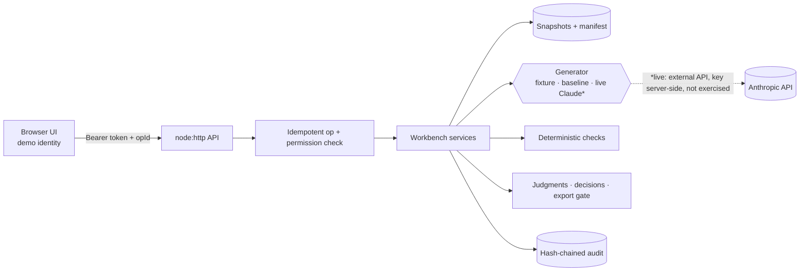
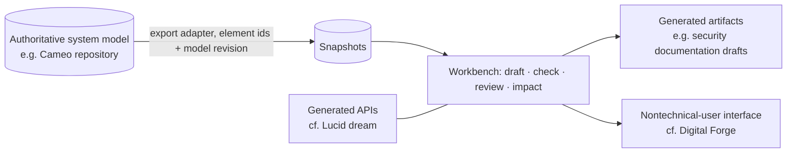

# Interview packet: evidence-grounded procedure workbench

Prepared for Evren Çakır · KBR Principal Software Architect and Development Lead (R2129410) · September 23, 2026

**Scope and handling.** Everything in the demo is synthetic. Gus's project descriptions (DMM-C, Digital Forge, "Lucid dream", AI-assisted TTP development) are paraphrases Evren relayed. They are treated as context, not as verified facts about KBR's systems. Candidate background items are marked *candidate-reported*. Internal assessment notes are in section H and are not meant for interviewers.

---

## A. One-page recommendation

**Verdict: ready with bounded preparation.** The prototype is suitable as a *design-and-judgment demonstration*. It is not evidence of prior Air Force, Cameo or production-scale work.

Before this session the repository was a Vite "hello world" turned greeting-card generator (commits `2a44206`, `2a1db85`). That code has no relevance to the role. The workbench was built in this session, on branch `claude/ttp-workbench-prototype-3t5kob`, by an AI coding assistant working from Evren's brief. Two consequences:

1. The demo is credible only if Evren can explain and defend every design decision and the key code paths. Section D lists the few functions to know.
2. How it was built should be stated plainly. The honest framing is also relevant to the job: "I specified the controls; an AI assistant implemented them; I verified the behavior with tests and an evaluation suite." Do not say "I hand-wrote this."

**Positioning statement.** *"When AI drafts a procedure, the valuable engineering is in the workflow around it: evidence that resolves to an exact source revision, checks that code owns, decisions bound to exactly what the reviewer saw, and automatic reassessment when a requirement changes."*

**Three claims Evren can best defend (all observed working):**

1. A change to one requirement (REQ-002, 180 → 90 days) marks the accepted candidate `STALE`. It identifies the 3 affected claims and 1 affected step, shows calibration moving from PASS to FAIL, and leaves 11 claims unaffected. The prior decision is retained but refused at export.
2. The server, not the UI, enforces the acceptance gate. Acceptance re-checks the version digest, the current source manifest, blocking findings, and a reviewer judgment on every fact claim inside one transaction. Authors, stale reviews, revoked reviews and client-supplied `approved: true` are all rejected (18 automated tests).
3. The workflow is evaluated as a whole: 18 fixed cases (8 dev, 10 held-out) against a simulated model and a template baseline, with criteria declared in advance and 0 unsafe outcomes. One case, H08, is expected to fail: mechanical checks cannot detect a real quote attached to the wrong claim.

**Chosen workflow:** draft → blocked acceptance → correction → review → acceptance → requirement change → impact → refused reuse. It maps to Gus's AI-assisted TTP interest. It also maps, as a hypothesis, to DMM-C's goal of consistent artifacts from an authoritative source.

**The limitation to say out loud:** "The generator in the demo is a deterministic stand-in, not a model. The live Claude adapter is written but has not run here. So this shows the controls and the evaluation harness, not AI draft quality."

**Strongest evidence for each responsibility:**

| Responsibility | Evidence |
|---|---|
| Chief architect | Responsibility boundaries between code, model and reviewer. Decisions bound to digest plus manifest hash. Conservative invalidation paired with precise impact analysis (`docs/ARCHITECTURE.md`) |
| Lead developer | Transactional review gate (`server/workbench.js` `decide`, line 506). Idempotent operations with a real process-kill crash/retry test (`test/process.test.js`). 18 passing tests |
| Innovation and R&D | Baseline comparison, held-out split, declared criteria, an intentionally failing case, and explicitly unmeasured items (`docs/EVALUATION_REPORT.md`) |

**Most important open question:** personal contribution. Decide before the interview exactly how to describe authorship of the brief, the design choices, and the code (see H.4).

---

## B. Repository findings and opportunity ranking

### B.1 Baseline

| Item | Value |
|---|---|
| Repository | `cal2020/hello-world-app`, branch `claude/ttp-workbench-prototype-3t5kob` |
| Base revision inspected | `2a1db85` (clean working tree at start) |
| Environment | Node 22.22.2, npm 10.9.7, SQLite 3.51.2 (built into Node), Linux container, Chromium through Playwright 1.56 |
| Pre-existing functionality | Greeting-card generator (Vite, vanilla JS). No backend, no tests. It is kept at `/greeting-card.html` |
| Added | `server/` (about 1,500 lines), `src/workbench/` (UI), `fixtures/`, `test/`, `scripts/`, `docs/` |

**Inspection coverage.** Everything in the workbench was traced end to end, because it was built and exercised in this session. The greeting-card code was only sampled. No external systems exist to inspect.

### B.2 Functionality inventory

| Capability | Status | How verified |
|---|---|---|
| Immutable source snapshots, revision rule, hashes, manifest | Observed working | Tests: "source history is never overwritten"; UI |
| Permitted retrieval (RESTRICTED excluded, recorded on run) | Observed working | Test and evaluation case H07 |
| Simulated generator with seeded faults | Observed working (and simulated by design) | Walkthrough, UI |
| Template baseline | Observed working | Evaluation |
| Live Claude generator | Implemented, not exercised | No credentials. Missing-key failure path tested |
| Deterministic checks | Observed working | Tests, evaluation |
| Review judgments, decisions, revocation, export gate | Observed working | Tests, UI driven in Chromium |
| Change impact (REASSESS / RECONFIRM, computed deltas) | Observed working | Tests, walkthrough, UI |
| Idempotent operations, crash-after-commit recovery, restart persistence | Observed working | `test/process.test.js` (real process exit 86 and restart) |
| Hash-chained append-only audit | Observed working (application-level) | Tests, UI "chain verified" |
| Authentication | Partial: fixed demo tokens | By design |
| Real system-model (Cameo) integration | Not found; simulated JSON only | — |

### B.3 Architecture assessment (short)

- **Strengths:** clear ownership boundaries; state is re-derived on the server; decisions are version-bound; the evaluation harness runs the same service code as the UI; there are very few dependencies.
- **Weaknesses:** checks are specific to this scenario; retrieval sends everything; there is a single process and single-writer SQLite; the model and reviewer roles are not independent (one reviewer can edit and accept); invalidation is conservative (any import marks everything stale).
- **Sustainment:** small and readable. A new engineer could run it in five minutes. Scaling it would need a rules or configuration layer for checks and a real identity provider.

### B.4 Ranked demonstration opportunities

Score = Σ weight × rating / 4 (ratings 0–4). All criteria were assessed; confidence is listed separately.

| # | Opportunity | Rel 25 | Arch 20 | Hands-on 15 | Delivery 15 | AI/R&D 15 | Clarity 10 | Score | Evidence confidence | Recommendation |
|---|---|---|---|---|---|---|---|---|---|---|
| 1 | Requirement change → impact → stale decision refused | 4 | 4 | 3 | 3 | 3 | 4 | **88.75** | Observed | **Show live (principal)** |
| 2 | Evidence-linked draft plus deterministic checks, blocked acceptance | 4 | 3 | 3 | 2 | 4 | 4 | **83.75** | Observed | **Show live (supporting 1)** |
| 3 | Evaluation suite with baseline, held-out split and declared failing case | 3 | 3 | 3 | 2 | 4 | 3 | **75.0** | Observed | **Show briefly (supporting 2)** |
| 4 | Crash-after-commit idempotency and restart | 2 | 3 | 4 | 4 | 1 | 2 | 66.25 | Observed | Explain with evidence / Q&A |
| 5 | Authorization boundary (author cannot accept; audited denial) | 3 | 3 | 2 | 3 | 1 | 4 | 66.25 | Observed | Mention within the principal flow |
| 6 | Prompt-injection text grants no authority; model status fields stripped | 2 | 3 | 2 | 3 | 3 | 3 | 65.0 | Observed | Reserve for Q&A |
| 7 | Restricted source excluded from model context | 2 | 2 | 2 | 3 | 2 | 2 | 53.75 | Observed | Q&A |
| 8 | Hash-chained audit and immutability triggers | 2 | 2 | 2 | 3 | 0 | 3 | 48.75 | Observed | Q&A |
| 9 | Live Claude drafting | 3 | 2 | 2 | 1 | 2 | 0 | 47.5 | Not exercised | Omit from live demo |
| 10 | Greeting-card app | 0 | 0 | 0 | 0 | 0 | 0 | 0 | Observed | Omit |

For each of the top three:

- **#1.** *Hiring concern addressed:* can the candidate design for change and provenance, not just demos? *Evidence:* the `impact()` and `decisionStatus()` functions and the "requirement change" test. *What the interviewer sees:* the impact tab. *Contribution:* see H.4. *Skeptical question:* "Isn't marking everything stale noisy?" *Limitation:* invalidation is manifest-wide. *Effort:* 30 minutes of rehearsal.
- **#2.** *Concern:* does the candidate understand where AI fails? *Evidence:* `runChecks` and the seeded fabricated step. *Skeptical question:* "Your 'model' is rigged to fail." Answer: yes, it is seeded on purpose, and that is stated on screen. *Limitation:* not a real model. *Effort:* 15 minutes.
- **#3.** *Concern:* R&D rigor. *Evidence:* the evaluation report. *Skeptical question:* "You wrote both the cases and the generator." Answer: agreed; this checks the controls, and model quality is unmeasured. *Limitation:* synthetic and small. *Effort:* 20 minutes.

**Why this selection:** #1 is what the brief asks for ("change a requirement and show which conclusions need reassessment"). It is also the least common capability among AI-drafting demos, and it shows architecture, implementation and evaluation in one flow. #2 sets up #1. #3 answers "how do you know?"

### B.5 Material weaknesses

1. The work was built in one session by an AI assistant. It is not a long-lived system with users, and it has no production history.
2. There is no real model result. AI-related claims are about the controls around a model, not the model.
3. The domain mapping to Air Force TTP development is unverified (see D.6 and section H).
4. It is a single-user, local deployment. No CI, container, or deployment pipeline was added.

---

## C. Architecture and three technical stories

### C.1 Actual system

Trust boundaries: the browser is untrusted (it only names intent). Generator output is untrusted (normalized and checked). Source text is data, never instructions. The only external dependency is the optional live model.

### C.2 Proposed KBR adaptation (hypothesis; not implemented)

Everything in this diagram depends on customer confirmation: interfaces, authority, versions, permissions.

### C.3 Story 1: Architect (binding a decision to what was reviewed)

- **Decision:** a review decision is valid only while the exact candidate digest and the source-manifest hash still match. Any import moves every open version to `STALE`. A separate impact view says precisely which conclusions to revisit.
- **Alternatives considered:**
  - (a) Trust the UI's status field. Rejected: a client could claim "approved".
  - (b) Precise per-claim invalidation only. Rejected as the *only* mechanism: a missed dependency would silently keep an old approval.
  - (c) Timestamps ("reviewed after the last change"). Rejected: timestamps do not identify *what* changed.
- **Tradeoff:** false positives (reviewers re-confirm things that did not change) in exchange for no false negatives. The cost is reduced by carrying judgments forward for byte-identical claims and by the REASSESS/RECONFIRM split.
- **Revisit when:** a real element-level dependency graph exists, or reviewers report fatigue. Then relevance-filtered staleness becomes worth its risk.
- **Attribution:** the brief specified version-bound decisions and conservative invalidation. Say "I specified…" only if the brief is Evren's own.

### C.4 Story 2: Developer and lead (crash after commit)

- **Problem:** if the server commits a review decision and then crashes before responding, the client retries. Naive code would record a second decision, or the client would never learn that the first one succeeded.
- **Implementation:** every mutation carries an `opId`. `runOp` (`server/ops.js:54`) writes the operation row *in the same transaction* as the mutation and stores the response. A retry returns it with `x-replayed: true`. Reusing an `opId` for a different request returns `409 OP_ID_REUSED`. Generation is two-phase (`startRun`, `server/workbench.js:250`), so a slow model call never holds a transaction. On startup, runs and operations left pending by a crash are marked interrupted.
- **Evidence:** `test/process.test.js` starts the real server with `WORKBENCH_FAULT=crash_after_commit:start_run`. The process exits with code 86 after commit. The test restarts the server, retries the same `opId`, and gets the committed run back with exactly one run in the database.
- **Team practice this supports:** a reset command with stages, a CLI walkthrough, and tests that a new engineer runs with one command. *Candidate-reported parallel:* Zillow serverless pipelines with automated recovery. Keep that clearly separate from this prototype.

### C.5 Story 3: R&D (proposed experiment, not yet run)

- **Hypothesis:** compared with a template baseline, AI-assisted drafting discloses more gaps and conflicts and reduces expert review time, without increasing reviewer-adjudicated unsupported claims.
- **Baseline:** already built (`baseline-template-v1`). It covers every requirement but discloses 0 of 1 seeded gaps and 0 of 1 conflicts on the dev and held-out cases.
- **Bounded experiment:**
  1. Run the live provider on 12–20 held-out synthetic cases, with 2 or more repeats for variance.
  2. Have two qualified reviewers judge independently, before any discussion.
  3. Measure unsupported claims per draft, gap/conflict disclosure, reviewer corrections, review minutes, latency and token cost.
- **Stop/go:**
  - Stop if there is any unsafe acceptance or stale bypass.
  - Stop if the unsupported-claim rate exceeds a threshold agreed with SMEs in advance.
  - Go only if disclosure and review time improve over the baseline.
- **Transition to delivery:** the configuration hash is recorded on every run. The suite becomes a CI regression gate, and prompt or model changes require a new evaluation.
- **Status:** proposed. No results exist.

---

## D. Ten-minute presentation and live-demo runbook

### D.1 Timed runbook

| Time | What I say (summary) | What I show / do | Expected observable result | Claim proved | Recovery if unavailable |
|---|---|---|---|---|---|
| 0:00–1:00 | Problem framing | Title slide or Sources tab | — | — | Talk over a slide |
| 1:00–2:00 | Sources and draft | Sources → click REQ-002@A → Generate | v1 DRAFT, 5 blocking | Provenance; checks | `npm run demo:reset -- --stage=draft` |
| 2:00–3:00 | The model is wrong once, on purpose | Click red citation; Accept | "quote not in passage"; 409 REVIEW_BLOCKED | Mechanical citation check; server gate | Screenshot 02/03 (labeled static) |
| 3:00–4:30 | Evidence closes gaps, reviewers close claims | Import corrected log → Regenerate → judge C14 "does not support" → remove → save → bulk judge → Accept → Export reviewed | v1 STALE; v3 NEEDS_REVIEW → REVIEWED_FOR_DEMO; banner | Versioned edits; bound decision | `--stage=reviewed` |
| 4:30–6:00 | Change a requirement | Import REQ-002 rev B → Change impact | 180 → 90; REASSESS C4, C6; RECONFIRM C7; S3; PASS → FAIL | Reassessment scope | `npm run demo:walkthrough` (CLI, real execution) |
| 6:00–6:30 | Old approval refused | Candidate → Export reviewed | 409 EXPORT_BLOCKED | Stale decision rejected | Walkthrough output |
| 6:30–7:30 | Code: the gate | Editor: `server/workbench.js` `decide` (line 506), `acceptReadiness` (line 162) | — | Hands-on credibility | Read from printed snippet |
| 7:30–8:15 | Evaluation | Runs & evaluation tab, point at H08 | Gate PASS, 0 unsafe, H08 known limitation | Complete workflow evaluated | `docs/EVALUATION_REPORT.md` |
| 8:15–9:15 | Tradeoff and connection to Gus's work | Architecture slide | — | Architecture judgment | Slide |
| 9:15–10:00 | Limits and discussion prompt | — | — | Candor | — |

### D.2 Spoken script (about 870 words)

**[0:00]** Gus mentioned that AI-assisted development of tactics, techniques and procedures is a differentiator. I wanted to show how I would approach that as an engineer. Everything I'm about to show is synthetic: an invented sensor kit, three made-up requirements, some inspection records, and a hand-written stand-in for a system-model export. It is not a TTP. It doesn't connect to Cameo, and it approves nothing operationally. What it demonstrates is the workflow around an AI draft, because I think that's where the risk and the value both sit.

**[1:00]** These are the sources. Each is an immutable snapshot with an id, a revision and a content hash. This requirement, REQ-002, says calibration is current within 180 days, and the number is also stored as a structured field that code can use. I'll ask for a candidate inspection procedure.

**[1:30]** The generator in this demo is a deterministic stand-in, not a model. I did that so the demo is repeatable offline, and it has one error seeded on purpose. The draft gives steps, claims, citations, assumptions, a hypothesis clearly labeled as a hypothesis, and two things it couldn't resolve: a missing battery observation and a serial-number conflict between two records.

**[2:00]** Here is the seeded error: a plausible cleaning step. The citation is red because the quoted text isn't in the cited passage. Code checks that the citation exists. It cannot check that a quote supports a claim; that's the reviewer's job, and the UI keeps the two separate. If I try to accept anyway, the server refuses and lists why. The browser can't send "approved"; the server re-derives everything.

**[3:00]** Now the inspector corrects the log. Importing it doesn't overwrite anything. It creates revision 2, and version 1 of the draft is now stale, because it was built on different sources. I regenerate. The gaps are gone, but the fake step is back, which is realistic: the model repeats its mistakes. As the reviewer, I mark that claim as not supported and remove it. That creates version 3, with its own digest. I judge the remaining claims and accept. The decision is bound to this exact digest and this exact source manifest.

**[4:30]** Here's the part I care about most. The requirement changes from 180 days to 90. I import revision B. The accepted version goes stale. The change-impact view shows what changed, down to the passage and the structured field. It shows exactly which conclusions need reassessment: the claim quoting the changed passage, the computed calibration result, which flips from current to not current because 114 days now exceeds 90, and one claim to re-confirm because its passage is textually unchanged. One step is affected; eleven claims aren't. The old decision is still in the history, and it says why it no longer applies.

**[6:00]** If someone tries to export the old approval, it's refused.

**[6:30]** Briefly in code: this is the acceptance function. In one transaction it checks the reviewer's permission, that the digest the reviewer saw is the stored digest, that the source manifest hasn't moved, that no blocking check is open, and that every factual claim has a reviewer judgment. A conflict returns a stale result naming the version that needs review. Every write carries an operation id, and there's a test that kills the server right after commit and proves the retry returns the committed result without duplication.

**[7:30]** I evaluated the whole workflow, not just the output. There are eighteen fixed cases, split into development and held-out, run against the stand-in and a simple template baseline, with criteria written down before the held-out run. There were zero unsafe outcomes: no stale, revoked or unauthorized acceptance got through. The baseline never discloses gaps; the drafting step does, but I wrote that stand-in myself, so that's a check of the harness, not a claim about any model. One case is designed to fail: a real quote attached to the wrong claim passes every mechanical check. Only the reviewer catches it. I kept it in because it marks the boundary.

**[8:15]** The main tradeoff: I invalidate conservatively. Any source change makes open reviews stale, and then I use precise impact analysis to keep the re-review small. I'd rather make an expert re-confirm something than silently keep an approval built on an old requirement. The pattern of an authoritative source, generated artifacts and version-bound review seems relevant to what Gus described for DMM-C and Digital Forge, but I'd want to learn how your model data is versioned and who has approval authority before claiming a fit.

**[9:15]** What this doesn't show: real model quality, real users, or conformance with how the Air Force actually develops tactics; I haven't been able to read DAFMAN 11-260 directly. The next experiment I'd propose is running a live model on held-out cases with two independent expert reviewers and comparing it against the template. A question for you: in your workflows, what is the authoritative source, and what event should force a re-review?

### D.3 Code to know (no memorization needed)

| Where | What to be able to explain |
|---|---|
| `server/workbench.js` `decide` (line 506) and `acceptReadiness` (162) | The acceptance gate; why `expectedDigest` and `expectedManifestHash` are required; the `STALE_CONFLICT` versus `REVIEW_BLOCKED` distinction |
| `server/workbench.js` `decisionStatus` (136), `markStale` (200) | Decision validity reasons; conservative invalidation |
| `server/workbench.js` `impact` (409), `claimDigest` (58) | REASSESS versus RECONFIRM; judgment carry-forward |
| `server/checks.js` `runChecks` (41), `resolve` (76), `normalizeContent` (15) | Citation statuses; code-computed calibration; stripping `approved` |
| `server/ops.js` `runOp` (54) | Idempotency in the same transaction; recorded rejections |
| `server/db.js` triggers (169+) | Append-only enforced at the application level, and its limits |

### D.4 Six-slide storyboard

| # | Headline | Takeaway | Visual | Points (≤3) | Speaker notes |
|---|---|---|---|---|---|
| 1 | AI drafts; evidence and experts decide | The workflow is the product | Pipeline diagram (C.1) | Synthetic data · simulated model export · no operational approval | Say the limits in the first minute |
| 2 | Every claim points at an exact source revision | Provenance is mechanical | Screenshot 02 (evidence panel) | Citation resolves ≠ supports · gaps and conflicts visible | Show the red citation |
| 3 | Acceptance is enforced by the server | UI state isn't authority | `decide()` snippet | Digest + manifest bound · judgments required · roles | Mention the crash/retry test |
| 4 | Change one requirement, see what to revisit | Reassessment scope | Screenshot 05 (impact) | REASSESS vs RECONFIRM · PASS → FAIL · old decision refused | The core minute |
| 5 | Evaluate the whole workflow | Evidence over polish | Evaluation table (screenshot 07) | 18 cases, 0 unsafe · baseline · H08 fails by design | Say who wrote the cases |
| 6 | Where this could go, carefully | Next experiment and questions | Diagram C.2 labeled "hypothesis" | Live-model held-out study · two independent SMEs · questions for Gus | End with a question |

### D.5 Ninety-second introduction

"I'm Evren. I've been writing and leading software for more than twenty-five years. Most recently I was CTO at Stimulus, where I rebuilt engineering and led production AI-assisted vendor intake, and separately a customer beta of a platform with human approvals and auditable agent actions. Before that I did secure artifact and GovCloud delivery work at Salesforce with policy-as-code, and durable serverless pipelines at Zillow. *(All candidate-reported.)* For today I built a small prototype around the thing Gus flagged: AI helping experts develop procedures. It's synthetic and deliberately modest. What I want to show is the engineering around the AI: evidence that resolves to exact source revisions, checks that code owns, review decisions bound to exactly what was reviewed, and what happens when a requirement changes. Then I'd like to hear how your teams handle authoritative sources and re-review today."

### D.6 Five-minute compressed version

Use `docs/DEMO_SCRIPT.md`. It covers the same claims with the code walk and the architecture discussion removed. End with the same question.

---

## E. Skeptical technical questions

1. **"Who built this?"** Say: "I wrote the brief: the controls, states, cases and acceptance criteria. An AI coding assistant implemented it in one session. I verified the behavior with tests, an evaluation suite, and by driving the UI." *(Adjust to what is actually true; see H.4.)* Then own the decisions. *Acknowledge an unknown if asked about specific lines you haven't read. Read `decide` and `runOp` before the interview.*
2. **Strongest objection: "A one-day AI-built prototype on synthetic data isn't evidence you can lead software across programs."** Say: "Agreed, it isn't evidence of scale. It's evidence of how I frame the problem, where I put controls, and how I test claims before making them. My leadership evidence is Stimulus, Salesforce and Zillow, and I'm happy to go deep there." *(candidate-reported)*
3. **"Why not just a template?"** The template covers every requirement but discloses nothing it wasn't told about: 0 of 1 gaps, 0 of 1 conflicts. AI's plausible value is synthesis across records. Deterministic logic stays better for ids, dates, thresholds and state, which is why code computes calibration.
4. **"How do you evaluate unsupported assertions?"** Mechanically: citation resolution and exact quote match. Semantically: a reviewer judgment per claim, stored separately. The human-adjudicated rate is currently *unmeasured*; H08 shows why mechanical checks aren't enough.
5. **"Isn't marking everything stale going to drown reviewers?"** Possibly. That's the tradeoff. Mitigations: judgments carry forward for identical claims, and the REASSESS/RECONFIRM split. Relevance-filtered staleness is next in the backlog, once dependencies are trustworthy.
6. **"Authorization and provenance?"** Server-side role checks with audited denials, decisions bound to digest plus manifest, immutable snapshots, a hash-chained audit. *Acknowledge:* demo tokens aren't authentication, and the triggers don't stop a database administrator.
7. **"Retries, partial failure, concurrency?"** `opId` in the same transaction; two-phase generation; startup reconciliation; `BEGIN IMMEDIATE` for the gate; test H02 shows a source import between load and accept yields `STALE_CONFLICT`. *Acknowledge:* single-writer SQLite and one process; no distributed transactions.
8. **"Prompt injection?"** Source text is data. Instruction-like passages are flagged, and claims citing them are blocking. Model output fields outside the schema (such as `approved`) are stripped and reported. The generator has no tools or permissions.
9. **"Constrained or disconnected deployment?"** Runs fully offline in fixture or baseline mode, with no mandatory external service. A disconnected deployment would need an approved on-premises or accredited model endpoint. The provider interface is where it plugs in. *Don't claim any accreditation.*
10. **"What would integrating system-model data require?"** Stable element ids and a model revision in an export, agreement on authority, element-level change detection, and permission mapping, all verified against vendor documentation. *Acknowledge:* no Cameo experience claimed; you'd need to learn their interfaces.
11. **"How does a prototype become maintainable across programs?"** Move scenario-specific checks into configurable rule packs with tests. Keep the review/state core shared. Put the evaluation suite in CI with a configuration hash per run. Assign owners per module.
12. **"How would you run the first pilot and the team?"** Pick one real, low-risk procedure family with two SMEs. Agree on stop/go criteria first. Pair a developer with an SME for fixtures. Weekly review of disagreements. Code review focused on the gate and state transitions. Onboarding through the reset/walkthrough commands. *Ask* what success means to Gus.

---

## F. Preparation priorities and rehearsal

### F.1 Two hours

| Action | Benefit | Effort | Acceptance criterion | Drop if short |
|---|---|---|---|---|
| Decide the attribution wording (H.4) | Removes the biggest credibility risk | 15 min | One sentence Evren is comfortable saying | Never drop |
| Run `npm run demo:reset && npm start`; do the 5-minute path twice | Demo reliability | 45 min | Under 5:30 twice with no errors | — |
| Read `decide`, `acceptReadiness`, `impact`, `runOp` | Code credibility | 40 min | Can explain each without notes | `impact` details |
| Test screen share over Teams at 125% zoom | Readability | 20 min | Citation chips readable on the other end | — |

### F.2 One day (adds)

- **Rehearse the 10-minute version** three times with a timer. *Acceptance:* 9:30–10:15.
- **Build the six slides** from D.4 using the existing screenshots, each labeled "static capture". *Drop if short:* slide 6.
- **Practice the 12 questions aloud.** *Acceptance:* each answer under 60 seconds.
- **Verification:** run `npm test` and `npm run eval` on the interview machine. Record the outputs.

### F.3 Three days (adds)

- **Genuine implementation, optional:** run the live provider with an API key on the held-out cases and record actual results in the evaluation report. *Benefit:* turns "not exercised" into "observed". *Risk:* results may be poor, which is still honest data. *Acceptance:* report updated with the model id, tokens and failures.
- **Obtain and read DAFMAN 11-260** from an official source. Update D.2 section 9:15 and section H if the terminology changes.
- **Optional polish:** add a relevance filter for staleness. Only do this if everything else is done.

### F.4 Rehearsal plan and readiness gate

- **Setup/reset:** `npm run demo:reset`. Keep the fallback stages ready.
- **Deterministic data:** the fixtures are fixed. Ids and timestamps differ per run; don't read them aloud.
- **Dependencies:** Node 22.13 or later only.
- **Screen sequence:** Sources → Candidate → Sources → Candidate → Impact → Candidate → Runs → History.
- **Fallback:** `npm run demo:walkthrough` is real execution in the terminal, not the UI. Screenshots are static. Never describe either as live UI.
- **Readiness gate:**
  - The path reproduces the claims in `docs/DEMO_SCRIPT.md`.
  - Evren can explain the two boundaries (citation versus support; stale conflict versus review blocked).
  - A failure is recoverable within 30 seconds using a fallback stage.

---

## G. Leave-behind and questions for Gus

### G.1 One-page technical brief (for Evren's review; not sent)

**Evidence-grounded procedure workbench (prototype, synthetic data)**

*Problem.* AI can draft procedures quickly, but a draft is only useful if every step traces to authoritative evidence, gaps are visible, experts decide, and approvals don't outlive the requirements they were based on.

*What is implemented.*
- Immutable versioned sources.
- Drafts whose claims cite exact passages.
- Deterministic checks for citations, gaps, conflicts, dates and coverage.
- Per-claim reviewer judgments, and decisions bound to the exact draft and source set.
- Automatic staleness, with a claim-level impact view when a source changes.
- Idempotent writes, an audit trail, and an evaluation suite with a baseline.

*Architecture.* A single Node.js service with SQLite and a browser UI. Code owns ids, hashes, dates and state. The generator only suggests. Reviewers judge support and decide.

*Evidence.* 18 automated tests, including process-kill crash/retry and restart. An 18-case evaluation with 0 unsafe outcomes and one declared, expected failure.

*Relevance (hypothesis).* The pattern of an authoritative source, generated artifacts, version-bound expert review and change impact may apply to AI-assisted TTP development and to consistent RMF artifact generation. That depends on your data sources and approval authorities.

*Limitations.* Synthetic data. Simulated model export. The drafting step in the demo is a deterministic stand-in; the live-model adapter has not been exercised. Not an Air Force process and not operational approval.

*Next experiment.* A live model on 12–20 held-out cases, with two independent SME reviewers, compared with a template baseline. Stop/go criteria agreed in advance.

### G.2 Five questions for Gus

1. For TTP development work, what is the authoritative source (model, documents, test data), and how is a revision of it identified?
2. Who holds approval authority at each stage, and what event should force a re-review of something already approved?
3. What would be the first valuable workflow to pilot, and who are the two experts who would judge it?
4. Which integration interfaces into the Cameo environment are installed and permitted today? What does "Lucid dream" expose that a workbench like this should consume rather than duplicate?
5. How would you measure success for an AI-assistance experiment: expert time, error catch rate, consistency, or something else?

---

## H. Evidence appendix (internal)

### H.1 Claim/evidence ledger

| Claim | User-visible behavior | Evidence location | Verification | Status | Interview-safe wording |
|---|---|---|---|---|---|
| Sources are immutable and versioned | Revisions listed with hashes; overwrite rejected | `server/sources.js` `importSnapshot`; `server/db.js` triggers | Test "source history is never overwritten" | Observed working | "Imports create revisions; history isn't overwritten by the application." |
| Citations resolve to the exact passage and span | Green or red chips; highlighted span | `checks.js` `resolve` | Test "every resolved citation…" | Observed working | "Every displayed citation is checked against the retained revision." |
| Citation ≠ support | Separate reviewer chip | `judge`; UI | Evaluation H08 | Observed working | "Code checks existence; reviewers judge support." |
| Missing/conflicting evidence blocks acceptance | 409 with reasons | `runChecks`; `acceptReadiness` | Tests; evaluation E02, E03 | Observed working | As stated |
| Decisions bind to digest + manifest | Decision shows both hashes | `decide`, `decisionStatus` | Tests; UI | Observed working | As stated |
| Requirement change → stale + impact | Impact tab | `markStale`, `impact` | Test; walkthrough; UI | Observed working | "…identifies the claims and steps to reassess in this scenario." |
| Stale/revoked/superseded decisions refused | 409 EXPORT_BLOCKED | `exportVersion` | Tests; evaluation E04, E06, E07, H03 | Observed working | As stated |
| Concurrent change rejects decision | 409 STALE_CONFLICT | `decide` | Test; evaluation H02 | Observed working (single process) | "…in a single-process prototype." |
| Authors cannot accept; denial audited | 403 | `ops.js` `ROLE_PERMISSIONS` | Test; evaluation H04 | Observed working | "Demo identities, server-enforced roles." |
| Crash after commit is safe to retry | Replayed response | `runOp`, `startRun` | `test/process.test.js` | Observed working | As stated |
| Restart preserves state | Data survives restart | SQLite file | `test/process.test.js` | Observed working | As stated |
| Injection text grants no authority | Findings; state DRAFT | `normalizeContent`, `runChecks` | Test; evaluation E08 | Observed working | "…on this seeded example." |
| Restricted sources excluded | Run shows exclusion | `retrieve` | Test; evaluation H07 | Observed working | As stated |
| Fixture versus live distinguishable | Mode chips; export text | `runConfig`, `renderExport` | Test | Observed working | As stated |
| Live Claude generation | "Live model" option | `providers/anthropic.js` | Missing-key path tested only | Implemented, not exercised | "An adapter exists; I haven't run it here." |
| Audit append-only, hash-chained | "chain verified" | `audit.js`, triggers | Test | Observed working (application-level) | "Tamper-evident within the application." |
| Real Cameo integration | — | — | — | Not found; proposed | "Not integrated; the model export is simulated." |
| Air Force TTP process conformance | — | — | Primary source not retrieved | Not established | "I haven't verified against DAFMAN 11-260." |

### H.2 Command results (2026-09-23, this container)

| Command | Result |
|---|---|
| `npm test` | 18 pass, 0 fail (about 1.2 s) |
| `npm run eval` | Gate PASS. fixture-sim-v1: dev 8/8, held-out 9/10 (1 declared limitation), 0 unsafe of 13 must-block attempts. baseline-template-v1: dev 4/7, held-out 5/6 (failures are draft-quality only), 0 unsafe of 11 |
| `npm run build` | Succeeds (Vite 7) |
| `npm run demo:walkthrough` | Full path reproduced (output matches `docs/DEMO_SCRIPT.md`) |
| UI in Chromium (Playwright) | Full path driven. Only console errors are the expected 409 responses. Screenshots in `docs/screenshots/` |
| Live provider | Not run: no credentials |

### H.3 External sources

| Source | What it establishes | Access in this session |
|---|---|---|
| DAFMAN 11-260, *Tactics Development Program*, https://static.e-publishing.af.mil/production/1/af_a3/publication/dafman11-260/dafman11-260.pdf | The official publication exists at this URL (it appears in search results) | **Direct fetch blocked by this environment's egress policy.** Search snippets, including a non-authoritative Quizlet page, mention Tactics Improvement Proposals (AF Form 4326), formal Tactics Development and Evaluations, and Weapons and Tactics Conferences. **Treat as unverified until read in the primary source.** Do not present any lifecycle as official. |
| EnterpriseVal (arXiv 2609.21841) and R5–R8 in the brief | Cited by the brief as design inspiration | arXiv access blocked here. **Not verified**, and dated after the assistant's training data. Cite only after reading. |
| NIST SP 800-207; NIST OSCAL documentation | Background (zero trust; OSCAL layers) | Not fetched in this session. Well-established publications, but re-read before citing specifics. |
| Anthropic SDK usage | Adapter request shape | Bundled SDK documentation. Not exercised against the API. |

**Keep these separate:** (1) doctrine, meaning what DAFMAN 11-260 actually says; (2) any unit's actual workflow; (3) this prototype's software states; (4) formal approval authority. The prototype implements only (3).

### H.4 Attribution questions for Evren (resolve before the interview)

1. Did Evren write the brief and the master prompt personally, co-write them with AI, or adopt them? This determines whether "I specified the controls" is accurate.
2. Which design decisions does Evren endorse as their own and can defend? At minimum: digest-plus-manifest binding, conservative invalidation, code-computed thresholds, and the declared failing case.
3. Commit authorship on this branch comes from an AI assistant session. Say so if asked.
4. Candidate-reported history (Stimulus, the FIFA intake, Workspaces beta, Salesforce, Zillow) is not evidenced by this repository. Keep production intake, the Workspaces beta, and this prototype distinct.

### H.5 Unresolved assumptions

- Gus's project names and descriptions are relayed paraphrases.
- No KBR architecture, interface or data is known.
- The interview date and panel are not established.
- Clearance status is not stated here and should not be inferred.

### H.6 Glossary

- **Snapshot:** an immutable revision of a source.
- **Manifest:** the set of active snapshots and its hash.
- **Digest:** the hash of a candidate version's content.
- **Judgment:** a reviewer's view of whether cited evidence supports a claim.
- **Decision:** accept for demo, request changes, or reject, bound to a digest and a manifest.
- **STALE:** the version's sources are no longer current.
- **REASSESS / RECONFIRM:** the impact classifications.
- **opId:** the idempotency key for a write.
- **TTP:** tactics, techniques and procedures.
- **RMF:** Risk Management Framework.
- **ATO / ATT:** authority to operate / authority to test.
- **SME:** subject-matter expert.
