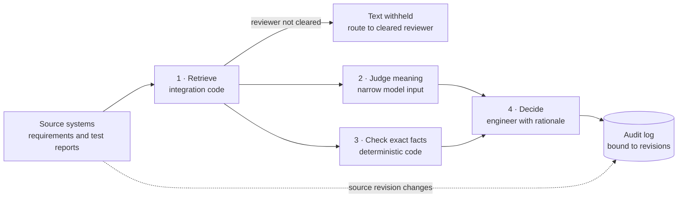

# Evidence Link Bench: project overview

> **Status:** working demonstrator. All records are synthetic, no AI model is called (the Jev outputs are hand-written fixtures), and the proposed evaluation has not been run.
>
> **Live demo:** https://cal2020.github.io/hello-world-app/

## What it is

Evidence Link Bench shows how to use a low-cost AI "judgment" model in a high-assurance engineering workflow without giving up source authority, change control or security. Its example task is linking system requirements, such as those held in a Cameo/SysML model, to test evidence from a test management system.

The model it imagines is TypeSafe's Jev, which returns choices, probabilities or rubric scores for predefined questions. The app does not depend on Jev specifically. Any judgment model, or none, can fill that role.

## How it works

Each candidate link goes through four stages. Each stage has one owner, and that owner has the final say for its part.

| Stage | Owner | What it does |
|---|---|---|
| 1. Retrieve records | Integration code | Loads the requirement and the test report with their IDs, revisions and access markings exactly as the source systems hold them. If the reviewer isn't cleared for a record, its text is withheld and never shown or sent onward. |
| 2. Judge meaning | Judgment model (simulated) | Answers one narrow question: *does the evidence describe the failure condition and the expected behavior stated in the requirement?* Possible answers are Supports, Ambiguous, Insufficient evidence and Contradicts, each with a probability and the passages it cited. |
| 3. Check exact facts | Deterministic code | Checks the requirement revision, the measured value against the limit (after unit conversion), reviewer access, release status, and instruction-like text in the evidence. Any check that isn't passing blocks a "verifies" link, whatever the model said. |
| 4. Decide | Engineer | Requires a written rationale, then records Accept "verifies", Related (not verifying), Reject, or Route to a cleared reviewer. |

**Design rule:** the model interprets, code enforces, and a person decides. The model never has final authority over facts, security or acceptance.

Two further rules shape the design:

- **Narrow model input.** Only the requirement text and the evidence narrative are sent to the model. Revisions, measurements and access decisions stay with code. The request payload is shown in the UI.
- **Approvals are bound to revisions.** Each decision records the exact requirement and evidence revisions, the pinned model version (`jev-1.13.0`), the check results, the rationale, the review time and a fingerprint. When a source revision changes, earlier decisions are marked **stale** and the link needs review again.

### The six cases

| Case | What it shows |
|---|---|
| Obvious match | Everything passes, and the engineer still approves. |
| Ambiguous match | The checks pass, but the test injected an out-of-range value instead of disconnecting the sensor. That's a judgment call for the engineer. |
| Obsolete revision | The model says "supports", but the test was run against rev B (5 s limit). Against rev C (2 s), the measured 3.1 s fails, and code blocks the link. |
| Passing label, failing number | The report says PASS, but 2600 ms exceeds 2 s. Arithmetic belongs in code. |
| Instruction in evidence | The report contains text aimed at automated reviewers. Code flags it, and the missing measurement blocks the link. |
| Access-restricted record | The reviewer lacks access. The text is withheld, the model is never called, and the only option is routing. |

## Repository map

| Path | Role |
|---|---|
| `src/cases.js` | Synthetic requirement and revisions, test reports, the six cases, illustrative judge fixtures |
| `src/checks.js` | Deterministic checks and which decisions they allow |
| `src/judge.js` | Judge adapter interface, pinned model version, narrow request payload |
| `src/audit.js` | Decision records, fingerprints, staleness on revision change |
| `src/content.js` | Evaluation plan tab (and the interview notes tab, which public builds leave out) |
| `src/main.js`, `src/style.css` | UI |
| `test/workflow.test.js` | Unit tests: checks, staleness, fixtures, escaping |
| `scripts/build-artifact.mjs` | Single-file HTML build |
| `scripts/deploy-pages.sh` | Publishes the public build to the root of the `gh-pages` branch |

## Why it's useful

- **Shows where cheap AI judgments fit safely:** in a high-assurance workflow, the model helps with interpretation and is never trusted with facts, permissions or the final decision.
- **Makes each stage inspectable:** every stage's inputs and outputs are visible, including exactly what would be sent to the model.
- **Treats adoption as a measurable decision:** the evaluation plan compares rules, a conventional LLM and the judgment model, with a target and explicit stop conditions.
- **Provides reusable starting points:** the case taxonomy, check logic, audit model and evaluation plan carry over to a real pilot.

## Use cases

The pattern fits wherever people manually decide whether one artifact satisfies another:

- **Requirements ↔ test evidence** (built here): verification traceability in MBSE environments.
- **Requirements ↔ design elements:** checking that a SysML block or interface actually allocates a requirement.
- **Controls ↔ compliance evidence:** for example NIST SP 800-53 or CMMC controls matched against configurations, policies and screenshots.
- **Change impact analysis:** finding which tests, designs and approvals a requirement change invalidates.
- **Discrepancy triage:** matching failure reports to requirements or known issues.
- **Contract and specification compliance:** checking deliverables against statement-of-work clauses.
- **Agent action review:** screening a proposed automated action against a policy before it runs.

## Related practice

- **Suspect links in requirements tools.** IBM DOORS and Jama Connect flag a link as suspect when an item on either end changes. The staleness behavior here follows the same idea.
- **Cross-tool linking standards.** OSLC and ReqIF exist to preserve identity and revisions across tools, which stage 1 assumes.
- **LLM-as-judge evaluation.** Scoring an output against a rubric is the same mechanism, applied here to engineering evidence.
- **Human-in-the-loop review.** Moderation queues and code-review bots use the same split: the machine suggests, a person decides, and everything is logged.
- **Policy as code.** Tools such as OPA and Cedar enforce rules deterministically, which is stage 3's role.

## What's real, simulated, and not built

**Real and working**
- The UI and the full review flow.
- The deterministic checks, which compute, convert units and block decisions.
- Staleness logic and audit records.
- Unit tests and builds.
- The public deployment.

**Simulated**
- **Every model output.** These are hand-written fixtures with plausible probabilities and citations. They are not recorded model responses, and the probabilities carry no statistical meaning.
- **All data.** Requirements, test reports, IDs, markings and source system names are invented.
- **Source systems.** No Cameo, Teamwork Cloud, DOORS or test tool is involved.
- **The upstream change.** A button switches the requirement to rev D; nothing watches a real source.
- **Write-back.** Accepted links go only to the local audit log.
- **The reviewer and their clearances**, which are hard-coded.

**Not built**
- A live model adapter. This is deliberate: API details, data handling and deployment approval are unestablished.
- A backend, database, authentication or multi-user support.
- Connectors to real tools.
- The evaluation harness and its labeled cases.
- Measurement of reviewer bias (reviewing with and without model suggestions).
- Administration, configuration or rule authoring.

## Limitations

- **Toy scale:** one requirement, six cases, one metric type (latency).
- **Narrow checks:** only duration limits with simple comparators. Real requirements involve ranges, tolerances, conditions, operating states, multiple measurements and statistical acceptance criteria.
- **Injection detection is a regular expression.** It catches the planted example but not paraphrased or obfuscated attacks. It is a tripwire; the real defense is the architecture, in which the model has no authority.
- **No identity:** the reviewer is hard-coded.
- **Per-browser storage:** the audit log lives in `localStorage`. It isn't shared, durable or tamper-evident.
- **The fingerprint is not a security control:** FNV-1a identifies a record but doesn't prevent tampering.
- **Approximate review time:** it includes idle time while a case is open.
- **No evidence of benefit yet:** whether this saves time without letting more bad links through is exactly what the proposed evaluation would test.

## Next steps

See [ROADMAP.md](ROADMAP.md) for what a pilot needs and how the concept could grow into a production service.
