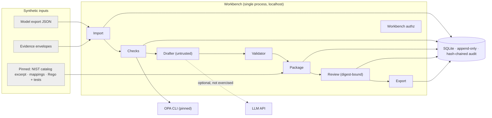
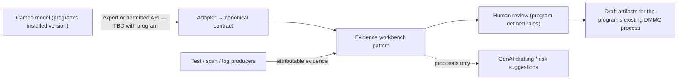

# KBR R2129410 — Repository evaluation and interview demonstration packet

Prepared for Evren Çakır · September 23, 2026 · Principal Software Architect and Development Lead (KBR)

Repository: `cal2020/hello-world-app`, branch `claude/kbr-interview-prep-5267oa`.
Inspected baseline: commit `2a1db85` (clean tree). Prototype added in commit `e5ee955` and later commits on the same branch.

> **Internal notes vs interviewer material.** Sections A–F and H are for your preparation. Section G (leave-behind) and
> the slide storyboard in D are the only parts written to be shown to KBR. Nothing here contains customer data or secrets.

---

## A. One-page recommendation

**Verdict.**
- **The original repository is unsuitable** as interview evidence. At `2a1db85` it is a 480-line Vite greeting-card page. It has no backend, tests or CI, and nothing relevant to the role.
- **The DMMC evidence workbench added to this branch is ready to present, with bounded preparation.** It is a working, locally runnable vertical slice. The five-step demo, 22 acceptance cases, 29 unit tests and a schema-valid OSCAL export all ran successfully here.
- **Readiness depends on one thing:** you have to own the code before you present it (see the attribution question below).

**Positioning statement.**
> "I build systems where it's clear why each claim is true, and where people see when that stops being the case. Model-derived security artifacts are exactly that kind of problem."

**The three claims you can defend best:**
1. **Source identity and change propagation.** A model change makes old evidence inapplicable and prior review stale, and the tool refuses to export stale material as currently reviewed. *Observed:* demo step 4 and eval cases E04 and E09.
2. **AI stays inside a review boundary.** Drafts are validated against permitted, digest-pinned sources. Prohibited or unsupported statements are flagged, and no model output can change review state or enforcement policy. *Observed:* E15, E16 and E22.
3. **Policy-as-code with independent tests.** The model's declared permissions are checked against a reviewed Rego bundle. The expected outcomes are written from requirements, not derived from the policy. *Observed:* AC-3 mismatch in revision B, E11 and E16. This links directly to your Salesforce OPA and control-to-policy coverage work (your account).

**Chosen workflow and its relevance to Gus.** Import model A, then remove a transport test, then accept a review bound to the exact digest, then import model B.
- After model B: the review goes stale, the export is refused, and an impact view appears.
- Rebuilding for B shows the AC-3 mismatch and a new unknown row for the provider flow.

This speaks to what you relayed about DMMC: generating SSP-type artifacts from model data "consistently from an authoritative source."

**The exact limitation to acknowledge:**
> "Everything is synthetic. The model format is my own JSON contract, not a Cameo export. The AI drafting shown is a deterministic fixture, so this demonstrates the controls around AI, not the quality of a model."

**Strongest evidence for each of Gus's three responsibilities:**

| Responsibility | Strongest evidence |
|---|---|
| Chief Software Architect | Trust boundaries and the authority table ([THREAT_AND_AUTHORITY.md](../dmmc-workbench/docs/THREAT_AND_AUTHORITY.md)). Conservative invalidation vs fine-grained impact. Stable IDs vs pointers. Assertion vs observation. |
| Lead Software Developer | Transactional review (`workbench/review.py:24`) and the single applicability rule (`workbench/model.py:59`). Two defects found by verification and fixed (story C2). 22 scenario cases. |
| Innovation and R&D | Validator against seeded LLM failure modes. Quarantined candidate-policy evaluation. Honest baseline comparison. Proposed TTP-assistance experiment with stop/go criteria (section C3 and §6). |

**Most important open question: attribution.**
- The prototype was implemented today by an AI coding agent working from your written brief. You have not yet read the code or run it yourself.
- Git history shows commits from this session; it cannot establish your personal authorship.
- The interview-safe phrasing is: "I specified it, and I used an AI coding agent to implement it in a day. Here's how I verified it." That is only true once you have done the 2-hour plan in section F.
- Do not say "I built" or "I wrote" about this code.

---

## B. Repository findings and opportunity ranking

### B1. Baseline (the repository as supplied)

| Item | Finding |
|---|---|
| Revision | `2a1db85`, "Transform hello world app into greeting card generator". It sits on top of `2a44206`, "Initial commit: Add Vite Hello World app" (author: Evren Cakir, 2025-09-25). |
| Stack | Vite `^7.1.7` (dev dependency only), vanilla JS. Files: `src/main.js` (80 lines), `src/card-generator.js` (146 lines) and `style.css`. |
| Tests / CI / backend | None found in the inspected scope (all files read). |
| Build | `npx vite build` succeeded (6.23 kB JS). Observed working. |
| Defect noted | `src/card-generator.js:74` inserts user-typed name and message into `innerHTML` without escaping (self-XSS in a local page). Minor, but a skeptical reviewer could spot it. |
| Relevance to R2129410 | None. **Recommendation: omit it from the interview entirely.** |

**Inspection coverage:**
- **Baseline app:** read completely.
- **Workbench:** traced deeply through import, checks, drafting, review, export and the UI. It was executed via CLI, the browser (Playwright), the eval suite and unit tests.
- **Not exercised:** the live model adapter (no credentials; its failure path *was* exercised), and the Docker path (no container file; the daemon was unavailable).
- **External sources:** access was limited by network policy (see H3).

### B2. Functionality inventory of the prototype (`dmmc-workbench/`, about 3,600 lines of Python)

| Capability | Status | Where |
|---|---|---|
| Synthetic model import: contract validation, digest, JSON Pointers, idempotent op IDs | Observed working | `importer.py:26`, `importer.py:64`; E18 |
| Evidence envelopes: assertion vs observation, withdraw/restore, digest over envelope + payload | Observed working | `importer.py:163`, `importer.py:178` |
| Evidence applicability (status, environment, expiry, target revisions) | Observed working | `model.py:59`; E03–E05 |
| AC-3 check: `opa check`, `opa test --fail-on-empty`, model-vs-policy decision table | Observed working (OPA 1.20.0) | `checks.py:84`; E11, E17 |
| AU-12 record-content check | Observed working | `checks.py:129`; E21 |
| SC-8 design assertion vs observation, per boundary-crossing flow | Observed working | `checks.py:179`; E02 |
| Inherited-control claim stays unresolved without provider evidence | Observed working (negative path only; no provider-attestation fixture exists) | `checks.py:208`; E08 |
| Deterministic "fixture" drafter with citations; passage offsets for text evidence | Observed working | `drafting.py:97` |
| Claim validator (uncited, unresolvable, not-permitted, prohibited, overclaim) | Observed working on seeded cases | `drafting.py:383`; E22 |
| Live Anthropic drafting adapter | Implemented, not exercised. The missing-package path raises a distinct error and writes no package (E17). | `drafting.py:292` |
| Digest-bound review, optimistic concurrency, revocation | Observed working | `review.py:24`; E10, E12, E13 |
| Conservative staleness (dependency manifest) | Observed working | `packages.py:19`, `packages.py:146` |
| Change impact by stable ID; new-scope rows; evidence applicability changes | Observed working | `impact.py:50`; E09 (0 false negatives and 0 false positives against the 4 expected rows) |
| Exports: Markdown SSP excerpt, evidence manifest, impact report | Observed working | `export.py:206`; `sample-exports/` |
| OSCAL 1.2.3 component definition, schema and reference validation | Observed working with `jsonschema` and `regex` installed. Without them, the file is labelled UNVALIDATED (also observed). | `export.py:162`; E19 |
| Quarantined candidate Rego evaluation | Observed working | `opa.py:112`; E16 |
| Workbench authorization, audited denials | Observed working with **simulated** identities | `identity.py:45`; E14 |
| Append-only tables, hash-chained audit, tamper detection | Observed working | `db.py:150`, `db.py:165`; E20 |
| Local web UI | Observed working (Playwright run, 10 screenshots) | `server.py` |
| Persistence across process restart | Observed working (a separate CLI process read the same state) | H2 |
| Cameo, Teamwork Cloud, OSLC, IdP, real scanners | Not found. Simulated by fixtures only. | `docs/SIMULATED_INTEGRATIONS.md` |

### B3. Architecture assessment (concise)

**Strengths:**
- A clear authority model: imported material is an assertion, and a check result is bounded by its predicate.
- Review is bound to content and dependencies.
- One applicability rule, and one transaction per state change.
- A reproducible offline path with pinned versions and digests.

**Weaknesses a reviewer will find (all true today):**
- Identities are simulated.
- A live LLM call would run inside the SQLite write transaction.
- Export files are written before the commit.
- The "overclaim" rule is a regex.
- It is a single process on SQLite.
- The same author wrote the cases, the expected values and the code in one session, so the held-out split is procedural.
- The AI value is unmeasured.
- The domain semantics (controls, obligations) are illustrative, not assessor-validated.

### B4. Ranked demonstration opportunities (presentation value, not hiring probability)

Scale 0–4 for each criterion. Total = Σ(weight × rating / 4). Weights: Relevance 25, Architecture 20, Hands-on 15, Delivery 15, AI/R&D 15, Demo 10.

| # | Opportunity | Rel | Arch | Hands-on | Delivery | AI/R&D | Demo | Total | Evidence confidence | Recommendation |
|---|---|---|---|---|---|---|---|---|---|---|
| 1 | End-to-end: model change → evidence applicability → stale review → impact | 4 | 4 | 3* | 3 | 2 | 3 | **82.5** | High (observed) | **Show live (principal)** |
| 2 | AC-3: model vs reviewed Rego, independent tests, quarantined candidate | 3 | 3 | 4* | 4 | 3 | 3 | **82.5** | High | Show live as supporting proof (inside #1, step 5 + candidate) |
| 3 | Validator vs seeded LLM failure modes + prompt injection | 3 | 3 | 3* | 3 | 4 | 4 | **81.25** | High (seeded, not a live model) | Show live as supporting proof |
| 4 | Change impact / staleness alone | 4 | 4 | 3* | 3 | 1 | 4 | 81.25 | High | Folded into #1 |
| 5 | Transactional review, retries, concurrency, audit chain | 2 | 3 | 4* | 4 | 0 | 2 | 62.5 | High | Explain with code (1 min) |
| 6 | Eval harness + template baseline | 2 | 2 | 3* | 2 | 4 | 2 | 61.25 | High, but small and self-labelled | Reserve for Q&A |
| 7 | OSCAL component-definition export + validation | 2 | 3 | 3* | 3 | 0 | 2 | 55 | High | Reserve for Q&A |
| 8 | AI-assisted TTP drafting (proposed) | 4 | 2 | unassessed | unassessed | 3 | unassessed | incomplete | Low (not built) | Explain as next experiment; **not live** |
| 9 | Greeting-card app | 0 | 0 | 1 | 0 | 0 | 3 | 11.25 | High | Omit |

\* The hands-on rating assumes you can explain the code under questioning. Until you've done the 2-hour plan, treat it as 1.

**Why #1 with #2 and #3 as supporting proof points:**
- It is the only story that touches all three of Gus's responsibilities in one continuous flow.
- It maps to the one project where your background transfers most directly (DMMC's model-to-artifact consistency, via your OPA and control-coverage work).
- It has a meaningful failure boundary built in.
- #2 and #3 answer the two obvious follow-ups: "where is the AI?" and "how do you trust generated policy?". They do this without turning the demo into a feature tour.

### B5. Material weaknesses to own
1. **Built today by an AI agent.** No team, users or operational history. It is evidence of specification and verification judgment, not of program leadership.
2. **No real Cameo data.** Relevance to Cameo integration and Digital Forge is transferable pattern only.
3. **The AI contribution is unmeasured.** The baseline comparison shows the value comes from deterministic checks. That is honest and defensible, but it isn't an AI result.
4. **Control semantics are illustrative.** A qualified assessor might disagree with the local obligations.

---

## C. Architecture and three technical stories

### C0. Actual system (implemented)



### C0'. Proposed KBR adaptation (not implemented; every box is an assumption to confirm)



### C1. Architect story: when does a review stop being valid?

**Situation (prototype).** A reviewed evidence package depends on:
- the model snapshot,
- every evidence artifact and its status,
- the catalog excerpt,
- the curated mappings,
- the reviewed policy bundle and its tests.

**Decision.**
- Any change to that dependency manifest makes prior review STALE (`packages.py:19`, `packages.py:146`).
- The impact analysis (`impact.py:50`) is used only to explain *what* to re-review.
- Export "as currently reviewed" re-checks freshness inside the export transaction.

**Alternatives considered:**
1. Fine-grained invalidation driven by the dependency graph. Fewer re-reviews, but a missed path silently keeps a stale approval.
2. Time-based review expiry. Simple, but unrelated to what actually changed.
3. No invalidation, with a manual "re-review" checkbox. That is the failure mode the tool exists to prevent.

**Trade-off.** The design accepts more reviewer work in exchange for never presenting stale acceptance as current. Identity uses stable namespaced IDs, while citations use JSON Pointers into digest-pinned bytes. Array positions move between revisions (the provider gateway was appended at `/elements/4`), but IDs don't.

**Outcome (observed).**
- After model B, the prior package is STALE and the export is refused.
- The impact report lists 4 affected rows, 1 new-scope row and 2 evidence items that no longer apply.
- These match the expected file exactly (E09), on this one synthetic change.

**When to revisit.** When reviewer load is the bottleneck, and impact analysis has measured recall on a corpus of real model changes.

### C2. Developer/lead story: what verification caught

**Facts from this build session. Phrase them as "when we verified the prototype…", not as your personal debugging history.**

1. **Evidence identity bug.**
   - Two audit samples collected against different API revisions (a1 and a2) had the *same* digest, because the digest covered only the payload.
   - The target revision lived in the unhashed envelope, so relabelling evidence to a new revision would not have changed its identity.
   - Fix: the digest now covers the envelope plus the payload hash (`importer.py:163`).
2. **Missing audit record for a denial.**
   - A denied `revoke_user` call was authorized *inside* the transaction, so the rollback erased the denial's audit event.
   - The eval case E14 (expecting 7 denied audit events, found 6) caught it.
   - Fix: authorize and audit the denial before the transaction, then re-check under the lock (`identity.py:70`).
3. **A bad test, not a bad policy.**
   - The first run of the independent Rego tests was 14/15.
   - `object.union` merges nested objects, so the "missing resource project" input still had a project. The test was fixed, not the policy.

**Code paths to walk through:**
- `review.decide` (`review.py:24`) — one IMMEDIATE transaction that re-reads reviewer revocation, the digest the reviewer saw, freshness, and the decision head.
- `db.find_operation` (`db.py:131`) — idempotent retries.
- `checks._combine` (`checks.py:165`) — PASS, FAIL, UNKNOWN and ERROR stay distinct.

**Team-effectiveness angle (your account; confirm the details):**
- How you used this kind of acceptance-case discipline at Salesforce (policy tests, Checkov) and at Stimulus (rebuilding engineering from 0 to 10, and production recovery within one week).
- The lesson to state: the defects above were found by scenario tests written from requirements, which is the practice you'd install on a team.

### C3. R&D story: where does AI earn its place? (proposed experiment)

- **Hypothesis.** AI-drafted narratives and gap questions reduce reviewer time per package without increasing unsupported assertions, compared with a template baseline.
- **What exists today.**
  - A template baseline (`drafting.py:243`).
  - A validator.
  - 4 scenarios with expected gap rows. Across them the workbench found 11 of 11 expected gap rows; the baseline found 0 and produced 11 implementation overclaims (`reports/evaluation_report.md`).
  - Those numbers measure deterministic checks, not AI.
- **Proposed bounded experiment.**
  - Setup: run live mode on 16–24 synthetic packages (a held-out third never used for prompt changes), with 2 reviewers.
  - Measure: citation resolution, reviewer-adjudicated support rate, unsupported and prohibited assertions per package, reviewer edit time, latency and cost.
  - Baseline: the template, plus the same reviewers.
- **Stop/go.**
  - Stop if unsupported assertions exceed the template's, or if reviewer time doesn't fall.
  - Go to a pilot on one real (authorized) model export if support is at least as high and reviewer time falls materially.
  - Keep the validator and human review as permanent gates either way.
- **Transition to delivery.** The adapter interface, validator, run manifests and eval harness already exist. The work is an approved provider for the data classification, a frozen prompt version, and eval in CI.

---

## D. Ten-minute presentation and live-demo runbook

**Setup, 10 minutes before:**
```
cd dmmc-workbench
export DMMC_NOW=2026-09-23T15:00:00Z
.venv/bin/python -m workbench serve
```
- Browser at 125–150% zoom, Teams "share window" (browser only), identity `bob`.
- Click **Reset demo state**.
- Have an editor open on `workbench/model.py` (line 59) and `workbench/review.py` (line 24), in a large font.
- Fallback tab: `sample-exports/demo-cli-transcript.txt` and `docs/screenshots/`. **Say out loud that they are recordings.**

| Time | What I say (summary; full script below) | What I show / do | Expected observable result | Claim proved | Recovery if unavailable |
|---|---|---|---|---|---|
| 0:00–1:00 | The problem, the scope, and how it was built | Dashboard (empty) | — | Framing | Same |
| 1:00–2:30 | Model A, rows, citation to exact bytes | Import model A → Import evidence A → Build → click a model citation | "3 of 4 selected demo obligation rows have current applicable evidence"; the citation page says "Resolves against the immutable version" | Source identity, assertion vs observation | Screenshots 01/02 |
| 2:30–3:30 | A missing test means UNKNOWN, not PASS | Evidence → Withdraw `ev-tls-portal-api-a1` → Build | SC-8 portal-api **UNKNOWN**, design PRESENT; pkg-001 **STALE** | Failure boundary | Screenshot 03 |
| 3:30–4:30 | Review bound to a digest, with gaps kept | Restore → Build → identity `alice` → ACCEPT with reason → Export current | REVIEWED_FOR_DEMO; export lists 4 files | Review semantics | Screenshot 04 |
| 4:30–6:00 | The model changes | `bob`: Import model B → `alice`: Export current → Impact page | "ExportRefused … STALE"; the impact page lists the new flow and the inapplicable evidence | Change propagation | Screenshots 05/06 |
| 6:00–7:00 | Code: applicability + the review transaction | Editor: `model.py:59`, `review.py:24` | — | Hands-on depth | Read from the packet |
| 7:00–8:00 | AI boundary | `bob`: Build (seeded drafter errors) → scroll to "seeded failure modes"; Dashboard → Evaluate generated candidate | 6 red flags; "FAILS_INDEPENDENT_TESTS (10 pass / 5 fail) … unchanged: True" | AI governed, not trusted | Screenshot 09 + H2 output |
| 8:00–9:00 | Trade-off: conservative invalidation | Stay on the impact page | — | Architecture judgment | — |
| 9:00–10:00 | Connection to Gus's work and a question | Stop sharing | — | Relevance | — |

*Optional (only if time allows): Import evidence B → Build shows AC-3 **FAIL** (maintainer/provider write mismatch) and provider-api **UNKNOWN**.*

### Spoken script (about 710 words; clicks and waiting fill the remaining time)

**[0:00]** Thanks for making the time. I'd like to show one workflow rather than a tour. You described DMMC as using system-model data to produce security artifacts: the SSP, the assessment report, checklists, all consistent from an authoritative source. In my experience with control-to-policy coverage work, the hard part isn't generating the document. It's being able to say *why* each statement is true, and noticing when it stops being true. So I built a small prototype around that question. Everything you'll see is synthetic: a fictional maintenance-telemetry system, fixture evidence, and three NIST 800-53 controls. It isn't Cameo and it isn't an SSP. I'll also be direct about how it was built. I wrote the specification, used an AI coding agent to implement it, and then went through the code and the test results myself. Happy to go into that.

**[1:00]** This is model revision A: four components, three flows, two boundaries. Every element keeps its source location. This citation resolves to the exact bytes of the imported snapshot, pinned by digest. The package has one row per element and control statement. For SC-8 on the portal-to-API flow, the model says TLS. That's a design assertion. Separately, there's a synthetic transport test run against API revision a1. Three of four rows have current evidence. The fourth is an inherited SC-8 claim for the database. The model says the provider handles it, there's no provider evidence, so it stays unknown.

**[2:30]** Now I'll withdraw the transport test. The design assertion is still there, but the row drops to UNKNOWN with a reason: no current applicable observation. The tool won't let a model attribute stand in for a test. The previous package is marked stale, because its evidence set changed.

**[3:30]** I restore it, rebuild, and switch to the reviewer. The acceptance is bound to this exact package digest and to the current dependency manifest. It records the open gaps as acknowledged limitations. Accepting the wording doesn't make a control effective. It's a document review.

**[4:30]** Now the model changes. Revision B adds an external maintenance provider and changes who can write telemetry. The reviewer tries to export the accepted package as current, and it's refused because it's stale. The impact view explains why, by stable ID. The API changed. A new boundary-crossing flow appeared and created a new SC-8 row. Two evidence items no longer apply because they were collected against API revision a1. Those reports say PASS, but they aren't reused.

**[6:00]** Two pieces of code carry most of this. `applicability` in model.py is the single rule for whether evidence is about the current system: status, environment, expiry, target revisions. And `review.decide` runs in one immediate transaction. It re-checks the reviewer's authority, the digest they saw, freshness, and the current decision head, so two reviewers can't silently overwrite each other. There are 22 scenario cases like that, including a retry after a lost acknowledgement and a revoked reviewer. Verification caught two real bugs in the generated code: one by a scenario case, one by reading the output.

**[7:00]** So where does AI fit? Drafting and surfacing gaps, not deciding. The drafter only sees permitted sources and has no tools. This is a deliberately bad draft with six seeded problems, including an uncited claim, a fabricated CVE, "compliant with SC-8", and a line that obeys an instruction hidden in a provider document. The validator flags all six, and no review state changes. Generated policy gets the same treatment. A candidate Rego policy runs in quarantine against tests written from the requirements. It fails five of fifteen, and the enforcement policy's digest doesn't change.

**[8:00]** The main trade-off: I invalidate review conservatively. Any change to the model, evidence, catalog, mappings or policy makes it stale, and the impact analysis only guides the re-review. Fine-grained invalidation would save reviewer time, but a wrong "still reviewed" is the expensive failure. I'd revisit that once we had measured the impact analysis's recall on real model changes.

**[9:00]** How this connects: I don't know DMMC's internals, and this isn't meant to replace anything you have. What transfers is source identity from the model, keeping assertions separate from observations, digest-bound review, and change propagation. Those are the same pieces I'd reuse for an AI-assisted TTP drafting experiment, with subject-matter-expert review. My question for you: where does DMMC still need the most manual reconciliation today? Mapping, evidence applicability, narrative, or re-review after a model change?

> ⚠ The sentence "went through the code and the test results myself" is true only after the 2-hour plan in section F. Until then, say: "and verified it with the test suite you'll see."

### Six-slide storyboard

| # | Headline | Takeaway | Visual | Points (≤3) | Speaker notes |
|---|---|---|---|---|---|
| 1 | Why is this statement true? | Model-derived artifacts need traceable, current evidence | One SC-8 row: model → control → check → evidence → paragraph | Synthetic system · 3 controls · not an SSP | State scope and the AI-assisted build up front |
| 2 | Assertion ≠ observation | A design attribute can't stand in for a test | Screenshot 03 (UNKNOWN after withdrawal) | Design kept · gap explained · no PASS on missing input | Point at the gap text |
| 3 | Review binds to content | Acceptance is digest- and dependency-bound | Screenshot 04 | Gaps retained · separate from effectiveness | "Document review, not an assessment" |
| 4 | Change makes review stale | Model B: export refused, impact explained | Screenshots 05 + 06 | New scope row · 2 evidence items inapplicable · conservative invalidation | The trade-off lives here |
| 5 | AI inside a boundary | Proposals are validated; nothing generated gains authority | Screenshot 09 + candidate result | 6/6 seeded flags · candidate fails 5/15 · enforcement unchanged | "Seeded, not a model-quality measurement" |
| 6 | What transfers to DMMC / TTP work | Reusable primitives + one bounded next experiment | Adaptation diagram C0' | Source identity · review binding · eval harness | End on the question for Gus |

### 90-second introduction

> I've spent 25-plus years in software, most recently as CTO at Stimulus. There I rebuilt engineering from zero to ten people, restored production within a week, and led AI-native procurement work. That included production AI-assisted vendor intake for the FIFA World Cup 2026 host committees in New York/New Jersey and Philadelphia. Before that, at Salesforce, I worked on secure artifact engineering and GovCloud delivery: Docker packaging, OPA policy-as-code, Checkov, and mapping controls to policies. At Zillow I ran serverless lead pipelines with automated recovery. When Gus described DMMC, the part that caught me was producing security artifacts from model data consistently. That's the problem I've worked on from the policy side. So I built a small synthetic prototype, AI-assisted and then verified, that traces a model element through a control, a check and its evidence to draft text, and shows what happens when the model changes. I'd like to show you that, and then hear where the real friction is for you.

### Five-minute compressed version

Use [dmmc-workbench/docs/DEMO_SCRIPT.md](../dmmc-workbench/docs/DEMO_SCRIPT.md) (steps 1–4 plus the AC-3 mismatch). Drop the code walk-through and the seeded drafter. Keep a one-sentence limitation and the closing question. The claims are the same as in the ten-minute version.

---

## E. Skeptical technical interview preparation

1. **"What did you personally build here?"**
   - Answer: "I wrote the brief: the scope, the authority boundaries, the acceptance cases and the non-goals. An AI coding agent implemented it in one session, and I verified it. The value I'd claim is the specification and the verification discipline. I'd hold a team to the same bar."
   - Evidence: the README provenance section and git history.
   - Acknowledge that it has no users and no team history.
2. **"How have you led teams, and how does this show it?"**
   - It doesn't, directly. Use your Stimulus 0→10 rebuild, one-week production recovery, hiring, and code-review standards (your account).
   - Then: "What I'd bring from this is writing acceptance cases from requirements before code, and making the failure cases part of the definition of done."
3. **"Why not a simpler approach, like just generating the SSP from the model with a template?"**
   - Show the baseline row: across the 4 synthetic scenarios, the template produced 11 implementation statements on rows without a passing check; the workbench produced 0 and found 11 of 11 expected gap rows.
   - The template is fine for *narrative*. It is wrong as a *claim*.
4. **"Why AI at all? Where is deterministic logic better?"**
   - Applicability, freshness, policy tests and review state are deterministic, and should be.
   - AI is useful for drafting narratives and questions from many sources, and possibly for suggesting risks. It stays a proposal.
   - Admit the value is unmeasured and describe the C3 experiment.
5. **"How do you evaluate output quality and unsupported assertions?"**
   - The validator checks citation presence, resolution against digests, permitted sources, prohibited assertions and overclaims (`drafting.py:383`).
   - Citation resolution ≠ support. Support needs reviewer adjudication, and an LLM judge stays advisory next to human labels.
   - The eval is small and self-authored.
6. **"Authorization, provenance, sensitive data?"**
   - Every mutating call is authorized server-side by role × project × revocation. Denials are audited (E14).
   - Provenance: snapshot and evidence digests, run manifests with code, OPA, prompt and schema versions.
   - Sensitive data: the drafter only sees selected active evidence. Live mode is off by default.
   - Acknowledge that identities are simulated, and that nothing is approved for CUI or classified data.
7. **"Source revisions: what if two sources disagree?"**
   - Both are kept, the row is UNKNOWN with evidence state CONFLICT, and a reviewer is asked to resolve it (E06).
   - The tool never picks the convenient one.
8. **"Retries, partial failure, concurrency?"**
   - Operation IDs make retries return the committed result, and reusing an ID for a different request is a conflict (E18).
   - `BEGIN IMMEDIATE` plus an optimistic head check gives an explicit conflict for concurrent reviewers (E13).
   - Known gaps: export files are written before commit; a live LLM call would hold the write lock. Fix: draft outside the transaction, then commit with a digest check.
9. **"What changes in a constrained or disconnected environment?"**
   - Already offline-capable: stdlib, pinned OPA with a verified hash, a vendored OSCAL schema, fixture mode.
   - What changes: an approved model hosted inside the boundary (or no model), dependency mirrors, signed releases, a container build, the program's IdP.
   - Don't claim GovCloud, disconnected or ATO suitability.
10. **"What would integrating real Cameo data require?"**
    - Confirm the program's installed version, which interfaces are permitted (file export, Teamwork Cloud REST or OSLC; vendor docs describe a read-only OSLC API — search results only, not verified), the profile/stereotype semantics for components, flows and boundaries, stable element IDs across versions, and data-release permission.
    - Then write an adapter to the contract and a mapping test set.
11. **"How does a prototype become maintainable across programs?"**
    - Separate reusable primitives (snapshots, evidence envelopes, review binding, validator, eval harness) from program-specific semantics (obligations, checks, policies).
    - Contract versioning; eval in CI; an owner per module; architecture decision records for the trade-offs in C1.
12. **"How would you organize engineers and an initial customer pilot?"**
    - Weeks 1–2: shadow the current DMMC workflow and pick one artifact and one pain point (see G questions).
    - Weeks 3–6: one adapter plus one artifact section on authorized data, pairing a developer with a model-based systems engineering (MBSE) SME.
    - Acceptance cases written with the security team.
    - Review practice: design reviews for authority boundaries, and code review focused on failure paths.
    - Mentoring through pairing on the eval harness.

**The strongest objection, answered candidly.**
> "This is a one-day, AI-built toy with synthetic data. Why should it count?"

"It shouldn't count as program experience. That comes from my history at Salesforce, Stimulus and Zillow. What it shows is how I scope an ambiguous problem, where I draw authority lines around AI, and how I verify. Verification caught two real bugs in the generated code, one of them through a scenario case. If you'd rather, I'm happy to skip the demo and talk through how I'd approach DMMC with your team."

---

## F. Preparation priorities and rehearsal

### 2 hours (must do)

| Action | Benefit | Effort | Dependency | Acceptance | Drop if short |
|---|---|---|---|---|---|
| Run `fetch_opa.sh`, create the venv, run `demo`, `eval` and the unit tests on *your* machine | Removes demo-failure risk; makes "verified" true | 20 min | Python 3.11, internet once | 22/22 eval cases, 29 tests OK | — |
| Read `model.py:59`, `review.py:24`, `checks.py:84–207`, `drafting.py:383` | Makes hands-on claims defensible | 50 min | — | You can explain each without notes | — |
| Rehearse the 10-minute script once with a timer, sharing over Teams | Timing, legibility | 30 min | Teams | ≤10:30; code readable at 150% | Five-minute version |
| Decide your attribution phrasing (A) | Avoids the biggest credibility risk | 10 min | — | One sentence you're comfortable with | — |
| Confirm the Stimulus, Salesforce and Zillow facts you'll cite | Consistency | 10 min | Your résumé | Matches your latest corrections ("within one week") | — |

### 1 day (adds)

| Action | Benefit | Effort | Acceptance | Drop if short |
|---|---|---|---|---|
| Read DAFMAN 11-260 and AFDP-1's doctrine/TTP distinction from the official sites (blocked here) | Makes the TTP conversation accurate | 2 h | You can state what the publication establishes, with its date | TTP details (keep it to "I'd learn your process first") |
| Move the live LLM call outside the DB transaction; draft → validate → commit with a digest check | Fixes a weakness you'd otherwise have to admit | 2 h (genuine implementation) | E17 plus a new test still pass | Admit it as a known limitation |
| Run live mode once with your own API key on the 4 scenarios; record the validator counts | First real (tiny) AI data point | 1 h | Counts recorded with model ID and prompt version; no generalisation | Say "unmeasured" |
| Two full rehearsals, one using the fallback recordings | Resilience | 1.5 h | Fallback segment ≤60 s | — |

### 3 days (adds)

| Action | Benefit | Effort | Acceptance |
|---|---|---|---|
| Build the bounded TTP-assistance slice (§6 design) on the same primitives | Directly answers Gus's AI/TTP interest | 1.5 days | Missing-source and unsupported-step cases observed; SME-review boundary enforced |
| Build a 16–24 case live-mode eval with a held-out third and a second reviewer | Honest early AI measurement | 1 day | Report with denominators; no production claims |
| Add a container build and a signed release manifest | Delivery story | 0.5 day | Container runs `demo` offline |

**Rehearsal plan:**
- **Reset:** click Reset, or run `python -m workbench reset`.
- **Deterministic data:** `DMMC_NOW` is pinned and the fixtures are fixed.
- **Dependencies:** the OPA binary and the venv.
- **Screen sequence:** follow the section D table.
- **Legibility:** zoom 125–150%, share the window rather than the whole screen, editor font ≥16 pt.
- **Timing:** time each segment; cut the optional step 5 first.

**Readiness gate. All of these must be true before the interview:**
1. The selected path reproduces on your machine.
2. You can explain `applicability()`, `review.decide()` and why conservative invalidation was chosen.
3. You can state every limitation in A without looking.
4. If OPA or the browser fails, you switch to the recordings within 30 seconds and say they are recordings.

---

## §6. AI-assisted TTP demonstration: evaluation

**What the primary sources say (limited by access).**
- The official hosts (`static.e-publishing.af.mil`, `doctrine.af.mil`, `nellis.af.mil`) were **blocked by this environment's network policy**, so no publication was read.
- Search results identify these sources:
  - **DAFMAN 11-260, *Tactics Development Program*.** The search index describes the Tactics Development and Implementation Process as including Tactics Improvement Proposals (AF Form 4326) and Tactics After Action Reports, with classified TIPs submitted via SIPRNet and capability gaps addressed at the Weapons and Tactics Conference (WEPTAC).
  - **AFDP-1**, where doctrine is described as guiding the development of AFTTPs.
  - **Air Combat Command WEPTAC articles**, including a 2026 article on nellis.af.mil.
- **None of this is verified.** Read the publications before saying anything about them. Keep four things separate:
  - doctrine (AFDP series),
  - the formal tactics-development process and its approval authorities (per the governing publication),
  - a unit's local workflow,
  - an illustrative software workflow (ours).

**Does the repo support a TTP demo today?**
- **Partly.** Reusable: source snapshots and digests, passage-offset citations, the claim validator (uncited, not-permitted, prohibited), digest-bound SME review, staleness on source change, the eval harness.
- **Missing:** a procedure schema (steps, roles, decision points, validation criteria), step-level deterministic checks, and a benign scenario corpus.
- **Estimate:** about 1.5 days on top of the current code.
- **Recommendation:** do **not** demo TTP live on the current timeline. Present it as the next bounded experiment.

**Proposed benign, shareable slice (not implemented).**
- **Scenario:** a *test procedure* for verifying transport protection on a newly added external interface of the synthetic telemetry system. Engineering and test only, no operational content.
- **Steps:**
  1. Objective, constraints and versioned sources (the model snapshot, the design note, the provider note).
  2. Retrieve evidence and show the gaps. For example, the provider note says only "supports TLS", which conflicts with the TLS 1.2+ design note.
  3. The drafter proposes steps with citations, roles, decision points and pass/fail criteria.
  4. Deterministic checks: every step cites a permitted source; every role is defined; every decision point has both branches; no step claims approval or effectiveness.
  5. An identified SME accepts or requests changes; the decision is bound to the digest.
  6. Change the provider note, and affected steps are marked for re-review (reusing staleness).
- **Boundary cases:** a missing source (the step is flagged unsupported), an injected instruction in a source (no authority follows), an unauthorized approver (denied).
- **Baseline:** a fixed template procedure.
- **Measures:** supported-step rate, unsupported assertions, detected conflicts, SME corrections, time.
- **What it cannot establish:** operational validity. Only SMEs and the formal process can do that.
- **Terms kept distinct:** draft procedure assistance ≠ an approved TTP ≠ a proposed mitigation ≠ a verified control ≠ generated evidence ≠ an authorization decision.

**Cameo and vendor interfaces.** No live Cameo access. The adapter boundary is `importer.validate_model` plus the contract document. Search results for No Magic docs mention a Teamwork Cloud REST API and a read-only OSLC API. `docs.nomagic.com` was blocked here, so verify against the vendor documentation for the program's version before mentioning them. Do not imply either is deployed at KBR.

---

## G. Leave-behind and questions for Gus

*The leave-behind is a separate file, [Leave_Behind_Brief.md](Leave_Behind_Brief.md), for your review. It has not been sent anywhere.*

**Five questions whose answers would change the architecture or the pilot:**
1. Where does DMMC still need the most manual reconciliation today: model-to-control mapping, evidence applicability, narrative preparation, or re-review after a model change?
2. What is the authoritative source for each artifact section? The Cameo model alone, or model plus scan, test and inventory data? And who owns conflicts between them?
3. Which Cameo interfaces are installed and permitted in your environments (file export, Teamwork Cloud APIs, plug-in), and what are the data-release constraints on model content?
4. When a model changes after an artifact is reviewed, what happens today? Who re-reviews, and how do they know what changed?
5. For AI-assisted TTP or risk suggestions, what would make a first experiment a success in your eyes, and who are the SMEs whose judgment defines "correct"?

---

## H. Evidence appendix

### H1. Claim/evidence ledger (reference for every script line)

| Claim or capability | User-visible behavior | Evidence location | Verification method / result | Status | Interview-safe wording |
|---|---|---|---|---|---|
| Original repo is a greeting-card app | Card preview/download | `src/card-generator.js`, `2a1db85` | Read all files; `vite build` OK | Observed working | (Omit) |
| Model import pins source by digest; citations resolve | Citation page "Resolves against the immutable version" | `importer.py:64`, `drafting.py:342` | Demo; 39/39 to 58/58 citations resolved per scenario | Observed working | "Every statement cites digest-pinned source bytes." |
| Missing observation → UNKNOWN, design kept | SC-8 row UNKNOWN + gap | `checks.py:179`, `model.py:59` | Demo step 2; E02 | Observed working | "A design attribute can't stand in for a test." |
| Old / other-environment / expired evidence not reused | Evidence "✘" with reason | `model.py:59` | E03, E04, E05 | Observed working | same |
| Conflicting observations surfaced | CONFLICT, UNKNOWN | `checks.py:165` | E06 | Observed working | "Both shown; a person resolves it." |
| Review bound to digest + dependencies; conflicts explicit | ACCEPT / ReviewConflict | `review.py:24` | Demo step 3; E10, E12, E13 | Observed working | as scripted |
| Model change → STALE, export refused, impact listed | ExportRefused; Impact page | `packages.py:146`, `export.py:206`, `impact.py:50` | Demo step 4; E09 (0 FN / 0 FP on 4 expected rows) | Observed working (one synthetic change) | "On this synthetic change, the impact list matched expectations." |
| AC-3 model vs policy mismatch | AC-3 FAIL, 2 mismatches | `checks.py:84`, `fixtures/target-policy/` | Demo step 5; OPA 15/15 on the reviewed bundle | Observed working | "Model and reviewed policy disagree; that's a finding for a person." |
| Candidate policy quarantined | FAILS_INDEPENDENT_TESTS 10/15; http.send rejected at compile | `opa.py:112` | E16; UI run | Observed working | "Fails five of fifteen; enforcement digest unchanged." |
| Validator flags seeded LLM failure modes incl. injection | 6 red flags | `drafting.py:219`, `drafting.py:383` | E15, E22 (6/6; 0 false flags on non-seeded claims) | Observed working (seeded, not a live model) | "Flags all six seeded cases." Never "catches hallucinations" in general. |
| Live LLM drafting | — | `drafting.py:292` | Only the failure path exercised (E17) | Implemented, not exercised | "There's an adapter; I haven't measured it." |
| Unauthorized actions denied without effect | Red "Denied" message | `identity.py:45` | E14 (7/7 denied, 0 effects) | Observed working with simulated identities | "Server-side checks; identities are simulated." |
| Retry after commit | Same result, one row | `db.py:131` | E18 | Observed working | as scripted |
| Audit chain detects tampering | Audit page "intact" | `db.py:150`, `db.py:165` | E20 (tamper detected at seq 3) | Observed working | "Tamper-evident, not tamper-proof." |
| OSCAL 1.2.3 component definition validates | `oscal-validation-report.json` | `export.py:162` | E19; demo | Observed working (with jsonschema + regex) | "Structurally valid; says nothing about truth." |
| Persistence across restart | Status identical in a new process | SQLite `var/` | Separate CLI process after the demo | Observed working | — |
| Template baseline overclaims; workbench finds gaps | Eval table | `reports/evaluation_report.md` | 11/11 gap rows vs 0/11; 0 vs 11 overclaims | Observed (synthetic, self-authored) | "The advantage came from the deterministic checks, not AI." |
| Cameo / TWC / OSLC integration | — | — | — | Not found in inspected scope | "Not integrated; here's what it would need." |
| TTP assistance | — | §6 | — | Proposed | "Next experiment." |
| Candidate history (Berkeley EECS, Stimulus CTO, FIFA intake, Salesforce OPA/Checkov/GovCloud, Zillow 100% uptime) | — | Your résumé and corrections | Not verifiable from the repo | Candidate account | Use past tense only for these, as your own account |

### H2. Commands run (September 23, 2026, this container; Python 3.11.15, OPA 1.20.0)

```
opa test fixtures/target-policy --fail-on-empty            → PASS 15/15 (first run 14/15: test bug, fixed)
opa test <candidate_missing_project_check + tests>         → 10/15, exit 2
python -m workbench demo                                    → 5 steps as in the README; audit chain ok, 23 events
python -m workbench eval                                    → 22/22 cases (first run 21/22: E14 found the unaudited denial)
python -m unittest tests.test_workbench (venv / system py)  → 29 OK / 29 OK (system python: OSCAL correctly UNVALIDATED)
Playwright UI run                                           → all actions as expected; 10 screenshots
npx vite build (original app)                               → OK
```

**Environment limits:**
- Docker daemon unavailable.
- No LLM credentials.
- Egress allowed GitHub and package registries only.

### H3. External sources (accessed September 23, 2026)

| Source | What it establishes | Access |
|---|---|---|
| NIST OSCAL content, SP 800-53 Rev 5.2.0 catalog JSON (`raw.githubusercontent.com/usnistgov/oscal-content/main/.../NIST_SP-800-53_rev5_catalog.json`), last-modified 2026-05-11, SHA-256 `01f37cf9…9bc062` | AC-3, AU-12, SC-8 statement text and parameters used in the excerpt | Downloaded; verbatim excerpt pinned |
| NIST OSCAL release v1.2.3, `oscal_component_schema.json` (GitHub release asset) | Component-definition structure used for validation | Downloaded; vendored unmodified |
| Open Policy Agent v1.20.0 release (GitHub), static binary SHA-256 `4e4c65be…c2a942a`, build timestamp 2026-08-27 | `opa test --fail-on-empty` behaviour and exit codes | Downloaded; behaviour observed |
| Brief references R1 (arXiv 2609.24036), R2 (arXiv 2607.08288), R9 (arXiv 2609.21841), NIST SP 800-37/53/53A landing pages, OPA docs pages | As characterised in your brief | **Not re-verified here** (hosts blocked) |
| DAFMAN 11-260; AFDP-1; ACC/Nellis WEPTAC articles | Existence and titles only (search results) | **Blocked; not read** |
| No Magic Teamwork Cloud REST/OSLC docs (docs.nomagic.com) | Search-index description only | **Blocked; not read** |
| KBR posting R2129410 | Not re-checked; the role text supplied in your brief was used | — |

To read the blocked sources from this environment, add those hosts to the environment's allowed domains (the cloud environment menu → Edit → Network access). Or read them yourself.

### H4. Unresolved assumptions and attribution questions
1. How will you describe the AI-assisted build? (A recommends the phrasing.)
2. Do you want the prototype on a public GitHub repo linked from the leave-behind, or kept private? It is synthetic, but check your comfort level.
3. The DMMC, Digital Forge and "Lucid dream" details are your paraphrases of Gus. Their spelling and scope are unverified.
4. Whether KBR uses OSCAL: unknown. Don't assume it.
5. Clearance: not stated here. Don't volunteer anything beyond what's true.

### H5. Glossary (terms used in this packet)
- **SSP:** System Security Plan.
- **RMF:** Risk Management Framework (NIST SP 800-37).
- **ATO / ATT:** authorization to operate / to test.
- **OSCAL:** NIST's machine-readable control and assessment formats.
- **OPA / Rego:** Open Policy Agent and its policy language.
- **Assertion vs observation:** a claimed design fact vs a recorded test or measurement.
- **Applicability:** whether evidence is about the current revision, environment and time.
- **STALE:** the package's dependency manifest no longer matches the current state.
- **Digest:** a SHA-256 content hash.
- **JSON Pointer:** an RFC 6901 path into a JSON document.
- **TTP:** tactics, techniques and procedures.
- **TIP / TAAR / WEPTAC:** Tactics Improvement Proposal / Tactics After Action Report / Weapons and Tactics Conference (as named in search results for DAFMAN 11-260; verify).
- **MBSE:** model-based systems engineering.
- **SME:** subject-matter expert.
