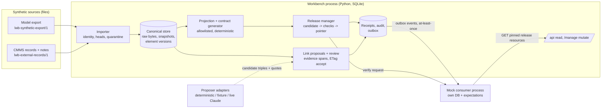

# Architecture note

Scope: a local prototype that explores one integration pattern: a model changes, and the system finds the affected contracts, links and consumers, rejects an obsolete update, and promotes a tested replacement without losing history. Everything runs locally against synthetic data.

## Components (as implemented)

Trust boundaries:

* **Browser/HTTP caller → server.** A simulated bearer token is resolved to a user on the server. Actor names in request bodies are never trusted.
* **Source bytes → importer.** Content is data. Unknown keys are preserved, not executed.
* **Proposer output → validator.** Model output is untrusted. Only record IDs, element IDs, predicates and quotes survive validation, and any other fields, `approved` among them, are dropped with a note.
* **Workbench → consumer.** The consumer authenticates as its own service identity and only reads over HTTP.

## Key decisions and tradeoffs

| Decision | Alternative considered | Why this choice | Revisit when |
|---|---|---|---|
| Identity = (source, project, source-native ID). Names never participate | Fuzzy name/type matching | A rename must not create a new entity, and similar names must not merge. Replacement candidates are flagged for review (`possible_replacement_not_merged`), never merged | A real tool exposes stable cross-project IDs or explicit replacement links |
| Revision IDs are opaque. Ordering comes only from declared parent links | Sort by revision string or arrival time | Neither is trustworthy. A late or unbased snapshot is quarantined and needs an explicit, head-guarded reconciliation | The source offers a commit graph API |
| Contract digest is computed from the consumer-visible shape only, not from source mappings | Digest the whole projection | Remapping `serialNumber` to a renamed source property leaves the contract unchanged (demo step 5), so consumers do not churn | Consumers need mapping provenance in the contract |
| Structural and semantic diagnostics are separate | Rely on JSON Schema validation | ms→s passes schema validation but changes meaning. It is caught by definition diff plus a consumer plausibility check (IC08) | Unit ontology available from the source |
| One pointer row per project, moved in a write transaction | Blue/green processes, feature flags | Atomic and trivially rollbackable locally. Failed promotion leaves the pointer untouched | Multi-instance serving |
| Consumer checks run against real HTTP responses, with expectations authored separately | Contract-only compatibility rules | Adding a field "should" be compatible, but the strict archive consumer rejects it (IC11). Tests decide, not assumptions | More consumers. Then a registry of declared consumers |
| Local transactional outbox, at-least-once delivery, consumer dedupe by event ID, per-project sequence, gap resync | Exactly-once claims, broker | Honest guarantee. Duplicates and lost acks are tested (IC16/17) | Real messaging infrastructure |
| AI proposes, code validates, people approve | Auto-accept above a confidence threshold | Confidence and co-occurrence do not establish correctness. Citations must resolve to retained bytes | Measured live-model precision/recall on a real evaluation set |

## Version dimensions (kept separate)

| Dimension | Where | Example |
|---|---|---|
| Source snapshot | `source_snapshot` (revision, parent, raw + normalized digests) | `7c1e9a` → `f02b44` → `31d8e0` |
| Canonical schema / adapter | `ADAPTER_VERSION`, recorded per snapshot | `lwb-synthetic-export-adapter/0.3.0` |
| Projection definition | `projection_definition` (reviewed status, digest) | `equipment-health@1.1.0` |
| API contract | `contract_artifact` (digest, contract version) | `equipment-health-api v1`, digest `33abe253…` |
| Release manifest | `release.manifest_json` (code version, generator, projection, contract, snapshots) | `examples/release_manifest_example.json` |

## Protected mutation: accepting a link

`POST /manage/proposals/{id}/decision` with `If-Match` (strong ETag), `Idempotency-Key`, and `expected_model_revision` / `expected_record_revision`. In one `BEGIN IMMEDIATE` transaction the server:

1. Checks the receipt and fingerprint (replay or mismatch).
2. Checks the caller's current grant (`link:approve`).
3. Checks ETag equality, returning 412 on mismatch and 428 if the ETag is missing.
4. Checks that the disposition is still open.
5. Checks that validation passed.
6. Checks freshness: whether the model head, record head or target version changed since the proposal. If so, the proposal is marked `stale_needs_review` and the call returns 409.
7. Checks that the caller's expected revisions match the current heads.
8. Writes the decision, link, outbox event, audit row and receipt.

An accepted link is workbench metadata with `authority=reviewer_accepted`. It is not a change to the engineering model.

## Known semantic loss and limits

* **Unknown content.** Element types, properties and keys the adapter does not recognize are preserved in the raw bytes and in `unrecognized_json` with warnings. They are not interpreted or exposed. Multiplicity is stored but not enforced.
* **Partial exports** are staged views only. They cannot advance the head, and they are not merged into it.
* **Rebase** re-checks quotes by exact substring. A reworded record invalidates the citation instead of fuzzily matching.
* **Conversions** are an allowlist (`s_to_ms`, `ms_to_s`). There is no general unit algebra.
* **Relationship direction check** covers `from`/`to` types only. Multiplicity changes are not diagnosed.
* **History is append-only by application convention.** An administrator with file access can edit the SQLite file. Hashes detect differences, not authenticity.
* **Receipts** carry a 7-day `expires_at`. Deleting them requires the explicit `scripts/purge_receipts.py`. After a purge, a reused key becomes a new request.

## Simulated integrations and deployment assumptions

* **Source adapter:** synthetic JSON only (`lwb-synthetic-export/1`). A real Cameo/Teamwork Cloud adapter would first need verified tool versions, export or API capabilities, identity conventions, deletion semantics and access rules. None of these have been established.
* **Identity:** demo tokens and grants in SQLite. A real deployment needs the customer's IdP and authorization model.
* **Delivery:** a local outbox worker posts to one configured consumer. No broker is involved.
* **Deployment:** local processes only. No cloud, GovCloud, container or disconnected-environment deployment was performed, and none is claimed.
* **Live model:** optional. Before use in a customer environment, it needs an approved model endpoint, data-handling review, and permission filtering. Filtering is already applied before model access here.

## Reference basis

These references are cited in the implementation brief. The concepts used here are:

* LOKI [R1]: typed candidate links with sentence-level evidence, and measuring misses as well as false matches.
* OMG Systems Modeling API [R2]: separating identity from version.
* OpenAPI 3.1.1 [R3] and JSON Schema 2020-12 [R4].
* RFC 9110 [R5]: `If-Match` / 412 / 428 semantics.
* W3C PROV-DM [R6]: provenance fields.
* The AWS Builders' Library on idempotent retries [R7] and the transactional outbox pattern [R8].

No external implementation was installed and no benchmark was reproduced. The sources themselves were not re-fetched while building this prototype. This prototype does not implement LOKI or the OMG API, and it makes no conformance claim.
