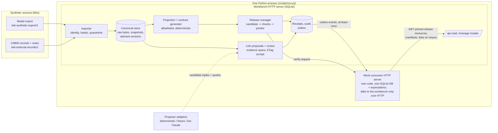

# Architecture note

Scope: a prototype that explores one integration pattern: a model changes, and the system finds the affected contracts, links and consumers, rejects an obsolete update, and promotes a tested replacement without losing history. Everything runs in one Python process against synthetic data, either locally or as one demo container (`DEPLOY.md`).

## Components (as implemented)

```mermaid
flowchart LR
  subgraph Sources["Synthetic sources (files)"]
    X[Model export<br/>lwb-synthetic-export/1]
    R[CMMS records + notes<br/>lwb-external-records/1]
  end
  subgraph PROC["One Python process (scripts/run.py)"]
    subgraph WB["Workbench HTTP server (SQLite)"]
      I[Importer<br/>identity, heads, quarantine]
      S[(Canonical store<br/>raw bytes, snapshots,<br/>element versions)]
      P[Projection + contract generator<br/>allowlisted, deterministic]
      REL[Release manager<br/>candidate -> checks -> pointer]
      L[Link proposals + review<br/>evidence spans, ETag accept]
      RC[(Receipts, audit,<br/>outbox)]
      API[/api read, /manage mutate/]
    end
    C[Mock consumer HTTP server<br/>own code, own SQLite DB + expectations;<br/>talks to the workbench only over HTTP]
  end
  M[Proposer adapters<br/>deterministic / fixture / live Claude]
  X --> I --> S
  R --> I
  S --> P --> REL
  S --> L
  M -. candidate triples + quotes .-> L
  REL --> RC
  L --> RC
  RC -- outbox events, at-least-once --> C
  C -- GET pinned release resources,<br/>manifests, links on resync --> API
  REL -- verify request --> C
```

The consumer is independent in code and data: it does not import `lucidwb`, keeps its own database, and reaches the workbench only through its HTTP API. It is not independent at runtime. `lucidwb/stack.py` imports it, sets its workbench URL and starts both HTTP servers as threads of one process, so the consumer shares the workbench's environment (including `LWB_ACCESS_CODE`) and stops when the workbench process stops.

Trust boundaries:

* **Browser/HTTP caller → server.** When `LWB_ACCESS_CODE` is set, a shared access code (login cookie or `X-Access-Code` header) gates every page and API call except `/healthz` and the login page. Wrong codes wait for their turn, one answer per second across all connections, with at most 8 waiting; more are refused at once (429). That slows a guesser who waits for each answer, but the 429 is an answer too, so a client sending in parallel can test codes as fast as the server responds. `scripts/run.py` therefore refuses to start with a code shorter than 16 characters. At its 256-connection cap the server closes the connection that has waited longest on its client, so neither wrong codes nor idle connections lock out `/healthz` or callers with the right code. Behind the gate, a simulated bearer token is resolved to a user on the server. Actor names in request bodies are never trusted. Mutations such as imports, builds, activation, proposal runs and link decisions check the caller's current grant again inside the write transaction that commits them.
* **Source bytes → importer.** Content is data. Unknown keys are preserved, not executed.
* **Proposer output → validator.** Model output is untrusted. The validator keeps the record ID, element ID, predicate and quoted evidence. Each quote must resolve to the retained record bytes. It also keeps the model's contradiction strings (cut to 300 characters) and its confidence, if that is a finite number. Reviewers see both in the proposals table (the `conf.` column and a contradictions badge), but no check uses them. `method_detail` and `rationale` are accepted and not stored. Every other field, `approved` among them, is dropped with an `ignored_model_field` note.
* **Workbench → consumer.** The consumer authenticates as its own service identity and only reads over HTTP.

## Key decisions and tradeoffs

| Decision | Alternative considered | Why this choice | Revisit when |
|---|---|---|---|
| Identity = (source, project, source-native ID). Names never participate | Fuzzy name/type matching | A rename must not create a new entity, and similar names must not merge. Replacement candidates are flagged for review (`possible_replacement_not_merged`), never merged | A real tool exposes stable cross-project IDs or explicit replacement links |
| Revision IDs are opaque. Ordering comes only from declared parent links | Sort by revision string or arrival time | Neither is trustworthy. A late or unbased snapshot is quarantined and needs an explicit, head-guarded reconciliation | The source offers a commit graph API |
| Contract digest is computed from the consumer-visible shape. Field mappings (`from`, `convert`) are left out. A relation's source predicate and direction are included, as `x-relation` | Digest the whole projection | Remapping `serialNumber` to a renamed source property leaves the contract unchanged (demo step 5), so consumers do not churn. Renaming a source relationship type does change the digest, so it needs a new contract version | Consumers need mapping provenance in the contract, or relations need a consumer-level name |
| Structural and semantic diagnostics are separate | Rely on JSON Schema validation | ms→s passes schema validation but changes meaning. It is caught by definition diff plus a consumer plausibility check (IC08) | Unit ontology available from the source |
| One pointer row per project, moved in a write transaction | Blue/green processes, feature flags | Atomic and trivially rollbackable locally. Failed promotion leaves the pointer untouched | Multi-instance serving |
| Consumer checks run against real HTTP responses, with expectations authored separately | Contract-only compatibility rules | Adding a field "should" be compatible, but the strict archive consumer rejects it (IC11). Tests decide, not assumptions | More consumers. Then a registry of declared consumers |
| Local transactional outbox, at-least-once delivery, consumer dedupe by event ID, per-project sequence, gap resync, pause per project | Exactly-once claims, broker | Honest guarantee. Duplicates and lost acks are tested (IC16/17) | Real messaging infrastructure |
| AI proposes, code validates, people approve | Auto-accept above a confidence threshold | Confidence and co-occurrence do not establish correctness. Citations must resolve to retained bytes | Measured live-model precision/recall on a real evaluation set |

## Version dimensions (kept separate)

| Dimension | Where | Example |
|---|---|---|
| Source snapshot | `source_snapshot` (revision, parent, raw + normalized digests) | `7c1e9a` → `f02b44` → `31d8e0` |
| Canonical schema / adapter | `ADAPTER_VERSION`, recorded per snapshot. Re-sending a stored revision's exact bytes is a duplicate even if a newer adapter normalizes them differently. So is the same content re-serialized, compared as the adapter that stored it read it (before 0.3.1, a delta or partial export without definitions was read without its parent's definitions). The database schema is upgraded in place at start (`db.migrate`) | `lwb-synthetic-export-adapter/0.3.1` |
| Projection definition | `projection_definition`, keyed by project, projection ID and version (reviewed status, digest) | `equipment-health@1.1.0` |
| API contract | `contract_artifact` is a store keyed by digest. A contract version belongs to one project, through that project's releases. A build blocked at generation does not claim the version | `equipment-health-api v1`, digest `33abe253…` |
| Release manifest | `release.manifest_json` (code version, generator, projection, contract, snapshots). The code version is `LWB_CODE_VERSION` if set, else Railway's `RAILWAY_GIT_COMMIT_SHA`, else the git revision | `examples/release_manifest_example.json` |

## Protected mutation: accepting a link

`POST /manage/proposals/{id}/decision` with `If-Match` (strong ETag), `Idempotency-Key`, and `expected_model_revision` / `expected_record_revision`. In one `BEGIN IMMEDIATE` transaction the server:

1. Checks the receipt and fingerprint (replay or mismatch). A replay also needs current read access.
2. Checks the caller's current grant (`link:approve`). The call returns 403 if it is missing, or 404 if the caller has no access to the project at all.
3. Checks the ETag. It returns 428 if `If-Match` is missing and 412 if it differs. The match is exact string equality with the proposal's one current strong ETag, so `If-Match: *` and ETag lists get 412.
4. Checks that the proposal is still `unresolved`. Reject, no-match and missing-evidence decisions may also close a `stale_needs_review` proposal.
5. Requires a reason. For an accept, it checks that validation passed and that both expected revisions are present.
6. Checks freshness: whether the model head, record head or target version changed since the proposal. If so, the proposal is marked `stale_needs_review` (committed) and the call returns 409 `stale_dependency`.
7. Checks that the caller's expected revisions match the current heads.
8. Refuses a second active link with the same record, target and predicate (409 `already_linked`).
9. Writes the decision, link, outbox event, audit row and receipt.

An accepted link is workbench metadata with `authority=reviewer_accepted`. It is not a change to the engineering model.

## Known semantic loss and limits

* **Unknown content.** Element types, properties and keys, and relationship, record and top-level keys, that the adapter does not recognize are preserved in the raw bytes and in `unrecognized_json` columns, with warnings. They are not interpreted and never reach a generated contract or a served resource. The snapshot element API lists unrecognized key names, and the records API returns each record's stored `unrecognized_json` text. Multiplicity is stored as text (a structured or numeric one JSON-encoded) but not enforced.
* **Partial exports** are staged views only. They cannot advance the head, and they are not merged into it. A partial of revision R and the complete export of R do not conflict.
* **Rebase** re-checks quotes by exact substring. A reworded record invalidates the citation instead of fuzzily matching.
* **Conversions** are an allowlist (`s_to_ms`, `ms_to_s`). There is no general unit algebra.
* **Relationship direction check** covers `from`/`to` types only. Multiplicity changes are not diagnosed.
* **History is append-only by application convention.** An administrator with file access can edit the SQLite file. Hashes detect differences, not authenticity.
* **Receipts** carry a 7-day `expires_at`. Deleting them requires the explicit `scripts/purge_receipts.py`. After a purge, a reused key becomes a new request.
* **Outbox** has no dead-letter state and no maximum attempt count. A consumer that keeps failing is retried with capped backoff until a release manager pauses that project's outbox.
* **Schema upgrades** run forward only. An older database (for example on a persistent volume) is upgraded in place at start. There is no downgrade path.
* **Access gate** is one shared code, with no per-user login and no lockout. Wrong codes are throttled only as far as that cannot lock out callers with the right code: once 8 are waiting, more are refused at once, so a flood can still test codes quickly. Bounding a parallel guesser would mean refusing codes without checking them, and the same flood would then lock out callers with the right code. The code's length is what protects it: `scripts/run.py` refuses a code shorter than 16 characters, but cannot check that it is random.

## Simulated integrations and deployment assumptions

* **Source adapter:** synthetic JSON only (`lwb-synthetic-export/1`). A real Cameo/Teamwork Cloud adapter would first need verified tool versions, export or API capabilities, identity conventions, deletion semantics and access rules. None of these have been established.
* **Identity:** demo tokens and grants in SQLite. A real deployment needs the customer's IdP and authorization model.
* **Delivery:** a local outbox worker posts to one configured consumer. No broker is involved.
* **Deployment:** one process, run locally or as one container behind the access gate. A container build and run were verified in the build sandbox (`DEPLOY.md`), and Railway is the chosen host. SQLite and the in-process outbox worker require exactly one instance. No GovCloud, classified or disconnected-environment deployment was made, and none is claimed.
* **Live model:** optional. Before use in a customer environment, it needs an approved model endpoint, data-handling review, and permission filtering. Filtering is already applied before model access here.

## Reference basis

These references are cited in the implementation brief. The concepts used here are:

* LOKI [R1]: typed candidate links with sentence-level evidence, and measuring misses as well as false matches.
* OMG Systems Modeling API [R2]: separating identity from version.
* OpenAPI 3.1.1 [R3] and JSON Schema 2020-12 [R4].
* RFC 9110 [R5]: `If-Match` and 412 semantics. Only a single exact strong ETag is accepted (see above).
* RFC 6585 (not in the brief's list): the 428 Precondition Required status.
* W3C PROV-DM [R6]: provenance fields.
* The AWS Builders' Library on idempotent retries [R7] and the transactional outbox pattern [R8].

No external implementation was installed and no benchmark was reproduced. The sources themselves were not re-fetched while building this prototype. This prototype does not implement LOKI or the OMG API, and it makes no conformance claim.
